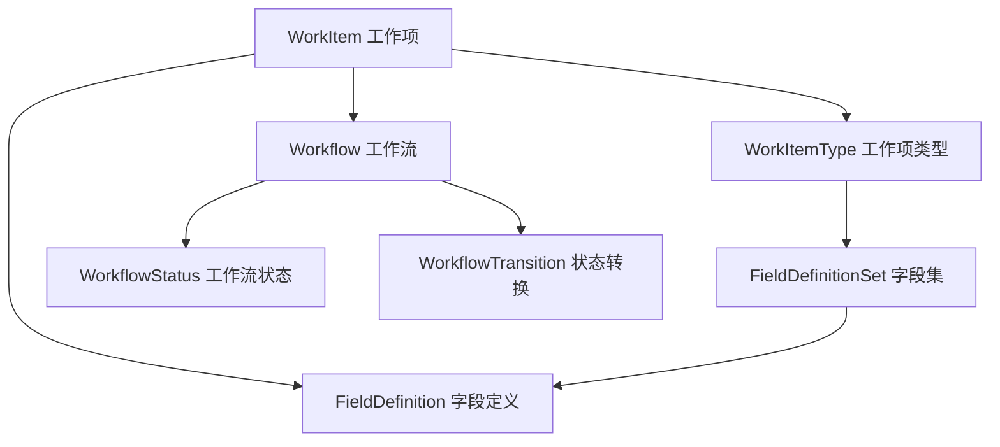
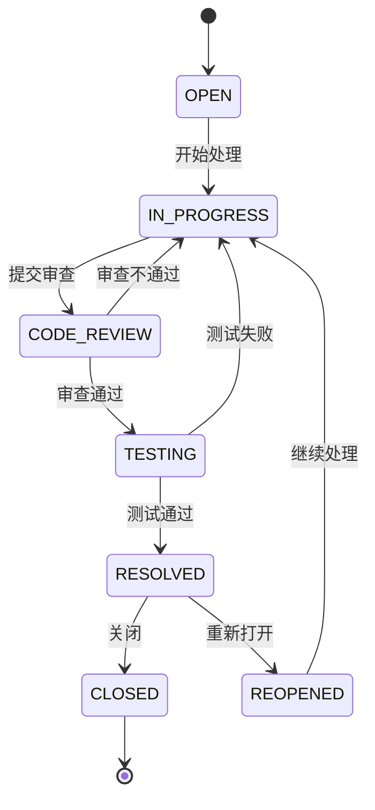
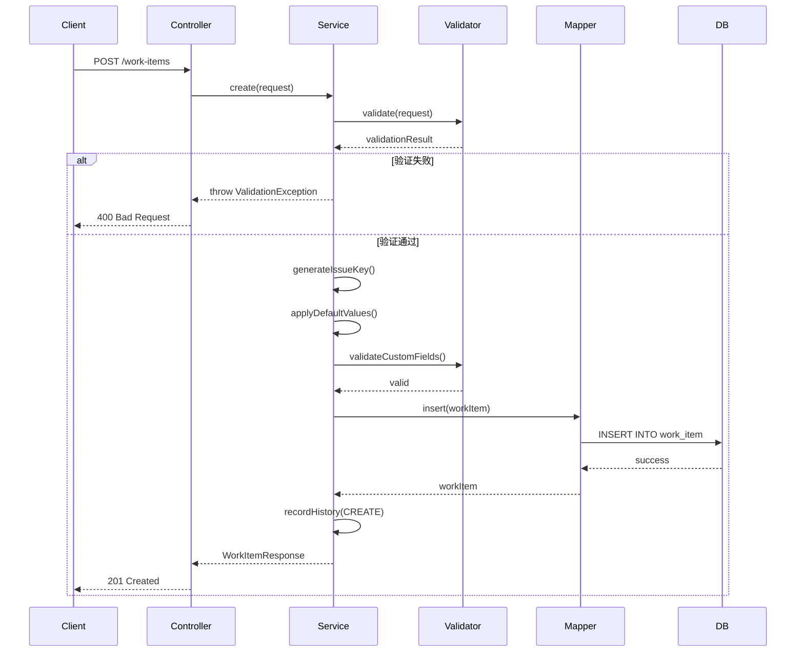
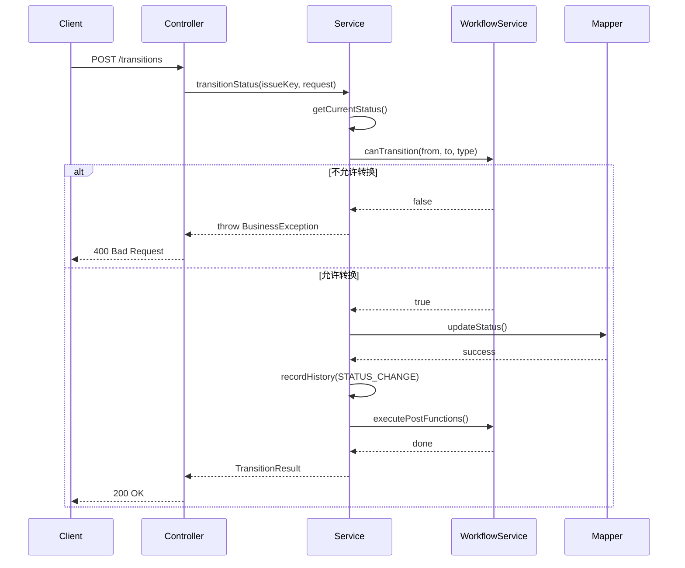
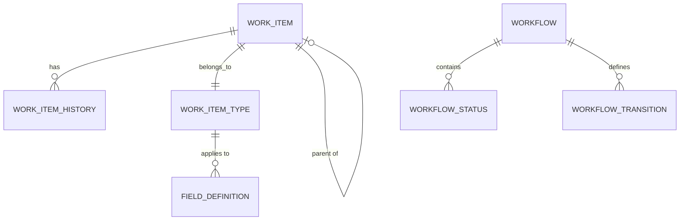

# 通用工作项管理系统 - 软件设计描述 (SDD)

## 1. 引言

### 1.1 目的
本文档详细描述通用工作项管理系统（Universal Work Item Management System）的软件架构、模块设计、数据模型和接口规范。该系统借鉴Jira Issue的核心设计理念，提供灵活可扩展的工作项管理能力。

### 1.2 范围
- 支持多类型工作项（任务、缺陷、需求、史诗等）
- 动态自定义字段配置
- 工作流引擎支持
- 灵活的查询和报表能力
- 权限管理框架

### 1.3 参考标准
- **Jira Issue Model**: 工作项类型、状态流转、字段配置
- **RESTful API**: HTTP接口设计规范
- **DDD**: 领域驱动设计原则

## 2. 系统架构

### 2.1 技术栈
| 层次 | 技术选型 | 版本 |
|------|----------|------|
| 运行环境 | JDK | 21+ |
| Web框架 | Spring Boot | 3.4.x |
| ORM框架 | MyBatis-Flex | 1.9.7+ |
| 数据库 | PostgreSQL | 15+ |
| 构建工具 | Maven | 3.9+ |
| 工具库 | Hutool | 5.8.x |
| JSON处理 | Jackson | 2.15+ |

### 2.2 架构分层

```
┌─────────────────────────────────────┐
│       Presentation Layer            │  ← Controller + DTO
├─────────────────────────────────────┤
│       Application Layer             │  ← Service (业务编排)
├─────────────────────────────────────┤
│       Domain Layer                  │  ← Entity + Domain Service
├─────────────────────────────────────┤
│       Infrastructure Layer          │  ← Mapper + TypeHandler
└─────────────────────────────────────┘
```

### 2.3 核心设计原则
1. **扩展性优先**: 通过JSONB存储自定义字段，无需修改表结构
2. **配置驱动**: 工作项类型、字段、工作流均可配置
3. **向后兼容**: 字段定义删除不影响历史数据
4. **性能优化**: GIN索引加速JSON查询

## 3. 领域模型设计

### 3.1 核心实体关系图



### 3.2 工作项类型体系（参考Jira）

#### 3.2.1 标准工作项类型
| 类型编码 | 名称 | 说明 | 典型用途 |
|---------|------|------|----------|
| EPIC | 史诗 | 大型功能集合 | 产品路线图规划 |
| STORY | 故事 | 用户故事 | 敏捷开发需求 |
| TASK | 任务 | 普通任务 | 日常工作任务 |
| BUG | 缺陷 | Bug跟踪 | 问题修复 |
| SUBTASK | 子任务 | 任务的细分 | 任务拆解 |

#### 3.2.2 工作项层级关系
```
EPIC (史诗)
  └── STORY/TASK/BUG (故事/任务/缺陷)
        └── SUBTASK (子任务)
```

### 3.3 工作流模型

#### 3.3.1 标准状态机


#### 3.3.2 状态定义
| 状态编码 | 名称 | 类别 | 说明 |
|---------|------|------|------|
| OPEN | 待处理 | To Do | 新建未开始 |
| IN_PROGRESS | 进行中 | In Progress | 正在处理 |
| CODE_REVIEW | 代码审查 | In Progress | 等待审查 |
| TESTING | 测试中 | In Progress | 等待测试 |
| RESOLVED | 已解决 | Done | 已完成待关闭 |
| CLOSED | 已关闭 | Done | 最终状态 |
| REOPENED | 重新打开 | To Do | 从Resolved reopen |

## 4. 数据库设计

### 4.1 核心表结构

#### 4.1.1 工作项表 (work_item)
```sql
CREATE TABLE work_item (
    id BIGSERIAL PRIMARY KEY,
    
    -- 基础信息
    issue_key VARCHAR(50) NOT NULL UNIQUE,  -- 工作项编号 (如: PROJ-123)
    work_item_type VARCHAR(50) NOT NULL,     -- 工作项类型
    title VARCHAR(255) NOT NULL,              -- 标题
    description TEXT,                         -- 描述
    
    -- 状态与优先级
    status VARCHAR(50) NOT NULL DEFAULT 'OPEN',
    priority VARCHAR(50) DEFAULT 'MEDIUM',
    resolution VARCHAR(50),                   -- 解决结果
    
    -- 人员信息
    reporter VARCHAR(100),                    -- 报告人
    assignee VARCHAR(100),                    -- 负责人
    
    -- 层级关系
    parent_id BIGINT REFERENCES work_item(id), -- 父工作项ID
    epic_link VARCHAR(50),                     -- 所属史诗
    
    -- 时间信息
    estimate_hours DECIMAL(10,2),             -- 预估工时
    time_spent DECIMAL(10,2),                 -- 已花费工时
    due_date TIMESTAMP,                       -- 截止日期
    
    -- 自定义字段 (核心扩展能力)
    custom_fields JSONB DEFAULT '{}',         -- 自定义字段值
    
    -- 审计字段
    created_at TIMESTAMP DEFAULT NOW(),
    updated_at TIMESTAMP DEFAULT NOW(),
    created_by VARCHAR(100),
    updated_by VARCHAR(100),
    
    -- 逻辑删除
    deleted BOOLEAN DEFAULT FALSE,
    
    -- 乐观锁
    version INTEGER DEFAULT 0
);

-- 索引
CREATE INDEX idx_work_item_type ON work_item(work_item_type);
CREATE INDEX idx_work_item_status ON work_item(status);
CREATE INDEX idx_work_item_priority ON work_item(priority);
CREATE INDEX idx_work_item_assignee ON work_item(assignee);
CREATE INDEX idx_work_item_reporter ON work_item(reporter);
CREATE INDEX idx_work_item_parent ON work_item(parent_id);
CREATE INDEX idx_work_item_epic ON work_item(epic_link);
CREATE INDEX idx_work_item_created_at ON work_item(created_at DESC);
CREATE INDEX idx_work_item_custom_fields ON work_item USING GIN(custom_fields);
```

#### 4.1.2 工作项类型定义表 (work_item_type)
```sql
CREATE TABLE work_item_type (
    id BIGSERIAL PRIMARY KEY,
    type_code VARCHAR(50) NOT NULL UNIQUE,    -- 类型编码
    type_name VARCHAR(100) NOT NULL,          -- 类型名称
    description TEXT,                         -- 描述
    icon VARCHAR(50),                         -- 图标
    color VARCHAR(20),                        -- 颜色
    hierarchy_level INTEGER DEFAULT 0,        -- 层级 (0=顶层, 1=中层, 2=底层)
    is_active BOOLEAN DEFAULT TRUE,           -- 是否启用
    
    created_at TIMESTAMP DEFAULT NOW(),
    updated_at TIMESTAMP DEFAULT NOW(),
    deleted BOOLEAN DEFAULT FALSE
);

-- 初始化数据
INSERT INTO work_item_type (type_code, type_name, hierarchy_level, icon, color) VALUES
('EPIC', '史诗', 0, 'epic', '#6554C0'),
('STORY', '故事', 1, 'story', '#0052CC'),
('TASK', '任务', 1, 'task', '#4FADE6'),
('BUG', '缺陷', 1, 'bug', '#FF5630'),
('SUBTASK', '子任务', 2, 'subtask', '#7A869A');
```

#### 4.1.3 字段定义表 (field_definition)
```sql
CREATE TABLE field_definition (
    id BIGSERIAL PRIMARY KEY,
    
    -- 字段基本信息
    field_name VARCHAR(100) NOT NULL UNIQUE,  -- 字段标识 (唯一)
    field_label VARCHAR(100) NOT NULL,        -- 显示标签
    field_type VARCHAR(50) NOT NULL,          -- 字段类型
    description TEXT,                         -- 字段说明
    
    -- 字段属性
    required BOOLEAN DEFAULT FALSE,           -- 是否必填
    default_value TEXT,                       -- 默认值
    options JSONB,                            -- 选项列表 (SELECT/MULTI_SELECT)
    validation_rule VARCHAR(255),             -- 验证规则 (正则表达式)
    
    -- 可见性与上下文
    applicable_types JSONB,                   -- 适用的工作项类型 ["BUG", "TASK"]
    display_order INTEGER DEFAULT 0,          -- 显示顺序
    
    -- 审计字段
    created_at TIMESTAMP DEFAULT NOW(),
    updated_at TIMESTAMP DEFAULT NOW(),
    created_by VARCHAR(100),
    deleted BOOLEAN DEFAULT FALSE
);

CREATE INDEX idx_field_definition_name ON field_definition(field_name);
CREATE INDEX idx_field_definition_applicable ON field_definition USING GIN(applicable_types);
```

#### 4.1.4 字段类型枚举
| 类型编码 | 名称 | Java类型 | 说明 | 是否支持options |
|---------|------|----------|------|----------------|
| TEXT | 单行文本 | String | 短文本输入 | 否 |
| TEXTAREA | 多行文本 | String | 长文本输入 | 否 |
| NUMBER | 数字 | BigDecimal | 数值输入 | 否 |
| BOOLEAN | 布尔值 | Boolean | 开关选择 | 否 |
| DATE | 日期 | LocalDate | 日期选择器 | 否 |
| DATETIME | 日期时间 | LocalDateTime | 日期时间选择器 | 否 |
| SELECT | 单选下拉 | String | 从选项中单选 | 是 |
| MULTI_SELECT | 多选下拉 | List<String> | 从选项中多选 | 是 |
| USER | 用户选择 | String | 用户选择器 | 否 |
| LABEL | 标签 | List<String> | 标签输入 | 否 |
| URL | 链接 | String | URL输入 | 否 |

#### 4.1.5 工作流定义表 (workflow)
```sql
CREATE TABLE workflow (
    id BIGSERIAL PRIMARY KEY,
    workflow_name VARCHAR(100) NOT NULL,      -- 工作流名称
    description TEXT,
    is_default BOOLEAN DEFAULT FALSE,         -- 是否为默认工作流
    is_active BOOLEAN DEFAULT TRUE,
    
    created_at TIMESTAMP DEFAULT NOW(),
    updated_at TIMESTAMP DEFAULT NOW(),
    deleted BOOLEAN DEFAULT FALSE
);

-- 工作流状态表
CREATE TABLE workflow_status (
    id BIGSERIAL PRIMARY KEY,
    workflow_id BIGINT NOT NULL REFERENCES workflow(id),
    status_code VARCHAR(50) NOT NULL,         -- 状态编码
    status_name VARCHAR(100) NOT NULL,        -- 状态名称
    category VARCHAR(20) NOT NULL,            -- 类别: TO_DO/IN_PROGRESS/DONE
    display_order INTEGER DEFAULT 0,
    
    UNIQUE(workflow_id, status_code)
);

-- 工作流转换规则表
CREATE TABLE workflow_transition (
    id BIGSERIAL PRIMARY KEY,
    workflow_id BIGINT NOT NULL REFERENCES workflow(id),
    from_status VARCHAR(50) NOT NULL,         -- 起始状态
    to_status VARCHAR(50) NOT NULL,           -- 目标状态
    transition_name VARCHAR(100),             -- 转换名称
    
    -- 条件与限制
    conditions JSONB,                         -- 转换条件
    validators JSONB,                         -- 验证器
    post_functions JSONB,                     -- 后置函数
    
    UNIQUE(workflow_id, from_status, to_status)
);
```

#### 4.1.6 工作项历史表 (work_item_history)
```sql
CREATE TABLE work_item_history (
    id BIGSERIAL PRIMARY KEY,
    work_item_id BIGINT NOT NULL REFERENCES work_item(id),
    
    -- 变更内容
    change_type VARCHAR(50) NOT NULL,         -- 变更类型: FIELD_CHANGE/STATUS_CHANGE/COMMENT
    field_name VARCHAR(100),                  -- 变更字段
    old_value TEXT,                           -- 旧值
    new_value TEXT,                           -- 新值
    
    -- 操作信息
    changed_by VARCHAR(100) NOT NULL,
    changed_at TIMESTAMP DEFAULT NOW(),
    
    comment TEXT                              -- 变更说明
);

CREATE INDEX idx_history_work_item ON work_item_history(work_item_id);
CREATE INDEX idx_history_changed_at ON work_item_history(changed_at DESC);
```

### 4.2 数据完整性约束

#### 4.2.1 触发器：自动更新时间戳
```sql
CREATE OR REPLACE FUNCTION update_updated_at_column()
RETURNS TRIGGER AS $$
BEGIN
    NEW.updated_at = NOW();
    RETURN NEW;
END;
$$ language 'plpgsql';

CREATE TRIGGER update_work_item_updated_at 
    BEFORE UPDATE ON work_item 
    FOR EACH ROW EXECUTE FUNCTION update_updated_at_column();

CREATE TRIGGER update_field_definition_updated_at 
    BEFORE UPDATE ON field_definition 
    FOR EACH ROW EXECUTE FUNCTION update_updated_at_column();
```

#### 4.2.2 函数：生成工作项编号
```sql
CREATE OR REPLACE FUNCTION generate_issue_key(project_code VARCHAR)
RETURNS VARCHAR AS $$
DECLARE
    next_num INTEGER;
BEGIN
    SELECT COALESCE(MAX(CAST(SPLIT_PART(issue_key, '-', 2) AS INTEGER)), 0) + 1
    INTO next_num
    FROM work_item
    WHERE issue_key LIKE project_code || '-%';
    
    RETURN project_code || '-' || LPAD(next_num::TEXT, 5, '0');
END;
$$ LANGUAGE plpgsql;
```

## 5. 接口设计

### 5.1 RESTful API规范

#### 5.1.1 统一响应格式
```json
{
  "code": 200,
  "message": "success",
  "data": {},
  "timestamp": "2026-04-12T10:30:00Z"
}
```

#### 5.1.2 错误响应格式
```json
{
  "code": 400,
  "message": "Validation failed",
  "errors": [
    {
      "field": "title",
      "message": "Title is required"
    }
  ],
  "timestamp": "2026-04-12T10:30:00Z"
}
```

### 5.2 工作项API

#### 5.2.1 创建工作项
```
POST /api/v1/work-items
Content-Type: application/json

Request:
{
  "projectCode": "PROJ",
  "workItemType": "BUG",
  "title": "登录页面加载缓慢",
  "description": "用户在弱网环境下登录超时",
  "priority": "HIGH",
  "assignee": "john.doe",
  "reporter": "jane.smith",
  "customFields": {
    "severity": "CRITICAL",
    "component": "authentication",
    "environment": "production",
    "steps_to_reproduce": "1. 打开登录页\n2. 输入凭证\n3. 点击登录",
    "tags": ["performance", "login"]
  },
  "parentIssueKey": "PROJ-00100",
  "epicLink": "PROJ-00050"
}

Response: 201 Created
{
  "code": 201,
  "message": "Work item created successfully",
  "data": {
    "id": 123,
    "issueKey": "PROJ-00123",
    "workItemType": "BUG",
    "title": "登录页面加载缓慢",
    "status": "OPEN",
    "createdAt": "2026-04-12T10:30:00Z"
  }
}
```

#### 5.2.2 批量创建工作项
```
POST /api/v1/work-items/batch
Content-Type: application/json

Request:
{
  "items": [
    { /* work item 1 */ },
    { /* work item 2 */ }
  ]
}

Response: 201 Created
{
  "code": 201,
  "message": "Batch creation completed",
  "data": {
    "successCount": 2,
    "failureCount": 0,
    "results": [
      {"issueKey": "PROJ-00124", "status": "CREATED"},
      {"issueKey": "PROJ-00125", "status": "CREATED"}
    ]
  }
}
```

#### 5.2.3 获取工作项详情
```
GET /api/v1/work-items/{issueKey}

Response: 200 OK
{
  "code": 200,
  "data": {
    "id": 123,
    "issueKey": "PROJ-00123",
    "workItemType": "BUG",
    "title": "登录页面加载缓慢",
    "description": "用户在弱网环境下登录超时",
    "status": "IN_PROGRESS",
    "priority": "HIGH",
    "resolution": null,
    "reporter": "jane.smith",
    "assignee": "john.doe",
    "parentId": 100,
    "parentIssueKey": "PROJ-00100",
    "epicLink": "PROJ-00050",
    "estimateHours": 8.0,
    "timeSpent": 3.5,
    "dueDate": "2026-04-20T00:00:00Z",
    "customFields": {
      "severity": "CRITICAL",
      "component": "authentication",
      "tags": ["performance", "login"]
    },
    "availableFields": [
      {"fieldName": "severity", "fieldLabel": "严重程度", "fieldType": "SELECT"},
      {"fieldName": "component", "fieldLabel": "组件", "fieldType": "TEXT"}
    ],
    "createdAt": "2026-04-12T10:30:00Z",
    "updatedAt": "2026-04-12T14:20:00Z",
    "createdBy": "jane.smith",
    "updatedBy": "john.doe"
  }
}
```

#### 5.2.4 更新工作项
```
PUT /api/v1/work-items/{issueKey}
Content-Type: application/json

Request:
{
  "title": "登录页面加载缓慢（更新）",
  "priority": "CRITICAL",
  "assignee": "mike.wilson",
  "customFields": {
    "severity": "HIGH",
    "component": "frontend"
  }
}

Response: 200 OK
```

**部分更新自定义字段**:
```
PATCH /api/v1/work-items/{issueKey}/custom-fields
Content-Type: application/json

Request:
{
  "severity": "CRITICAL"
}

Note: 仅更新severity字段，其他自定义字段保持不变
```

#### 5.2.5 删除工作项
```
DELETE /api/v1/work-items/{issueKey}

Response: 204 No Content

Note: 软删除，设置deleted=true
```

#### 5.2.6 分页查询工作项
```
GET /api/v1/work-items?page=1&pageSize=20&sort=createdAt,desc&status=OPEN&priority=HIGH

Query Parameters:
- page: 页码 (default: 1)
- pageSize: 每页数量 (default: 20, max: 100)
- sort: 排序字段 (format: field,direction)
- status: 状态筛选
- priority: 优先级筛选
- assignee: 负责人筛选
- workItemType: 工作项类型筛选
- query: 全文搜索关键词

Response: 200 OK
{
  "code": 200,
  "data": {
    "content": [ /* work items */ ],
    "page": {
      "number": 1,
      "size": 20,
      "totalElements": 150,
      "totalPages": 8
    }
  }
}
```

#### 5.2.7 动态列查询（高级查询）
```
POST /api/v1/work-items/query
Content-Type: application/json

Request:
{
  "columns": ["issueKey", "title", "status", "priority", "severity", "component"],
  "conditions": {
    "status": ["OPEN", "IN_PROGRESS"],
    "priority": "HIGH",
    "customFields": {
      "severity": "CRITICAL",
      "component": "authentication"
    },
    "dateRange": {
      "field": "createdAt",
      "from": "2026-04-01T00:00:00Z",
      "to": "2026-04-30T23:59:59Z"
    }
  },
  "sort": [{"field": "priority", "direction": "DESC"}, {"field": "createdAt", "direction": "ASC"}],
  "page": 1,
  "pageSize": 50
}

Response: 200 OK
{
  "code": 200,
  "data": {
    "content": [
      {
        "issueKey": "PROJ-00123",
        "title": "登录页面加载缓慢",
        "status": "IN_PROGRESS",
        "priority": "HIGH",
        "severity": "CRITICAL",
        "component": "authentication"
      }
    ],
    "page": {
      "number": 1,
      "size": 50,
      "totalElements": 25,
      "totalPages": 1
    }
  }
}
```

#### 5.2.8 工作项状态转换
```
POST /api/v1/work-items/{issueKey}/transitions
Content-Type: application/json

Request:
{
  "toStatus": "IN_PROGRESS",
  "comment": "开始处理此问题"
}

Response: 200 OK
{
  "code": 200,
  "message": "Status transitioned successfully",
  "data": {
    "issueKey": "PROJ-00123",
    "fromStatus": "OPEN",
    "toStatus": "IN_PROGRESS",
    "transitionedAt": "2026-04-12T14:30:00Z",
    "transitionedBy": "john.doe"
  }
}
```

#### 5.2.9 获取可用状态转换
```
GET /api/v1/work-items/{issueKey}/available-transitions

Response: 200 OK
{
  "code": 200,
  "data": [
    {
      "toStatus": "IN_PROGRESS",
      "transitionName": "开始处理",
      "available": true
    },
    {
      "toStatus": "CLOSED",
      "transitionName": "直接关闭",
      "available": false,
      "reason": "Cannot transition from OPEN to CLOSED"
    }
  ]
}
```

#### 5.2.10 获取工作项历史
```
GET /api/v1/work-items/{issueKey}/history?page=1&pageSize=50

Response: 200 OK
{
  "code": 200,
  "data": {
    "content": [
      {
        "id": 1,
        "changeType": "STATUS_CHANGE",
        "fieldName": "status",
        "oldValue": "OPEN",
        "newValue": "IN_PROGRESS",
        "changedBy": "john.doe",
        "changedAt": "2026-04-12T14:30:00Z",
        "comment": "开始处理此问题"
      },
      {
        "id": 2,
        "changeType": "FIELD_CHANGE",
        "fieldName": "priority",
        "oldValue": "MEDIUM",
        "newValue": "HIGH",
        "changedBy": "jane.smith",
        "changedAt": "2026-04-12T11:00:00Z"
      }
    ],
    "page": {
      "number": 1,
      "size": 50,
      "totalElements": 10,
      "totalPages": 1
    }
  }
}
```

### 5.3 字段定义API

#### 5.3.1 创建字段定义
```
POST /api/v1/field-definitions
Content-Type: application/json

Request:
{
  "fieldName": "customer_impact",
  "fieldLabel": "客户影响",
  "fieldType": "SELECT",
  "description": "评估对客户的影响程度",
  "required": false,
  "defaultValue": "LOW",
  "options": ["LOW", "MEDIUM", "HIGH", "CRITICAL"],
  "applicableTypes": ["BUG", "TASK"],
  "displayOrder": 10
}

Response: 201 Created
```

#### 5.3.2 更新字段定义
```
PUT /api/v1/field-definitions/{id}
Content-Type: application/json

Request:
{
  "fieldLabel": "客户影响程度",
  "required": true,
  "options": ["NONE", "LOW", "MEDIUM", "HIGH", "CRITICAL"],
  "displayOrder": 15
}

Note: 不允许修改 fieldName 和 fieldType
```

#### 5.3.3 删除字段定义
```
DELETE /api/v1/field-definitions/{id}

Response: 204 No Content

Note: 软删除，已有工作项的该字段数据保留但不显示
```

#### 5.3.4 获取字段定义列表
```
GET /api/v1/field-definitions?workItemType=BUG&active=true

Response: 200 OK
{
  "code": 200,
  "data": [
    {
      "id": 1,
      "fieldName": "severity",
      "fieldLabel": "严重程度",
      "fieldType": "SELECT",
      "required": true,
      "options": ["LOW", "MEDIUM", "HIGH", "CRITICAL"],
      "applicableTypes": ["BUG"],
      "displayOrder": 1
    }
  ]
}
```

### 5.4 工作项类型API

#### 5.4.1 获取所有工作项类型
```
GET /api/v1/work-item-types

Response: 200 OK
{
  "code": 200,
  "data": [
    {
      "typeCode": "BUG",
      "typeName": "缺陷",
      "description": "软件缺陷或问题",
      "icon": "bug",
      "color": "#FF5630",
      "hierarchyLevel": 1,
      "isActive": true
    }
  ]
}
```

## 6. 模块设计

### 6.1 包结构
```
com.workitem
├── WorkItemApplication.java          # 启动类
├── config/                           # 配置类
│   ├── MyBatisFlexConfig.java
│   ├── GlobalExceptionHandler.java
│   └── SwaggerConfig.java
├── controller/                       # 控制器层
│   ├── HomeController.java
│   ├── WorkItemController.java
│   ├── FieldDefinitionController.java
│   └── WorkItemTypeController.java
├── service/                          # 服务层
│   ├── WorkItemService.java
│   ├── FieldDefinitionService.java
│   ├── WorkflowService.java
│   └── QueryService.java
├── mapper/                           # 数据访问层
│   ├── WorkItemMapper.java
│   ├── FieldDefinitionMapper.java
│   ├── WorkItemTypeMapper.java
│   └── WorkflowMapper.java
├── entity/                           # 实体类
│   ├── WorkItem.java
│   ├── FieldDefinition.java
│   ├── WorkItemType.java
│   ├── Workflow.java
│   └── WorkItemHistory.java
├── dto/                              # 数据传输对象
│   ├── request/
│   │   ├── WorkItemCreateRequest.java
│   │   ├── WorkItemUpdateRequest.java
│   │   ├── DynamicQueryRequest.java
│   │   └── FieldDefinitionRequest.java
│   └── response/
│       ├── WorkItemResponse.java
│       ├── PageResponse.java
│       └── FieldDefinitionResponse.java
├── enums/                            # 枚举类
│   ├── WorkItemTypeEnum.java
│   ├── StatusEnum.java
│   ├── PriorityEnum.java
│   └── FieldTypeEnum.java
├── validator/                        # 验证器
│   ├── WorkItemValidator.java
│   └── FieldDefinitionValidator.java
└── handler/                          # 类型处理器
    └── JacksonJsonTypeHandler.java
```

### 6.2 核心服务设计

#### 6.2.1 WorkItemService
```java
public interface WorkItemService {
    // CRUD操作
    WorkItemResponse create(WorkItemCreateRequest request);
    WorkItemResponse getByIssueKey(String issueKey);
    WorkItemResponse update(String issueKey, WorkItemUpdateRequest request);
    void delete(String issueKey);
    
    // 查询操作
    PageResponse<WorkItemResponse> pageQuery(int page, int pageSize, Map<String, Object> filters);
    PageResponse<Map<String, Object>> dynamicQuery(DynamicQueryRequest request);
    
    // 状态转换
    TransitionResult transitionStatus(String issueKey, StatusTransitionRequest request);
    List<AvailableTransition> getAvailableTransitions(String issueKey);
    
    // 历史追踪
    PageResponse<WorkItemHistory> getHistory(String issueKey, int page, int pageSize);
    
    // 批量操作
    BatchResult batchCreate(List<WorkItemCreateRequest> requests);
}
```

#### 6.2.2 FieldDefinitionService
```java
public interface FieldDefinitionService {
    FieldDefinitionResponse create(FieldDefinitionRequest request);
    FieldDefinitionResponse update(Long id, FieldDefinitionRequest request);
    void delete(Long id);
    FieldDefinitionResponse getById(Long id);
    List<FieldDefinitionResponse> list(String workItemType, boolean activeOnly);
    
    // 验证自定义字段值
    ValidationResult validateCustomFields(Map<String, Object> customFields, String workItemType);
}
```

#### 6.2.3 WorkflowService
```java
public interface WorkflowService {
    boolean canTransition(String currentStatus, String targetStatus, String workItemType);
    List<String> getNextStatuses(String currentStatus, String workItemType);
    void executePostFunctions(String issueKey, String fromStatus, String toStatus);
}
```

### 6.3 关键业务流程

#### 6.3.1 创建工作项流程


#### 6.3.2 状态转换流程


## 7. 安全设计

### 7.1 输入验证
- 所有输入参数进行非空校验
- 字符串长度限制
- 字段类型匹配验证
- SQL注入防护（使用参数化查询）
- XSS防护（输出转义）

### 7.2 权限控制（预留）
```java
// 未来扩展：基于角色的访问控制
@PreAuthorize("hasRole('ADMIN') or hasPermission(#issueKey, 'WRITE')")
public WorkItemResponse update(String issueKey, WorkItemUpdateRequest request) {
    // ...
}
```

### 7.3 审计日志
- 记录所有写操作（CREATE/UPDATE/DELETE）
- 记录操作用户和时间
- 保留完整的历史变更轨迹

## 8. 性能优化

### 8.1 数据库优化
1. **索引策略**
   - 常用查询字段建立B-Tree索引
   - JSONB字段使用GIN索引
   - 复合索引优化多条件查询

2. **查询优化**
   - 避免SELECT *，只查询需要的字段
   - 使用分页限制返回数据量
   - 动态列查询减少数据传输

3. **连接池配置**
```yaml
spring:
  datasource:
    hikari:
      maximum-pool-size: 20
      minimum-idle: 5
      connection-timeout: 30000
      idle-timeout: 600000
      max-lifetime: 1800000
```

### 8.2 缓存策略（预留）
- 字段定义缓存（Redis）
- 工作项类型缓存
- 工作流配置缓存

### 8.3 异步处理（预留）
- 历史记录异步写入
- 通知发送异步化
- 批量操作并行处理

## 9. 扩展点设计

### 9.1 自定义字段验证器
```java
public interface CustomFieldValidator {
    boolean supports(String fieldName);
    ValidationResult validate(Object value, FieldDefinition definition);
}

// 示例：邮箱格式验证器
@Component
public class EmailFieldValidator implements CustomFieldValidator {
    @Override
    public boolean supports(String fieldName) {
        return "contact_email".equals(fieldName);
    }
    
    @Override
    public ValidationResult validate(Object value, FieldDefinition definition) {
        String email = (String) value;
        if (!EmailValidator.isValid(email)) {
            return ValidationResult.error("Invalid email format");
        }
        return ValidationResult.success();
    }
}
```

### 9.2 工作流后置函数
```java
public interface PostFunction {
    void execute(String issueKey, String fromStatus, String toStatus);
}

// 示例：状态转换为RESOLVED时自动分配给测试人员
@Component
public class AssignToTesterPostFunction implements PostFunction {
    @Override
    public void execute(String issueKey, String fromStatus, String toStatus) {
        if ("RESOLVED".equals(toStatus)) {
            // 自动分配给测试团队
            workItemService.assignToGroup(issueKey, "QA_TEAM");
        }
    }
}
```

### 9.3 事件监听器
```java
// 工作项创建事件
@EventListener
public void onWorkItemCreated(WorkItemCreatedEvent event) {
    // 发送通知
    notificationService.notifyReporter(event.getIssueKey());
    // 触发自动化规则
    automationEngine.evaluate(event);
}
```

## 10. 部署架构

### 10.1 最小部署架构
```
┌──────────────┐
│   Client     │  ← Browser / Mobile / API Consumer
└──────┬───────┘
       │ HTTPS
┌──────▼───────┐
│ Spring Boot  │  ← Application Server
│  Application │
└──────┬───────┘
       │ JDBC
┌──────▼───────┐
│ PostgreSQL   │  ← Database
└──────────────┘
```

### 10.2 生产环境架构（建议）
```
┌──────────────┐
│   Nginx      │  ← Load Balancer + SSL Termination
└──────┬───────┘
       │
  ┌────▼────┐
  │ App #1  │
  ├─────────┤
  │ App #2  │  ← Application Cluster
  ├─────────┤
  │ App #3  │
  └────┬────┘
       │
  ┌────▼────┐
  │ Redis   │  ← Cache Layer (Optional)
  └────┬────┘
       │
  ┌────▼──────────┐
  │ PostgreSQL    │  ← Primary Database
  │  (Master)     │
  └────┬──────────┘
       │ Replication
  ┌────▼──────────┐
  │ PostgreSQL    │  ← Read Replica (Optional)
  │  (Slave)      │
  └───────────────┘
```

## 11. 监控与运维

### 11.1 健康检查端点
```
GET /health
GET /health/db
GET /metrics
```

### 11.2 关键指标
- API响应时间（P95 < 200ms）
- 数据库连接池使用率
- 工作项创建/更新QPS
- 错误率（< 1%）

### 11.3 日志规范
```java
@Slf4j
@Service
public class WorkItemService {
    public WorkItemResponse create(WorkItemCreateRequest request) {
        log.info("Creating work item: type={}, title={}", 
                 request.getWorkItemType(), request.getTitle());
        try {
            // business logic
            log.info("Work item created: issueKey={}", result.getIssueKey());
            return result;
        } catch (Exception e) {
            log.error("Failed to create work item: title={}", 
                     request.getTitle(), e);
            throw e;
        }
    }
}
```

## 12. 测试策略

### 12.1 单元测试
- Service层业务逻辑测试
- Validator验证逻辑测试
- 覆盖率目标：> 80%

### 12.2 集成测试
- Controller API测试
- Mapper数据库操作测试
- 事务回滚测试

### 12.3 端到端测试
- 完整业务流程测试
- 并发场景测试
- 性能压力测试

## 13. 版本演进路线

### v1.0 (当前版本)
- ✅ 基础工作项CRUD
- ✅ 自定义字段管理
- ✅ 动态列查询
- ✅ 工作流基础支持

### v1.1 (计划中)
- [ ] 评论系统
- [ ] 附件上传
- [ ] 订阅与通知
- [ ] 仪表盘统计

### v2.0 (规划中)
- [ ] 项目管理（多项目隔离）
- [ ] 权限管理系统
- [ ] 自动化规则引擎
- [ ] Webhook集成
- [ ] REST API v2

## 14. 附录

### 14.1 Jira对比分析

| 特性 | Jira | 本系统 | 说明 |
|------|------|--------|------|
| 工作项类型 | Issue Type | WorkItemType | 支持自定义 |
| 自定义字段 | Custom Fields | FieldDefinition | JSONB存储 |
| 工作流 | Workflow | Workflow Engine | 可配置状态机 |
| 查询语言 | JQL | Dynamic Query | 简化版JQL |
| 权限系统 | Permission Scheme | RBAC (计划中) | v2.0实现 |
| 项目管理 | Project | Project (计划中) | v2.0实现 |
| 看板 | Board | Dashboard (计划中) | v1.1实现 |

### 14.2 数据库ER图



### 14.3 参考资料
- [Jira Data Model Documentation](https://confluence.atlassian.com/jirakb/jira-data-model-779160808.html)
- [MyBatis-Flex Official Guide](https://mybatis-flex.com/)
- [Spring Boot Best Practices](https://spring.io/guides)
- [PostgreSQL JSONB Performance](https://www.postgresql.org/docs/current/datatype-json.html)

---

**文档版本**: 1.0  
**最后更新**: 2026-04-12  
**作者**: AI Assistant  
**审核状态**: Draft
