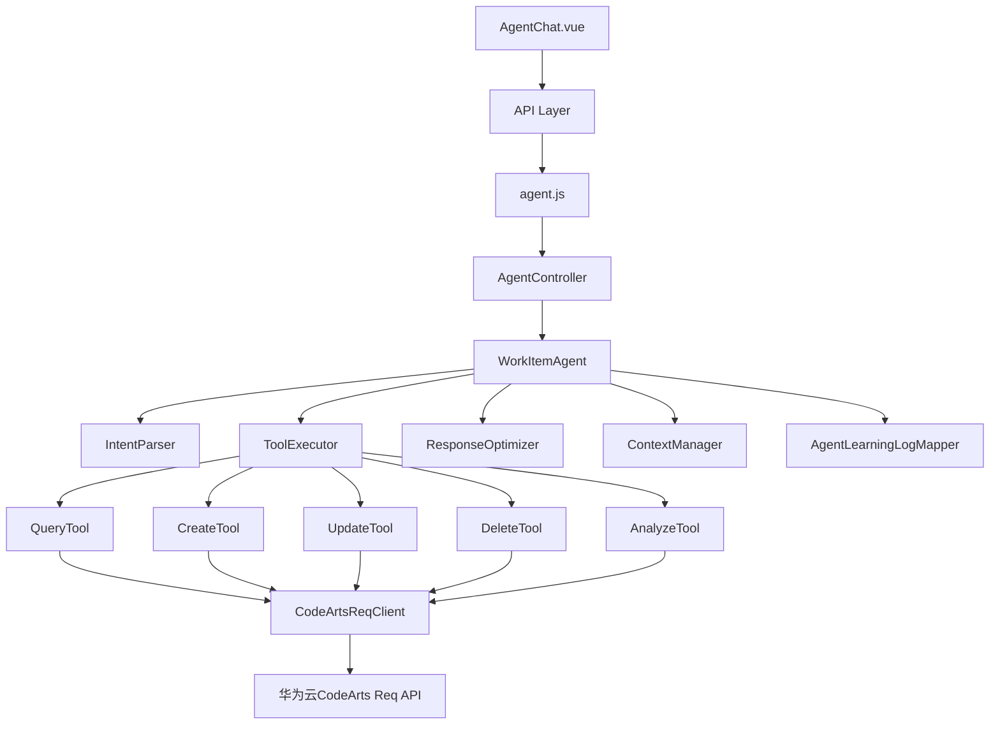
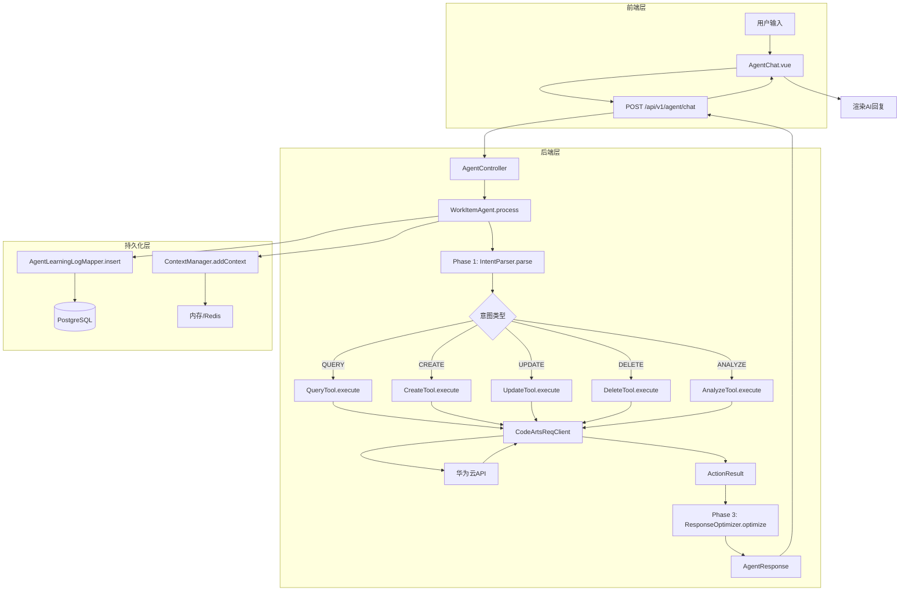
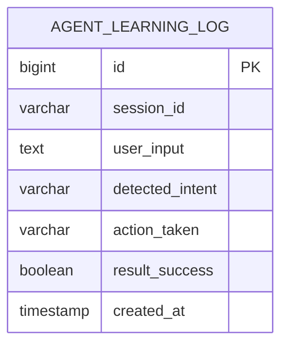
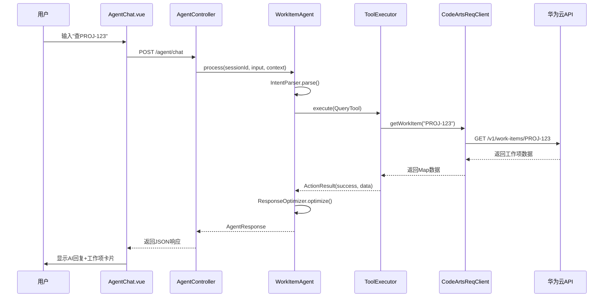

# 项目管理智能体详细技术设计文档（V1 - Plane AI风格）

## 文档版本

| 版本 | 日期 | 作者 | 说明 |
|------|------|------|------|
| V1.0 | 2026-04-26 | AI Assistant | 初始版本 - 基于可视化原型 |

---

## 1. 概述

### 1.1 文档目的
本文档定义项目管理智能体的完整技术实现方案，参考Plane AI的自然语言交互模式，集成华为云CodeArts Req API，实现智能化的工作项管理。

### 1.2 设计目标
- ✅ **自然语言交互**: 用户通过对话而非表单操作工作项
- ✅ **智能意图识别**: 自动理解查询/创建/更新/分析意图
- ✅ **实时API集成**: 调用华为云CodeArts Req进行数据操作
- ✅ **可视化反馈**: 工作项以卡片形式展示
- ✅ **上下文感知**: 记住当前项目和历史对话

### 1.3 参考系统
- **Plane AI**: 自然语言任务管理
- **GitHub Copilot Chat**: 即时反馈、流式响应
- **Notion AI**: 简洁UI、智能建议

### 1.4 相关文档
- [AGENT_UI_PROTOTYPE.md](./AGENT_UI_PROTOTYPE.md) - 可视化原型图

---

## 2. 系统架构

### 2.1 技术栈

#### 前端技术栈
```
Vue 3.4.x          - 渐进式 JavaScript 框架
├─ Composition API - 组合式 API
├─ ref/reactive    - 响应式数据
└─ computed        - 计算属性

Element Plus 2.6.x - UI 组件库
├─ el-card         - 卡片组件
├─ el-button       - 按钮组件
├─ el-input        - 输入框组件
├─ el-message      - 消息提示
└─ el-avatar       - 头像组件

Markdown-it        - Markdown 渲染库
Axios              - HTTP 客户端
```

#### 后端技术栈
```
Spring Boot 3.4.4  - Java Web 框架
MyBatis Plus 3.5.9 - ORM 框架
PostgreSQL 14+     - 关系型数据库
Lombok 1.18.44     - 代码简化工具
Hutool 5.8.22      - Java工具库（HTTP请求）
```

#### AI能力
```
现有架构:
├─ IntentParser    - 意图解析器（规则+关键词匹配）
├─ ToolExecutor    - 工具执行器
├─ ResponseOptimizer - 响应优化器
└─ CodeArtsReqClient - 华为云API客户端
```

**未来扩展**:
- 集成大语言模型（LLM）提升意图识别准确率
- 支持流式响应（SSE）
- RAG检索增强生成

### 2.2 组件架构图



### 2.3 数据流图



---

## 3. 数据库设计

### 3.1 表结构（复用现有）

已存在的表满足需求：

#### agent_learning_log 表
```sql
CREATE TABLE agent_learning_log (
    id BIGSERIAL PRIMARY KEY,
    session_id VARCHAR(64) NOT NULL,
    user_input TEXT NOT NULL,
    detected_intent VARCHAR(50),
    action_taken VARCHAR(50),
    result_success BOOLEAN DEFAULT FALSE,
    optimization_applied TEXT,
    created_at TIMESTAMP DEFAULT CURRENT_TIMESTAMP
);

-- 索引优化
CREATE INDEX idx_agent_log_session ON agent_learning_log(session_id);
CREATE INDEX idx_agent_log_created ON agent_learning_log(created_at DESC);
```

**用途**: 记录Agent学习日志，用于后续分析和优化

### 3.2 ER 图



### 3.3 配置信息存储

**application.yml** 中配置：
```yaml
codearts:
  api:
    base-url: https://openapi.huaweicloud.com
    token: ${CODEARTS_API_TOKEN:}
    project-id: ${CODEARTS_PROJECT_ID:}
```

**环境变量**:
- `CODEARTS_API_TOKEN`: 华为云API Token
- `CODEARTS_PROJECT_ID`: CodeArts项目ID

---

## 4. API 设计

### 4.1 RESTful API 规范

**基础路径**: `/api/v1`

**通用响应格式**:
```json
{
  "code": 200,
  "message": "success",
  "data": { ... }
}
```

### 4.2 Agent 聊天 API

| 方法 | 路径 | 请求体 | 响应 | 说明 |
|------|------|--------|------|------|
| POST | `/agent/chat` | `AgentChatRequest` | `AgentResponse` | 发送消息获取AI回复 |
| GET | `/agent/sessions` | - | `SessionList` | 获取会话列表 |
| DELETE | `/agent/sessions/:id` | - | `void` | 删除会话 |

### 4.3 请求/响应示例

#### AgentChatRequest
```json
{
  "sessionId": "sess_abc123",
  "userInput": "帮我查一下PROJ-123的状态",
  "context": {
    "currentProject": "PROJ-A",
    "lastIntent": "QUERY_WORK_ITEM"
  }
}
```

#### AgentResponse
```json
{
  "content": "✅ 已找到工作项 PROJ-123\n\n📋 **用户登录功能优化**\n- 状态: 🟡 进行中\n- 优先级: 🔴 高\n- 负责人: 张三\n- 截止日期: 2026-05-01",
  "intent": "QUERY_WORK_ITEM",
  "confidence": 0.95,
  "workItem": {
    "id": "PROJ-123",
    "title": "用户登录功能优化",
    "status": "IN_PROGRESS",
    "priority": "HIGH",
    "assignee": "张三",
    "dueDate": "2026-05-01"
  },
  "suggestedActions": [
    {"label": "查看详情", "action": "view", "params": {"id": "PROJ-123"}},
    {"label": "编辑", "action": "edit", "params": {"id": "PROJ-123"}}
  ]
}
```

### 4.4 DTO 定义

#### AgentChatRequest
```java
@Data
public class AgentChatRequest {
    @NotBlank
    private String sessionId;
    
    @NotBlank
    private String userInput;
    
    private Map<String, Object> context;
}
```

#### AgentResponse
```java
@Data
public class AgentResponse {
    private String content;           // AI回复内容（支持Markdown）
    private String intent;            // 识别的意图
    private Double confidence;        // 置信度
    private Map<String, Object> workItem; // 相关工作项数据
    private List<Map<String, Object>> suggestedActions; // 建议操作
}
```

---

## 5. 前端详细设计

### 5.1 AgentChat.vue 完整实现

```vue
<template>
  <div class="agent-chat-container">
    <!-- 顶部导航栏 -->
    <div class="chat-header">
      <el-page-header @back="goBack">
        <template #content>
          <span class="page-title">Agent智能助手</span>
        </template>
      </el-page-header>
      <div class="header-actions">
        <el-button :icon="BarChart" @click="showStats = !showStats">统计</el-button>
        <el-button :icon="Setting" @click="showSettings = true">设置</el-button>
      </div>
    </div>

    <!-- 主体内容 -->
    <div class="chat-body">
      <!-- 侧边栏 -->
      <aside class="sidebar" :class="{ collapsed: sidebarCollapsed }">
        <!-- 会话历史 -->
        <div class="session-history">
          <h3>📋 会话历史</h3>
          <el-button 
            type="primary" 
            plain 
            size="small" 
            @click="createNewSession"
            style="width: 100%; margin-bottom: 10px"
          >
            ✨ 新对话
          </el-button>
          
          <div class="session-list">
            <div
              v-for="session in sessions"
              :key="session.id"
              class="session-item"
              :class="{ active: currentSessionId === session.id }"
              @click="switchSession(session.id)"
            >
              <span>{{ session.name }}</span>
              <el-icon class="delete-icon" @click.stop="deleteSession(session.id)">
                <Close />
              </el-icon>
            </div>
          </div>
        </div>

        <!-- 上下文信息 -->
        <div class="context-info">
          <h3>ℹ️ 当前上下文</h3>
          <div class="info-item">
            <label>当前项目:</label>
            <span>{{ currentProject?.name || '未选择' }}</span>
          </div>
          <div class="info-item">
            <label>工作项总数:</label>
            <span>{{ stats.totalCount || 0 }}</span>
          </div>
        </div>
      </aside>

      <!-- 对话主区域 -->
      <main class="chat-main">
        <!-- 消息列表 -->
        <div class="message-list" ref="messageListRef">
          <div
            v-for="msg in messages"
            :key="msg.id"
            class="message-item"
            :class="msg.role"
          >
            <!-- AI消息 -->
            <div v-if="msg.role === 'assistant'" class="message-content">
              <el-avatar :size="32" class="avatar">🤖</el-avatar>
              <div class="message-bubble">
                <div class="message-text" v-html="renderMarkdown(msg.content)"></div>
                
                <!-- 工作项卡片 -->
                <div v-if="msg.workItem" class="work-item-card">
                  <div class="card-header">
                    <span class="card-title">📋 {{ msg.workItem.id }}: {{ msg.workItem.title }}</span>
                  </div>
                  <div class="card-body">
                    <div class="card-field">
                      <label>状态:</label>
                      <el-tag :type="getStatusType(msg.workItem.status)" size="small">
                        {{ getStatusText(msg.workItem.status) }}
                      </el-tag>
                    </div>
                    <div class="card-field">
                      <label>优先级:</label>
                      <el-tag :type="getPriorityType(msg.workItem.priority)" size="small">
                        {{ getPriorityText(msg.workItem.priority) }}
                      </el-tag>
                    </div>
                    <div class="card-field">
                      <label>负责人:</label>
                      <span>{{ msg.workItem.assignee || '未分配' }}</span>
                    </div>
                    <div class="card-field">
                      <label>截止日期:</label>
                      <span>{{ msg.workItem.dueDate || '无' }}</span>
                    </div>
                  </div>
                  <div class="card-actions">
                    <el-button size="small" @click="viewWorkItem(msg.workItem.id)">
                      查看详情
                    </el-button>
                    <el-button size="small" type="primary" @click="editWorkItem(msg.workItem.id)">
                      编辑
                    </el-button>
                  </div>
                </div>

                <!-- 建议操作 -->
                <div v-if="msg.suggestedActions && msg.suggestedActions.length > 0" class="suggested-actions">
                  <div class="suggestion-label">💡 你可以继续：</div>
                  <el-button
                    v-for="action in msg.suggestedActions"
                    :key="action.label"
                    size="small"
                    plain
                    @click="executeSuggestion(action)"
                  >
                    {{ action.label }}
                  </el-button>
                </div>
              </div>
            </div>

            <!-- 用户消息 -->
            <div v-else class="message-content">
              <div class="message-bubble user">
                <div class="message-text">{{ msg.content }}</div>
              </div>
              <el-avatar :size="32" class="avatar">👤</el-avatar>
            </div>
          </div>

          <!-- 加载中提示 -->
          <div v-if="isTyping" class="message-item assistant">
            <div class="message-content">
              <el-avatar :size="32" class="avatar">🤖</el-avatar>
              <div class="message-bubble typing">
                <span class="typing-dot"></span>
                <span class="typing-dot"></span>
                <span class="typing-dot"></span>
              </div>
            </div>
          </div>
        </div>

        <!-- 输入区域 -->
        <div class="input-area">
          <!-- 快捷操作按钮 -->
          <div class="quick-actions">
            <el-button size="small" @click="fillTemplate('query')">🔍 查询</el-button>
            <el-button size="small" @click="fillTemplate('create')">➕ 创建</el-button>
            <el-button size="small" @click="fillTemplate('update')">✏️ 更新</el-button>
            <el-button size="small" @click="fillTemplate('analyze')">📊 分析</el-button>
          </div>

          <!-- 文本输入框 -->
          <div class="input-wrapper">
            <el-input
              v-model="userInput"
              type="textarea"
              :rows="1"
              :autosize="{ minRows: 1, maxRows: 5 }"
              placeholder="💬 输入自然语言指令..."
              @keydown.enter.exact.prevent="sendMessage"
              @keydown.enter.shift.exact="userInput += '\n'"
            />
            <el-button
              type="primary"
              :icon="Promotion"
              :loading="loading"
              :disabled="!userInput.trim()"
              @click="sendMessage"
              class="send-btn"
            >
              发送
            </el-button>
          </div>
        </div>
      </main>
    </div>

    <!-- 设置对话框 -->
    <el-dialog v-model="showSettings" title="Agent设置" width="500px">
      <el-form label-width="120px">
        <el-form-item label="当前项目">
          <el-select v-model="currentProjectId" placeholder="选择项目">
            <el-option
              v-for="project in projects"
              :key="project.id"
              :label="project.name"
              :value="project.id"
            />
          </el-select>
        </el-form-item>
        <el-form-item label="API Token">
          <el-input v-model="apiToken" type="password" show-password />
        </el-form-item>
      </el-form>
      <template #footer>
        <el-button @click="showSettings = false">取消</el-button>
        <el-button type="primary" @click="saveSettings">保存</el-button>
      </template>
    </el-dialog>
  </div>
</template>

<script setup>
import { ref, computed, onMounted, nextTick } from 'vue'
import { useRouter } from 'vue-router'
import { ElMessage, ElMessageBox } from 'element-plus'
import { BarChart, Setting, Close, Promotion } from '@element-plus/icons-vue'
import MarkdownIt from 'markdown-it'
import { sendMessage as sendAgentMessage, getSessions, deleteSession as deleteSessionAPI } from '@/api/agent'

const router = useRouter()
const md = new MarkdownIt()

// ========== 核心状态 ==========
const messages = ref([])
const currentSessionId = ref(null)
const isTyping = ref(false)
const userInput = ref('')
const loading = ref(false)
const sidebarCollapsed = ref(false)
const showSettings = ref(false)
const showStats = ref(false)

const sessions = ref([])
const currentProject = ref(null)
const currentProjectId = ref(null)
const apiToken = ref('')
const projects = ref([])
const stats = ref({})

const messageListRef = ref(null)

// ========== 计算属性 ==========
const hasMessages = computed(() => messages.value.length > 0)

// ========== 初始化 ==========
onMounted(async () => {
  await loadSessions()
  if (sessions.value.length > 0) {
    switchSession(sessions.value[0].id)
  } else {
    createNewSession()
  }
  await loadProjects()
})

// ========== 数据加载 ==========
const loadSessions = async () => {
  try {
    sessions.value = await getSessions()
  } catch (error) {
    ElMessage.error('加载会话失败: ' + error.message)
  }
}

const loadProjects = async () => {
  // TODO: 从API加载项目列表
  projects.value = [
    { id: 'PROJ-A', name: '项目A' },
    { id: 'PROJ-B', name: '项目B' }
  ]
}

// ========== 会话管理 ==========
const createNewSession = () => {
  const newSession = {
    id: `sess_${Date.now()}`,
    name: `新对话 ${sessions.value.length + 1}`
  }
  sessions.value.unshift(newSession)
  switchSession(newSession.id)
}

const switchSession = async (sessionId) => {
  currentSessionId.value = sessionId
  messages.value = []
  
  // TODO: 从API加载历史消息
  // messages.value = await getMessageHistory(sessionId)
}

const deleteSession = async (sessionId) => {
  try {
    await ElMessageBox.confirm('确定要删除这个会话吗？', '警告', { type: 'warning' })
    await deleteSessionAPI(sessionId)
    await loadSessions()
    
    if (currentSessionId.value === sessionId && sessions.value.length > 0) {
      switchSession(sessions.value[0].id)
    }
    
    ElMessage.success('删除成功')
  } catch (error) {
    if (error !== 'cancel') {
      ElMessage.error('删除失败: ' + error.message)
    }
  }
}

// ========== 消息发送 ==========
const sendMessage = async () => {
  if (!userInput.value.trim()) return
  
  const userMessage = {
    id: Date.now(),
    role: 'user',
    content: userInput.value
  }
  
  messages.value.push(userMessage)
  const currentUserInput = userInput.value
  userInput.value = ''
  
  // 滚动到底部
  await nextTick()
  scrollToBottom()
  
  // 调用API
  loading.value = true
  isTyping.value = true
  
  try {
    const response = await sendAgentMessage({
      sessionId: currentSessionId.value,
      userInput: currentUserInput,
      context: {
        currentProject: currentProjectId.value
      }
    })
    
    const aiMessage = {
      id: Date.now() + 1,
      role: 'assistant',
      content: response.content,
      workItem: response.workItem,
      suggestedActions: response.suggestedActions
    }
    
    messages.value.push(aiMessage)
    
    // 更新上下文
    if (response.workItem) {
      updateContext(response.workItem)
    }
    
  } catch (error) {
    ElMessage.error('发送失败: ' + error.message)
  } finally {
    loading.value = false
    isTyping.value = false
    await nextTick()
    scrollToBottom()
  }
}

// ========== 辅助函数 ==========
const renderMarkdown = (text) => {
  return md.render(text)
}

const getStatusType = (status) => {
  const map = {
    'TODO': 'info',
    'IN_PROGRESS': 'warning',
    'DONE': 'success',
    'CLOSED': 'info'
  }
  return map[status] || ''
}

const getStatusText = (status) => {
  const map = {
    'TODO': '待办',
    'IN_PROGRESS': '进行中',
    'DONE': '已完成',
    'CLOSED': '已关闭'
  }
  return map[status] || status
}

const getPriorityType = (priority) => {
  const map = {
    'LOW': 'info',
    'MEDIUM': '',
    'HIGH': 'warning',
    'CRITICAL': 'danger'
  }
  return map[priority] || ''
}

const getPriorityText = (priority) => {
  const map = {
    'LOW': '低',
    'MEDIUM': '中',
    'HIGH': '高',
    'CRITICAL': '紧急'
  }
  return map[priority] || priority
}

const fillTemplate = (type) => {
  const templates = {
    query: '帮我查一下工作项 ',
    create: '创建一个任务：，优先级，分配给',
    update: '更新工作项 的',
    analyze: '分析一下当前项目的'
  }
  userInput.value = templates[type] || ''
}

const executeSuggestion = (action) => {
  // TODO: 执行建议操作
  console.log('Execute suggestion:', action)
}

const viewWorkItem = (id) => {
  // TODO: 跳转到工作项详情页
  console.log('View work item:', id)
}

const editWorkItem = (id) => {
  userInput.value = `更新工作项 ${id} 的`
}

const updateContext = (workItem) => {
  // TODO: 更新上下文信息
  console.log('Update context:', workItem)
}

const scrollToBottom = () => {
  if (messageListRef.value) {
    messageListRef.value.scrollTop = messageListRef.value.scrollHeight
  }
}

const goBack = () => {
  router.back()
}

const saveSettings = async () => {
  // TODO: 保存设置到后端
  ElMessage.success('设置已保存')
  showSettings.value = false
}
</script>

<style scoped lang="scss">
.agent-chat-container {
  height: 100vh;
  display: flex;
  flex-direction: column;
  background: #f5f7fa;
  
  .chat-header {
    display: flex;
    justify-content: space-between;
    align-items: center;
    padding: 16px 24px;
    background: #fff;
    border-bottom: 1px solid #dcdfe6;
    
    .page-title {
      font-size: 18px;
      font-weight: 600;
    }
    
    .header-actions {
      display: flex;
      gap: 10px;
    }
  }
  
  .chat-body {
    flex: 1;
    display: flex;
    overflow: hidden;
    
    .sidebar {
      width: 280px;
      background: #fff;
      border-right: 1px solid #dcdfe6;
      display: flex;
      flex-direction: column;
      padding: 16px;
      
      &.collapsed {
        width: 0;
        padding: 0;
        overflow: hidden;
      }
      
      h3 {
        font-size: 14px;
        font-weight: 600;
        margin: 0 0 12px 0;
        color: #303133;
      }
      
      .session-history {
        margin-bottom: 24px;
        
        .session-list {
          max-height: 300px;
          overflow-y: auto;
          
          .session-item {
            display: flex;
            justify-content: space-between;
            align-items: center;
            padding: 8px 12px;
            margin-bottom: 4px;
            border-radius: 4px;
            cursor: pointer;
            transition: all 0.2s;
            
            &:hover {
              background: #f5f7fa;
              
              .delete-icon {
                opacity: 1;
              }
            }
            
            &.active {
              background: #ecf5ff;
              color: #409eff;
            }
            
            .delete-icon {
              opacity: 0;
              transition: opacity 0.2s;
              
              &:hover {
                color: #f56c6c;
              }
            }
          }
        }
      }
      
      .context-info {
        .info-item {
          display: flex;
          justify-content: space-between;
          padding: 8px 0;
          border-bottom: 1px solid #ebeef5;
          font-size: 13px;
          
          label {
            color: #909399;
          }
          
          span {
            color: #303133;
            font-weight: 500;
          }
        }
      }
    }
    
    .chat-main {
      flex: 1;
      display: flex;
      flex-direction: column;
      overflow: hidden;
      
      .message-list {
        flex: 1;
        overflow-y: auto;
        padding: 24px;
        
        .message-item {
          margin-bottom: 24px;
          
          &.user {
            .message-content {
              flex-direction: row-reverse;
              
              .message-bubble {
                background: #409eff;
                color: #fff;
                
                &.user {
                  background: #409eff;
                }
              }
            }
          }
          
          .message-content {
            display: flex;
            gap: 12px;
            align-items: flex-start;
            
            .avatar {
              flex-shrink: 0;
            }
            
            .message-bubble {
              max-width: 70%;
              padding: 12px 16px;
              background: #fff;
              border-radius: 8px;
              box-shadow: 0 2px 8px rgba(0, 0, 0, 0.05);
              
              .message-text {
                font-size: 14px;
                line-height: 1.6;
                
                :deep(p) {
                  margin: 0 0 8px 0;
                  
                  &:last-child {
                    margin-bottom: 0;
                  }
                }
              }
              
              &.typing {
                display: flex;
                gap: 4px;
                padding: 16px;
                
                .typing-dot {
                  width: 8px;
                  height: 8px;
                  border-radius: 50%;
                  background: #909399;
                  animation: typing 1.4s infinite;
                  
                  &:nth-child(2) {
                    animation-delay: 0.2s;
                  }
                  
                  &:nth-child(3) {
                    animation-delay: 0.4s;
                  }
                }
              }
            }
          }
        }
        
        // 工作项卡片
        .work-item-card {
          margin-top: 12px;
          border: 1px solid #dcdfe6;
          border-radius: 8px;
          overflow: hidden;
          
          .card-header {
            padding: 12px 16px;
            background: #f5f7fa;
            border-bottom: 1px solid #dcdfe6;
            
            .card-title {
              font-weight: 600;
              font-size: 14px;
            }
          }
          
          .card-body {
            padding: 12px 16px;
            
            .card-field {
              display: flex;
              align-items: center;
              margin-bottom: 8px;
              font-size: 13px;
              
              &:last-child {
                margin-bottom: 0;
              }
              
              label {
                width: 70px;
                color: #909399;
                flex-shrink: 0;
              }
              
              span {
                color: #303133;
              }
            }
          }
          
          .card-actions {
            padding: 12px 16px;
            border-top: 1px solid #dcdfe6;
            display: flex;
            gap: 8px;
          }
        }
        
        // 建议操作
        .suggested-actions {
          margin-top: 12px;
          
          .suggestion-label {
            font-size: 12px;
            color: #909399;
            margin-bottom: 8px;
          }
          
          .el-button {
            margin-right: 8px;
            margin-bottom: 8px;
          }
        }
      }
      
      .input-area {
        padding: 16px 24px;
        background: #fff;
        border-top: 1px solid #dcdfe6;
        
        .quick-actions {
          margin-bottom: 12px;
          display: flex;
          gap: 8px;
        }
        
        .input-wrapper {
          display: flex;
          gap: 12px;
          align-items: flex-end;
          
          .el-textarea {
            flex: 1;
          }
          
          .send-btn {
            flex-shrink: 0;
          }
        }
      }
    }
  }
}

@keyframes typing {
  0%, 60%, 100% {
    transform: translateY(0);
  }
  30% {
    transform: translateY(-10px);
  }
}
</style>
```

### 5.2 API 封装

#### src/api/agent.js
```javascript
import request from '@/utils/request'

/**
 * 发送消息获取AI回复
 */
export const sendMessage = (data) => {
  return request({
    url: '/agent/chat',
    method: 'post',
    data
  })
}

/**
 * 获取会话列表
 */
export const getSessions = () => {
  return request({
    url: '/agent/sessions',
    method: 'get'
  })
}

/**
 * 删除会话
 */
export const deleteSession = (sessionId) => {
  return request({
    url: `/agent/sessions/${sessionId}`,
    method: 'delete'
  })
}
```

---

## 6. 后端详细设计

### 6.1 AgentController

```java
package com.workitem.controller;

import com.workitem.agent.AgentResponse;
import com.workitem.agent.WorkItemAgent;
import com.workitem.dto.AgentChatRequest;
import lombok.RequiredArgsConstructor;
import org.springframework.web.bind.annotation.*;

@RestController
@RequestMapping("/api/v1/agent")
@RequiredArgsConstructor
public class AgentController {
    
    private final WorkItemAgent agent;
    
    @PostMapping("/chat")
    public Result<AgentResponse> chat(@RequestBody AgentChatRequest request) {
        AgentResponse response = agent.process(
            request.getSessionId(),
            request.getUserInput(),
            request.getContext()
        );
        return Result.success(response);
    }
    
    @GetMapping("/sessions")
    public Result<List<Map<String, Object>>> getSessions() {
        // TODO: 从数据库或Redis加载会话列表
        return Result.success(List.of());
    }
    
    @DeleteMapping("/sessions/{sessionId}")
    public Result<Void> deleteSession(@PathVariable String sessionId) {
        // TODO: 删除会话
        return Result.success(null);
    }
}
```

### 6.2 IntentParser 增强

需要增强意图识别能力，支持更多场景：

```java
@Component
public class IntentParser {
    
    public IntentResult parse(String userInput, Map<String, Object> context) {
        String lowerInput = userInput.toLowerCase();
        
        // 查询意图
        if (lowerInput.contains("查询") || lowerInput.contains("查找") || 
            lowerInput.contains("查看") || lowerInput.matches(".*[A-Z]+-\\d+.*")) {
            return parseQueryIntent(userInput);
        }
        
        // 创建意图
        if (lowerInput.contains("创建") || lowerInput.contains("新建") || 
            lowerInput.contains("添加")) {
            return parseCreateIntent(userInput);
        }
        
        // 更新意图
        if (lowerInput.contains("更新") || lowerInput.contains("修改") || 
            lowerInput.contains("变更")) {
            return parseUpdateIntent(userInput);
        }
        
        // 删除意图
        if (lowerInput.contains("删除") || lowerInput.contains("移除")) {
            return parseDeleteIntent(userInput);
        }
        
        // 分析意图
        if (lowerInput.contains("分析") || lowerInput.contains("统计") || 
            lowerInput.contains("多少")) {
            return parseAnalyzeIntent(userInput);
        }
        
        // 默认：未知意图
        return new IntentResult("UNKNOWN", 0.5, Map.of());
    }
    
    private IntentResult parseQueryIntent(String input) {
        // 提取工作项ID
        Pattern pattern = Pattern.compile("([A-Z]+-\\d+)");
        Matcher matcher = pattern.matcher(input);
        
        Map<String, Object> params = new HashMap<>();
        if (matcher.find()) {
            params.put("workItemId", matcher.group(1));
        }
        
        return new IntentResult("QUERY_WORK_ITEM", 0.95, params);
    }
    
    // 其他解析方法...
}
```

### 6.3 ResponseOptimizer

优化AI回复，生成结构化响应：

```java
@Component
public class ResponseOptimizer {
    
    public AgentResponse optimize(IntentResult intent, ActionResult action, 
                                  Map<String, Object> context) {
        AgentResponse response = new AgentResponse();
        response.setIntent(intent.getIntent());
        response.setConfidence(intent.getConfidence());
        
        if (!action.isSuccess()) {
            response.setContent("❌ 操作失败: " + action.getError());
            return response;
        }
        
        switch (intent.getIntent()) {
            case "QUERY_WORK_ITEM":
                return optimizeQueryResponse(action.getData());
            case "CREATE_WORK_ITEM":
                return optimizeCreateResponse(action.getData());
            case "UPDATE_WORK_ITEM":
                return optimizeUpdateResponse(action.getData());
            case "ANALYZE_PROJECT":
                return optimizeAnalyzeResponse(action.getData());
            default:
                response.setContent("✅ 操作成功");
                return response;
        }
    }
    
    private AgentResponse optimizeQueryResponse(Object data) {
        AgentResponse response = new AgentResponse();
        Map<String, Object> workItem = (Map<String, Object>) data;
        
        StringBuilder content = new StringBuilder();
        content.append("✅ 已找到工作项 ").append(workItem.get("id")).append("\n\n");
        content.append("📋 **").append(workItem.get("title")).append("**\n");
        content.append("- 状态: ").append(getStatusEmoji(workItem.get("status"))).append(" ")
               .append(getStatusText(workItem.get("status"))).append("\n");
        content.append("- 优先级: ").append(getPriorityEmoji(workItem.get("priority"))).append(" ")
               .append(getPriorityText(workItem.get("priority"))).append("\n");
        content.append("- 负责人: ").append(workItem.getOrDefault("assignee", "未分配")).append("\n");
        content.append("- 截止日期: ").append(workItem.getOrDefault("dueDate", "无"));
        
        response.setContent(content.toString());
        response.setWorkItem(workItem);
        response.setSuggestedActions(Arrays.asList(
            Map.of("label", "查看详情", "action", "view", "params", Map.of("id", workItem.get("id"))),
            Map.of("label", "编辑", "action", "edit", "params", Map.of("id", workItem.get("id")))
        ));
        
        return response;
    }
    
    // 其他优化方法...
}
```

---

## 7. 交互设计

### 7.1 时序图



### 7.2 错误处理

| 错误场景 | 处理方式 | 用户提示 |
|----------|----------|----------|
| API Token无效 | 捕获异常，提示配置 | ❌ "API Token无效，请在设置中配置" |
| 网络超时 | 重试机制（最多3次） | ⚠️ "网络超时，正在重试..." |
| 工作项不存在 | 返回友好提示 | ❌ "未找到工作项 PROJ-999" |
| 意图识别失败 | 引导用户澄清 | 💡 "我不太理解，您可以这样说：..." |
| 权限不足 | 提示联系管理员 | ❌ "权限不足，请联系项目管理员" |

---

## 8. 性能优化

### 8.1 前端优化
- **虚拟滚动**: 消息超过50条时启用
- **Markdown缓存**: 使用`marked`库缓存渲染结果
- **防抖输入**: 输入框防抖300ms

### 8.2 后端优化
- **HTTP连接池**: Hutool HttpClient复用连接
- **异步日志**: Agent学习日志异步写入
- **缓存上下文**: Redis缓存会话上下文（TTL: 30min）

---

## 9. 测试策略

### 9.1 单元测试

```java
@SpringBootTest
class IntentParserTest {
    
    @Autowired
    private IntentParser parser;
    
    @Test
    void testParseQueryIntent() {
        IntentResult result = parser.parse("帮我查一下PROJ-123", Map.of());
        assertEquals("QUERY_WORK_ITEM", result.getIntent());
        assertTrue(result.getConfidence() > 0.9);
    }
    
    @Test
    void testParseCreateIntent() {
        IntentResult result = parser.parse("创建一个任务：优化登录页面", Map.of());
        assertEquals("CREATE_WORK_ITEM", result.getIntent());
    }
}
```

### 9.2 集成测试

```java
@SpringBootTest
class AgentIntegrationTest {
    
    @Autowired
    private WorkItemAgent agent;
    
    @Test
    void testFullConversation() {
        AgentResponse response = agent.process(
            "test-session",
            "查询PROJ-123",
            Map.of("currentProject", "PROJ-A")
        );
        
        assertNotNull(response);
        assertEquals("QUERY_WORK_ITEM", response.getIntent());
        assertNotNull(response.getWorkItem());
    }
}
```

---

## 10. 验收标准

### 10.1 功能验收

- [ ] 能发起自然语言对话
- [ ] 能正确识别查询/创建/更新/分析意图
- [ ] 能调用华为云CodeArts Req API
- [ ] 能以卡片形式展示工作项
- [ ] 能保持对话上下文
- [ ] 能切换不同会话
- [ ] 能提供快捷操作模板
- [ ] 错误时有友好提示

### 10.2 体验验收

- [ ] 响应时间 < 2s（简单查询）
- [ ] 输入框支持快捷键（Enter发送）
- [ ] 消息滚动流畅
- [ ] 工作项卡片信息完整
- [ ] 加载状态明确（打字动画）
- [ ] 空状态有引导文案

### 10.3 性能验收

- [ ] 首屏加载 < 1.5s
- [ ] 消息渲染 < 100ms
- [ ] 支持100+条消息无卡顿
- [ ] 内存占用 < 100MB

### 10.4 兼容性验收

- [ ] Chrome 最新版
- [ ] Firefox 最新版
- [ ] Safari 最新版
- [ ] Edge 最新版
- [ ] 移动端浏览器

---

## 11. 实施步骤

### Step 1: 后端开发
1. ✅ CodeArtsReqClient（已存在）
2. ✅ QueryTool/CreateTool/UpdateTool/DeleteTool/AnalyzeTool（已存在）
3. ✅ IntentParser（需增强）
4. ✅ ResponseOptimizer（需完善）
5. ✅ AgentController（需创建）
6. ⏳ AgentChatRequest/AgentResponse DTO（需创建）

### Step 2: 前端开发
1. ⏳ agent.js API封装
2. ⏳ AgentChat.vue 组件实现
3. ⏳ 路由配置
4. ⏳ 菜单集成

### Step 3: 联调测试
1. ⏳ 功能测试
2. ⏳ 性能测试
3. ⏳ 兼容性测试

---

**文档结束**
