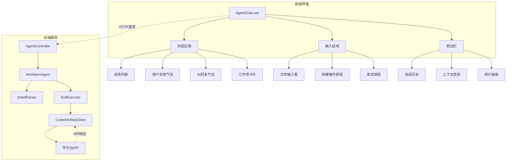
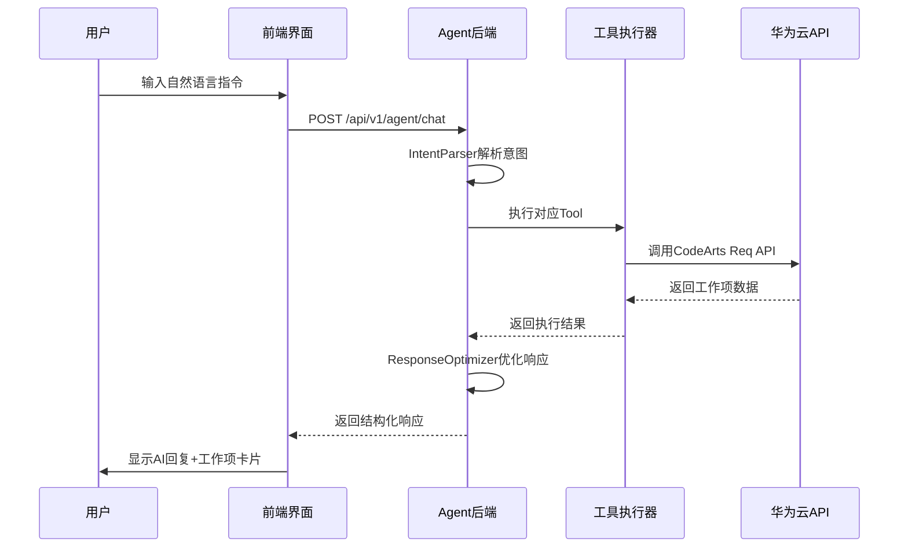
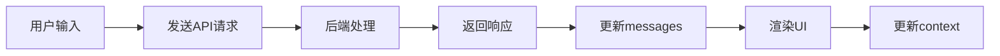

# 项目管理智能体 UI 原型设计

## 文档版本

| 版本 | 日期 | 作者 | 说明 |
|------|------|------|------|
| V1.0 | 2026-04-26 | AI Assistant | 初始版本 - Plane AI风格智能助手 |

---

## 0. 可视化原型图

### 0.1 整体布局架构图



### 0.2 页面布局示意图（ASCII Art）

```
┌──────────────────────────────────────────────────────────────────────┐
│  顶部导航栏 (60px)                                                    │
│  [← 返回]  Agent智能助手                              [📊 统计] [⚙️设置] │
├──────────┬───────────────────────────────────────────────────────────┤
│          │                                                           │
│  侧边栏   │              对话主区域                                     │
│  (280px) │  ┌─────────────────────────────────────────────────┐    │
│          │  │ 🤖 AI: 你好！我是项目管理智能助手，可以帮你：      │    │
│  📋 会话  │  │    • 查询工作项状态                              │    │
│  历史     │  │    • 创建/更新工作项                             │    │
│          │  │    • 分析项目进度                                │    │
│  - 新对话 │  │    • 生成周报                                    │    │
│  - 项目A  │  └─────────────────────────────────────────────────┘    │
│  - 项目B  │  ┌─────────────────────────────────────────────────┐    │
│          │  │ 👤 你: 帮我查一下PROJ-123的状态                    │    │
│  ℹ️ 上下  │  └─────────────────────────────────────────────────┘    │
│  文信息   │  ┌─────────────────────────────────────────────────┐    │
│          │  │ 🤖 AI:                                            │    │
│  当前项目:│  │ ✅ 已找到工作项 PROJ-123                          │    │
│  PROJ-A   │  │                                                  │    │
│  工作项数:│  │ ┌──────────────────────────────────────────┐   │    │
│  45       │  │ │ 📋 PROJ-123: 用户登录功能优化             │   │    │
│          │  │ │ 状态: 🟡 进行中                            │   │    │
│  ⏱️ 工时  │  │ │ 优先级: 🔴 高                             │   │    │
│  本周: 12h│  │ │ 负责人: 张三                              │   │    │
│          │  │ │ 截止日期: 2026-05-01                      │   │    │
│          │  │ └──────────────────────────────────────────┘   │    │
│          │  └─────────────────────────────────────────────────┘    │
│          │  ┌─────────────────────────────────────────────────┐    │
│          │  │ 💡 你可以继续问我：                               │    │
│          │  │    • "更新这个工作项的优先级为紧急"               │    │
│          │  │    • "查看该项目的所有缺陷"                       │    │
│          │  └─────────────────────────────────────────────────┘    │
│          │                                                           │
│          │  ┌─────────────────────────────────────────────────┐    │
│          │  │ [💬 输入自然语言指令...              ] [📤 发送] │    │
│          │  │                                                  │    │
│          │  │ [🔍 查询] [➕ 创建] [✏️ 更新] [📊 分析]         │    │
│          │  └─────────────────────────────────────────────────┘    │
└──────────┴───────────────────────────────────────────────────────────┘
```

### 0.3 交互流程图



### 0.4 核心交互场景

#### 场景1：查询工作项
```
用户输入: "帮我查一下PROJ-123的状态"
    ↓
AI识别: QUERY_WORK_ITEM (confidence: 0.95)
    ↓
执行: QueryTool.execute({workItemId: "PROJ-123"})
    ↓
调用: CodeArtsReqClient.getWorkItem("PROJ-123")
    ↓
返回: {id: "PROJ-123", title: "...", status: "进行中", ...}
    ↓
AI回复: 展示工作项卡片 + 自然语言总结
```

#### 场景2：创建工作项
```
用户输入: "创建一个任务：优化登录页面性能，优先级高，分配给李四"
    ↓
AI识别: CREATE_WORK_ITEM (confidence: 0.92)
    ↓
提取参数: {title: "优化登录页面性能", priority: "高", assignee: "李四"}
    ↓
执行: CreateTool.execute(params)
    ↓
调用: CodeArtsReqClient.createWorkItem(params)
    ↓
返回: {id: "PROJ-124", ...}
    ↓
AI回复: "✅ 已创建工作项 PROJ-124" + 工作项卡片
```

#### 场景3：批量查询与分析
```
用户输入: "这个项目有多少个未完成的缺陷？"
    ↓
AI识别: ANALYZE_PROJECT (confidence: 0.88)
    ↓
执行: AnalyzeTool.execute({projectKey: "PROJ", type: "缺陷", status: "未完成"})
    ↓
调用: CodeArtsReqClient.listWorkItems(...)
    ↓
分析: 统计数据 + 趋势图表
    ↓
AI回复: "📊 当前项目有15个未完成缺陷，其中5个高优先级..."
```

---

## 1. 设计理念

### 1.1 参考系统
- **Plane AI**: 自然语言交互、智能任务管理、上下文感知
- **GitHub Copilot Chat**: 代码辅助、即时反馈、流式响应
- **Notion AI**: 文档生成、智能建议、简洁UI

### 1.2 核心交互模式
- **自然语言驱动**: 用户通过对话而非表单操作工作项
- **智能意图识别**: 自动理解用户意图并执行对应操作
- **可视化反馈**: 工作项以卡片形式展示，直观清晰
- **上下文感知**: 记住当前项目和历史对话，提供个性化建议
- **渐进式披露**: 简单操作一步完成，复杂操作引导式交互

### 1.3 设计原则
- ✅ **简洁优先**: 减少认知负担，聚焦核心功能
- ✅ **即时反馈**: 所有操作都有明确的视觉反馈
- ✅ **容错性强**: 支持模糊输入，智能纠错
- ✅ **可扩展性**: 预留接口支持更多AI能力

---

## 2. 页面组件说明

### 2.1 对话主区域 (Chat Area)

#### 消息气泡组件
```
┌────────────────────────────────────────┐
│ 🤖 AI助手                              │
│                                        │
│ 这里是AI的自然语言回复内容...           │
│                                        │
│ [工作项卡片 - 可选]                    │
│                                        │
│ 💡 建议操作: [按钮1] [按钮2]           │
└────────────────────────────────────────┘
```

**特性**:
- 支持Markdown渲染
- 支持工作项卡片嵌入
- 支持快捷操作按钮
- 区分用户/AI样式（左/右对齐）

#### 工作项卡片组件
```
┌────────────────────────────────────────┐
│ 📋 PROJ-123: 用户登录功能优化           │
│ ─────────────────────────────────────  │
│ 状态: 🟡 进行中                         │
│ 优先级: 🔴 高                           │
│ 负责人: 👤 张三                         │
│ 截止日期: 📅 2026-05-01                │
│ ─────────────────────────────────────  │
│ [查看详情] [编辑] [关闭]                │
└────────────────────────────────────────┘
```

**字段映射**:
- 标题 → work_item.title
- 状态 → work_item.status (带颜色标签)
- 优先级 → work_item.priority (带图标)
- 负责人 → work_item.assignee
- 截止日期 → work_item.due_date

### 2.2 输入区域 (Input Area)

#### 文本输入框
```
┌────────────────────────────────────────┐
│ 💬 输入自然语言指令...                  │
│                                        │
│ [🔍查询] [➕创建] [✏️更新] [📊分析]   │
│                              [📤 发送] │
└────────────────────────────────────────┘
```

**特性**:
- 支持多行输入（Shift+Enter换行）
- Enter键发送
- 快捷操作按钮（预填充模板）
- 自动高度调整（最大5行）

#### 快捷操作模板
| 按钮 | 预填充文本 |
|------|-----------|
| 🔍 查询 | "帮我查一下工作项 " |
| ➕ 创建 | "创建一个任务：，优先级，分配给" |
| ✏️ 更新 | "更新工作项 的" |
| 📊 分析 | "分析一下当前项目的" |

### 2.3 侧边栏 (Sidebar)

#### 会话历史
```
📋 会话历史
────────────
✨ 新对话
📁 项目A (12条)
📁 项目B (8条)
📝 上周工作总结
```

**功能**:
- 点击切换会话
- 右键删除/重命名
- 自动保存最近20个会话

#### 上下文信息
```
ℹ️ 当前上下文
────────────
当前项目: PROJ-A
工作项总数: 45
本周新增: 8
本周完成: 5
```

**动态更新**:
- 根据对话自动识别项目
- 实时同步工作项统计

#### 统计面板
```
⏱️ 工时统计
────────────
本周: 12h / 40h
本月: 48h / 160h
趋势: 📈 +15%
```

---

## 3. 拖拽交互细节

### 3.1 不适用场景
本功能以对话交互为主，不涉及拖拽操作。

---

## 4. 状态管理

### 4.1 核心状态定义

```javascript
// 对话状态
const messages = ref([])              // 消息列表
const currentSessionId = ref(null)    // 当前会话ID
const isTyping = ref(false)           // AI输入中状态

// 上下文状态
const currentProject = ref(null)      // 当前项目
const contextHistory = ref([])        // 上下文历史

// UI状态
const sidebarCollapsed = ref(false)   // 侧边栏折叠
const loading = ref(false)            // 加载状态
```

### 4.2 数据流图



---

## 5. 响应式设计

### 5.1 断点策略

| 断点 | 宽度 | 布局调整 |
|------|------|---------|
| 桌面端 | ≥1200px | 完整三栏布局 |
| 平板端 | 768-1199px | 隐藏侧边栏，可滑出 |
| 移动端 | <768px | 单栏布局，底部输入框 |

### 5.2 移动端适配

```
┌──────────────────────┐
│ [←] Agent助手  [≡]  │  ← 顶部导航
├──────────────────────┤
│                      │
│   对话消息列表        │  ← 主内容区
│                      │
├──────────────────────┤
│ 💬 输入指令... [📤] │  ← 底部固定输入框
└──────────────────────┘
```

---

## 6. 验收标准

### 6.1 功能验收

- [ ] 能发起自然语言对话
- [ ] 能正确识别查询/创建/更新/分析意图
- [ ] 能调用华为云CodeArts Req API
- [ ] 能以卡片形式展示工作项
- [ ] 能保持对话上下文
- [ ] 能切换不同会话
- [ ] 能提供快捷操作模板
- [ ] 错误时有友好提示

### 6.2 体验验收

- [ ] 响应时间 < 2s（简单查询）
- [ ] 输入框支持快捷键（Enter发送）
- [ ] 消息滚动流畅
- [ ] 工作项卡片信息完整
- [ ] 加载状态明确（骨架屏/Spinner）
- [ ] 空状态有引导文案

### 6.3 性能验收

- [ ] 首屏加载 < 1.5s
- [ ] 消息渲染 < 100ms
- [ ] 支持100+条消息无卡顿
- [ ] 内存占用 < 100MB

### 6.4 兼容性验收

- [ ] Chrome 最新版
- [ ] Firefox 最新版
- [ ] Safari 最新版
- [ ] Edge 最新版
- [ ] 移动端浏览器

---

## 7. 后续优化方向

### P0（已完成）
- ✅ 基础对话界面
- ✅ 意图识别框架
- ✅ CodeArts Req集成
- ✅ 工作项卡片展示

### P1（待实现）
- [ ] 流式响应（打字机效果）
- [ ] 语音输入支持
- [ ] 工作项图表分析
- [ ] 智能建议（基于历史）
- [ ] 多轮对话澄清

### P2（可选）
- [ ] 文件上传（截图识别）
- [ ] 代码片段生成
- [ ] 自动生成周报
- [ ] 团队协作（@提及）
- [ ] 自定义AI模型接入

---

**下一步**: 基于此原型输出详细技术设计文档（AGENT_SDD_V1.md）
