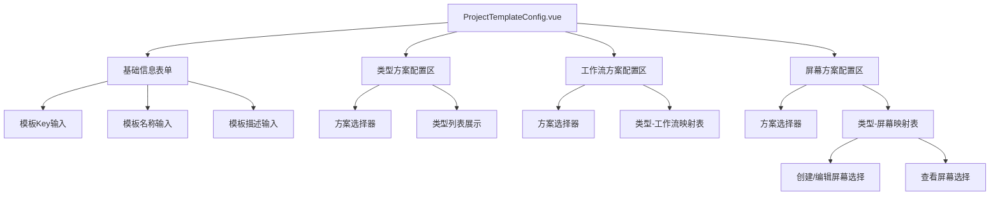
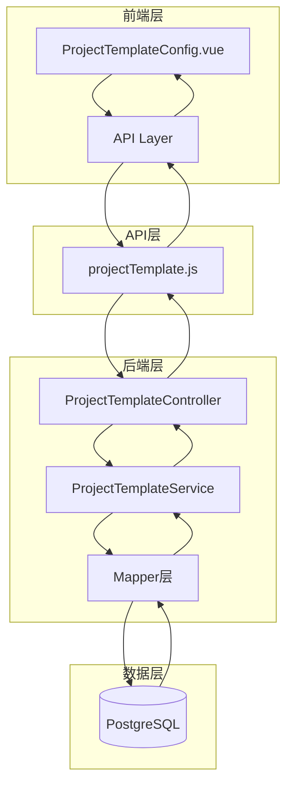
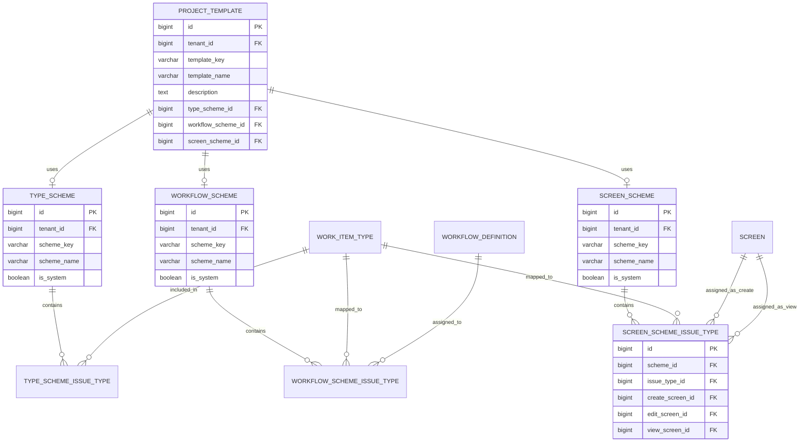
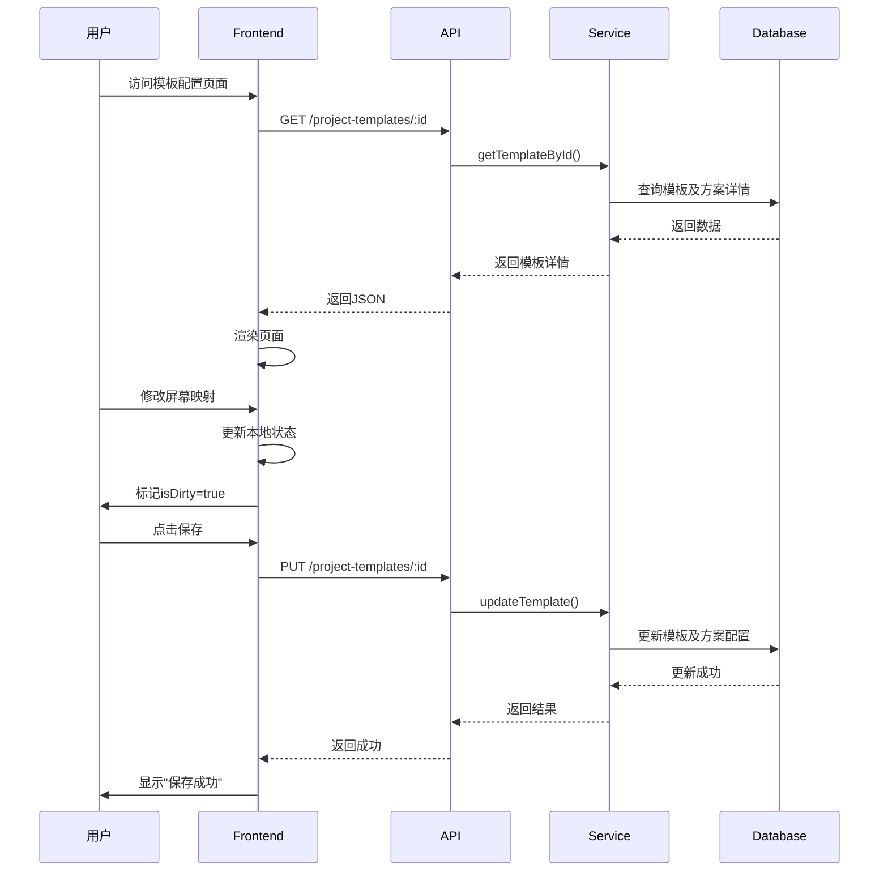
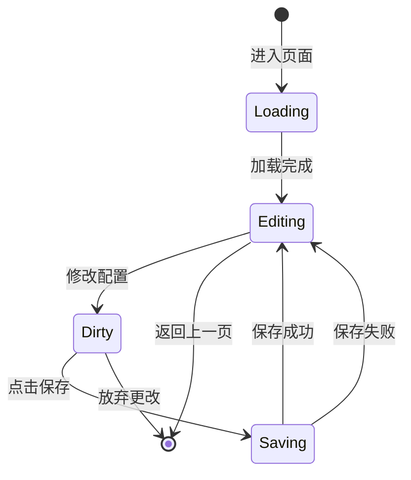

# 项目模板配置（集成Screen）详细技术设计文档 V1.0

## 文档版本

| 版本 | 日期 | 作者 | 说明 |
|------|------|------|------|
| V1.0 | 2026-04-19 | AI Assistant | 初始版本，基于SDD模式设计 |

---

## 1. 概述

### 1.1 文档目的
本文档定义项目模板配置功能的完整技术实现方案，将Screen集成到项目模板中，参考Jira的Scheme架构设计。

### 1.2 设计目标
- ✅ **方案化管理**：通过Type Scheme、Workflow Scheme、Screen Scheme聚合配置
- ✅ **模板化复用**：预定义模板快速创建项目
- ✅ **灵活映射**：工作项类型与工作流、屏幕的动态关联
- ✅ **可视化配置**：直观的表格形式展示映射关系

### 1.3 参考系统
- **Jira Project Template**: 项目模板与方案管理
- **Jira Schemes**: Type Scheme、Workflow Scheme、Screen Scheme
- **ONES 项目模板**: 预设配置的快速应用

### 1.4 相关文档
- [PROJECT_TEMPLATE_UI_PROTOTYPE.md](./PROJECT_TEMPLATE_UI_PROTOTYPE.md) - 可视化原型图
- [SCREEN_SDD_V3.md](./SCREEN_SDD_V3.md) - Screen配置详细设计
- [schema_jira.sql](../schema_jira.sql) - Jira风格数据库设计

---

## 2. 系统架构

### 2.1 技术栈

#### 前端技术栈
```
Vue 3.4.x          - 渐进式 JavaScript 框架
├─ Composition API - 组合式 API
├─ ref/reactive    - 响应式数据
└─ computed        - 计算属性

Element Plus 2.6.x - UI 组件库
├─ el-form         - 表单组件
├─ el-select       - 下拉选择器
├─ el-table        - 表格组件
├─ el-card         - 卡片组件
├─ el-tag          - 标签组件
└─ el-message      - 消息提示

Vite 5.4.x         - 构建工具
SCSS               - CSS 预处理器
```

#### 后端技术栈
```
Spring Boot 3.4.4  - Java Web 框架
MyBatis Plus 3.5.9 - ORM 框架
PostgreSQL 14+     - 关系型数据库
Lombok 1.18.44     - 代码简化工具
```

### 2.2 组件架构



**设计理由**：
- ✅ 单一组件管理所有状态，避免props传递复杂度
- ✅ 按功能分区，代码组织清晰
- ✅ 便于后续提取可复用组件

### 2.3 数据流架构



---

## 3. 数据库设计

### 3.1 表结构（基于schema_jira.sql扩展）

#### project_template 表（已存在）
```sql
CREATE TABLE project_template (
    id BIGSERIAL PRIMARY KEY,
    tenant_id BIGINT NOT NULL REFERENCES tenant(id),
    template_key VARCHAR(50) NOT NULL,
    template_name VARCHAR(200) NOT NULL,
    description TEXT,
    type_scheme_id BIGINT,                    -- 关联类型方案
    workflow_scheme_id BIGINT,                -- 关联工作流方案
    screen_scheme_id BIGINT,                  -- 关联屏幕方案（新增）
    default_field_values JSONB DEFAULT '{}',
    created_at TIMESTAMP DEFAULT CURRENT_TIMESTAMP,
    updated_at TIMESTAMP DEFAULT CURRENT_TIMESTAMP,
    deleted BOOLEAN DEFAULT FALSE,
    UNIQUE(tenant_id, template_key)
);

-- 索引优化
CREATE INDEX idx_template_tenant ON project_template(tenant_id);
CREATE INDEX idx_template_key ON project_template(template_key);
```

**变更说明**：
- ✅ 新增 `screen_scheme_id` 字段，关联屏幕方案

#### type_scheme 表（已存在）
```sql
CREATE TABLE type_scheme (
    id BIGSERIAL PRIMARY KEY,
    tenant_id BIGINT NOT NULL REFERENCES tenant(id),
    scheme_key VARCHAR(50) NOT NULL,
    scheme_name VARCHAR(200) NOT NULL,
    description TEXT,
    is_system BOOLEAN DEFAULT FALSE,          -- 是否系统方案
    created_at TIMESTAMP DEFAULT CURRENT_TIMESTAMP,
    updated_at TIMESTAMP DEFAULT CURRENT_TIMESTAMP,
    deleted BOOLEAN DEFAULT FALSE,
    UNIQUE(tenant_id, scheme_key)
);

CREATE INDEX idx_typescheme_tenant ON type_scheme(tenant_id);
```

#### type_scheme_issue_type 表（已存在）
```sql
CREATE TABLE type_scheme_issue_type (
    id BIGSERIAL PRIMARY KEY,
    scheme_id BIGINT NOT NULL REFERENCES type_scheme(id),
    issue_type_id BIGINT NOT NULL REFERENCES work_item_type(id),
    display_order INTEGER DEFAULT 0,
    UNIQUE(scheme_id, issue_type_id)
);

CREATE INDEX idx_tsit_scheme ON type_scheme_issue_type(scheme_id);
CREATE INDEX idx_tsit_type ON type_scheme_issue_type(issue_type_id);
```

#### workflow_scheme 表（已存在）
```sql
CREATE TABLE workflow_scheme (
    id BIGSERIAL PRIMARY KEY,
    tenant_id BIGINT NOT NULL REFERENCES tenant(id),
    scheme_key VARCHAR(50) NOT NULL,
    scheme_name VARCHAR(200) NOT NULL,
    description TEXT,
    is_system BOOLEAN DEFAULT FALSE,
    created_at TIMESTAMP DEFAULT CURRENT_TIMESTAMP,
    updated_at TIMESTAMP DEFAULT CURRENT_TIMESTAMP,
    deleted BOOLEAN DEFAULT FALSE,
    UNIQUE(tenant_id, scheme_key)
);

CREATE INDEX idx_workflowscheme_tenant ON workflow_scheme(tenant_id);
```

#### workflow_scheme_issue_type 表（已存在）
```sql
CREATE TABLE workflow_scheme_issue_type (
    id BIGSERIAL PRIMARY KEY,
    scheme_id BIGINT NOT NULL REFERENCES workflow_scheme(id),
    issue_type_id BIGINT NOT NULL REFERENCES work_item_type(id),
    workflow_id BIGINT NOT NULL REFERENCES workflow_definition(id),
    UNIQUE(scheme_id, issue_type_id)
);

CREATE INDEX idx_wsit_scheme ON workflow_scheme_issue_type(scheme_id);
CREATE INDEX idx_wsit_type ON workflow_scheme_issue_type(issue_type_id);
CREATE INDEX idx_wsit_workflow ON workflow_scheme_issue_type(workflow_id);
```

#### screen_scheme 表（新增）
```sql
CREATE TABLE screen_scheme (
    id BIGSERIAL PRIMARY KEY,
    tenant_id BIGINT NOT NULL REFERENCES tenant(id),
    scheme_key VARCHAR(50) NOT NULL,
    scheme_name VARCHAR(200) NOT NULL,
    description TEXT,
    is_system BOOLEAN DEFAULT FALSE,
    created_at TIMESTAMP DEFAULT CURRENT_TIMESTAMP,
    updated_at TIMESTAMP DEFAULT CURRENT_TIMESTAMP,
    deleted BOOLEAN DEFAULT FALSE,
    UNIQUE(tenant_id, scheme_key)
);

CREATE INDEX idx_screenscheme_tenant ON screen_scheme(tenant_id);

COMMENT ON TABLE screen_scheme IS '屏幕方案表';
COMMENT ON COLUMN screen_scheme.scheme_key IS '方案唯一标识';
COMMENT ON COLUMN screen_scheme.is_system IS '系统内置方案不可删除';
```

#### screen_scheme_issue_type 表（新增）
```sql
CREATE TABLE screen_scheme_issue_type (
    id BIGSERIAL PRIMARY KEY,
    scheme_id BIGINT NOT NULL REFERENCES screen_scheme(id),
    issue_type_id BIGINT NOT NULL REFERENCES work_item_type(id),
    create_screen_id BIGINT REFERENCES screen(id),      -- 创建/编辑屏幕
    edit_screen_id BIGINT REFERENCES screen(id),        -- 编辑屏幕（可与create相同）
    view_screen_id BIGINT REFERENCES screen(id),        -- 查看屏幕
    UNIQUE(scheme_id, issue_type_id)
);

CREATE INDEX idx_ssit_scheme ON screen_scheme_issue_type(scheme_id);
CREATE INDEX idx_ssit_type ON screen_scheme_issue_type(issue_type_id);
CREATE INDEX idx_ssit_create_screen ON screen_scheme_issue_type(create_screen_id);
CREATE INDEX idx_ssit_view_screen ON screen_scheme_issue_type(view_screen_id);

COMMENT ON TABLE screen_scheme_issue_type IS '屏幕方案与工作项类型的关联表';
COMMENT ON COLUMN screen_scheme_issue_type.create_screen_id IS '创建和编辑时使用的屏幕';
COMMENT ON COLUMN screen_scheme_issue_type.view_screen_id IS '查看详情时使用的屏幕';
```

### 3.2 ER 图



### 3.3 初始化数据

```sql
-- =============================================
-- Initial Data: Default Screen Scheme
-- =============================================
INSERT INTO screen_scheme (tenant_id, scheme_key, scheme_name, description, is_system) VALUES
(1, 'default-screen-scheme', '默认屏幕方案', '适用于所有工作项类型的默认屏幕配置', TRUE),
(1, 'software-dev-screen-scheme', '软件开发屏幕方案', '适用于软件研发项目的屏幕配置', TRUE)
ON CONFLICT (tenant_id, scheme_key) DO NOTHING;

-- 为默认屏幕方案配置映射
INSERT INTO screen_scheme_issue_type (scheme_id, issue_type_id, create_screen_id, edit_screen_id, view_screen_id)
SELECT 
    ss.id as scheme_id,
    wit.id as issue_type_id,
    s_default.id as create_screen_id,
    s_default.id as edit_screen_id,
    s_default.id as view_screen_id
FROM screen_scheme ss
CROSS JOIN work_item_type wit
CROSS JOIN screen s_default
WHERE ss.scheme_key = 'default-screen-scheme'
  AND ss.tenant_id = 1
  AND wit.tenant_id = 1
  AND s_default.screen_name = 'Default Screen'
  AND s_default.tenant_id = 1
ON CONFLICT (scheme_id, issue_type_id) DO NOTHING;

-- 为软件开发屏幕方案配置映射
INSERT INTO screen_scheme_issue_type (scheme_id, issue_type_id, create_screen_id, edit_screen_id, view_screen_id)
SELECT 
    ss.id as scheme_id,
    wit.id as issue_type_id,
    CASE wit.type_key
        WHEN 'epic' THEN s_epic.id
        WHEN 'story' THEN s_story.id
        WHEN 'task' THEN s_task.id
        WHEN 'bug' THEN s_bug.id
        ELSE s_default.id
    END as create_screen_id,
    CASE wit.type_key
        WHEN 'epic' THEN s_epic.id
        WHEN 'story' THEN s_story.id
        WHEN 'task' THEN s_task.id
        WHEN 'bug' THEN s_bug.id
        ELSE s_default.id
    END as edit_screen_id,
    CASE wit.type_key
        WHEN 'epic' THEN s_epic.id
        WHEN 'story' THEN s_story.id
        WHEN 'task' THEN s_task.id
        WHEN 'bug' THEN s_bug.id
        ELSE s_default.id
    END as view_screen_id
FROM screen_scheme ss
CROSS JOIN work_item_type wit
LEFT JOIN screen s_epic ON s_epic.screen_name = 'Epic Screen' AND s_epic.tenant_id = 1
LEFT JOIN screen s_story ON s_story.screen_name = 'Story Screen' AND s_story.tenant_id = 1
LEFT JOIN screen s_task ON s_task.screen_name = 'Task Screen' AND s_task.tenant_id = 1
LEFT JOIN screen s_bug ON s_bug.screen_name = 'Bug Screen' AND s_bug.tenant_id = 1
LEFT JOIN screen s_default ON s_default.screen_name = 'Default Screen' AND s_default.tenant_id = 1
WHERE ss.scheme_key = 'software-dev-screen-scheme'
  AND ss.tenant_id = 1
  AND wit.tenant_id = 1
ON CONFLICT (scheme_id, issue_type_id) DO NOTHING;

-- =============================================
-- Initial Data: Sample Project Templates
-- =============================================
INSERT INTO project_template (tenant_id, template_key, template_name, description, type_scheme_id, workflow_scheme_id, screen_scheme_id)
SELECT 
    1,
    'software-development',
    '软件开发模板',
    '适用于软件研发项目的标准模板，包含史诗、故事、任务、问题等工作项类型',
    ts.id,
    ws.id,
    ss.id
FROM type_scheme ts
JOIN workflow_scheme ws ON ws.scheme_key = 'standard-workflow-scheme' AND ws.tenant_id = 1
JOIN screen_scheme ss ON ss.scheme_key = 'software-dev-screen-scheme' AND ss.tenant_id = 1
WHERE ts.scheme_key = 'default-type-scheme' AND ts.tenant_id = 1
ON CONFLICT (tenant_id, template_key) DO NOTHING;
```

---

## 4. API 设计

### 4.1 RESTful API 规范

**基础路径**: `/api/v1`

**通用响应格式**:
```json
{
  "code": 200,
  "message": "success",
  "data": { ... }
}
```

**错误响应**:
```json
{
  "code": 400,
  "message": "参数错误",
  "data": null
}
```

### 4.2 项目模板管理 API

| 方法 | 路径 | 请求体 | 响应 | 说明 |
|------|------|--------|------|------|
| GET | `/project-templates` | - | `ProjectTemplate[]` | 获取模板列表 |
| GET | `/project-templates/:id` | - | `ProjectTemplateDetail` | 获取模板详情（含方案配置） |
| POST | `/project-templates` | `ProjectTemplateCreateRequest` | `ProjectTemplate` | 创建模板 |
| PUT | `/project-templates/:id` | `ProjectTemplateUpdateRequest` | `ProjectTemplate` | 更新模板 |
| DELETE | `/project-templates/:id` | - | `void` | 删除模板 |

### 4.3 屏幕方案管理 API

| 方法 | 路径 | 请求体 | 响应 | 说明 |
|------|------|--------|------|------|
| GET | `/screen-schemes` | - | `ScreenScheme[]` | 获取屏幕方案列表 |
| GET | `/screen-schemes/:id` | - | `ScreenSchemeDetail` | 获取方案详情（含类型映射） |
| POST | `/screen-schemes` | `ScreenSchemeCreateRequest` | `ScreenScheme` | 创建方案 |
| PUT | `/screen-schemes/:id` | `ScreenSchemeUpdateRequest` | `ScreenScheme` | 更新方案 |
| DELETE | `/screen-schemes/:id` | - | `void` | 删除方案 |

### 4.4 屏幕方案映射 API

| 方法 | 路径 | 请求体 | 响应 | 说明 |
|------|------|--------|------|------|
| POST | `/screen-schemes/:schemeId/mappings` | `ScreenSchemeMappingRequest` | `ScreenSchemeIssueType` | 添加类型映射 |
| PUT | `/screen-schemes/:schemeId/mappings/:mappingId` | `ScreenSchemeMappingRequest` | `ScreenSchemeIssueType` | 更新类型映射 |
| DELETE | `/screen-schemes/mappings/:mappingId` | - | `void` | 删除类型映射 |
| PUT | `/screen-schemes/:schemeId/mappings/batch` | `ScreenSchemeMappingRequest[]` | `void` | 批量更新映射 |

**请求示例** - 添加类型映射:
```http
POST /api/v1/screen-schemes/1/mappings
Content-Type: application/json

{
  "issueTypeId": 2,
  "createScreenId": 2,
  "editScreenId": 2,
  "viewScreenId": 2
}
```

**请求示例** - 批量更新映射:
```http
PUT /api/v1/screen-schemes/1/mappings/batch
Content-Type: application/json

[
  {
    "issueTypeId": 1,
    "createScreenId": 1,
    "editScreenId": 1,
    "viewScreenId": 1
  },
  {
    "issueTypeId": 2,
    "createScreenId": 2,
    "editScreenId": 2,
    "viewScreenId": 2
  }
]
```

### 4.5 DTO 定义

#### ProjectTemplateDetailResponse
```java
@Data
public class ProjectTemplateDetailResponse {
    private Long id;
    private String templateKey;
    private String templateName;
    private String description;
    
    // 方案信息
    private Long typeSchemeId;
    private String typeSchemeName;
    
    private Long workflowSchemeId;
    private String workflowSchemeName;
    
    private Long screenSchemeId;
    private String screenSchemeName;
    
    // 方案详情（用于配置页面）
    private List<TypeSchemeIssueTypeResponse> typeSchemeDetails;
    private List<WorkflowSchemeIssueTypeResponse> workflowSchemeDetails;
    private List<ScreenSchemeIssueTypeResponse> screenSchemeDetails;
    
    private LocalDateTime createdAt;
    private LocalDateTime updatedAt;
}
```

#### ScreenSchemeResponse
```java
@Data
public class ScreenSchemeResponse {
    private Long id;
    private String schemeKey;
    private String schemeName;
    private String description;
    private Boolean isSystem;
    private Integer issueTypeCount; // 关联的工作项类型数量
    private LocalDateTime createdAt;
    private LocalDateTime updatedAt;
}
```

#### ScreenSchemeDetailResponse
```java
@Data
public class ScreenSchemeDetailResponse {
    private Long id;
    private String schemeKey;
    private String schemeName;
    private String description;
    private Boolean isSystem;
    private List<ScreenSchemeIssueTypeResponse> mappings;
    private LocalDateTime createdAt;
    private LocalDateTime updatedAt;
}
```

#### ScreenSchemeIssueTypeResponse ⚠️ 重要
```java
@Data
public class ScreenSchemeIssueTypeResponse {
    private Long id;
    private Long schemeId;
    private Long issueTypeId;
    private String issueTypeKey;
    private String issueTypeName;
    private String issueTypeIcon;
    
    private Long createScreenId;
    private String createScreenName;
    
    private Long editScreenId;
    private String editScreenName;
    
    private Long viewScreenId;
    private String viewScreenName;
}
```

#### ScreenSchemeMappingRequest
```java
@Data
public class ScreenSchemeMappingRequest {
    @NotNull
    private Long issueTypeId;
    
    private Long createScreenId;
    
    private Long editScreenId;
    
    private Long viewScreenId;
}
```

---

## 5. 前端详细设计

### 5.1 页面布局

#### 5.1.1 整体布局结构

```
┌──────────────────────────────────────────────────────────────────────┐
│  顶部操作栏 (60px 固定高度)                                           │
├──────────────────────────────────────────────────────────────────────┤
│                                                                      │
│  主体内容区（垂直滚动）                                                │
│  ┌────────────────────────────────────────────────────────────────┐ │
│  │  📋 基础信息卡片                                                 │ │
│  ├────────────────────────────────────────────────────────────────┤ │
│  │  🔧 工作项类型方案配置区                                         │ │
│  ├────────────────────────────────────────────────────────────────┤ │
│  │  🔄 工作流方案配置区                                             │ │
│  ├────────────────────────────────────────────────────────────────┤ │
│  │  🖥️ 屏幕方案配置区                                               │ │
│  └────────────────────────────────────────────────────────────────┘ │
│                                                                      │
└──────────────────────────────────────────────────────────────────────┘
```

### 5.2 核心状态管理

```javascript
<script setup>
import { ref, computed, onMounted, watch } from 'vue'
import { useRoute, useRouter } from 'vue-router'
import { ElMessage, ElMessageBox } from 'element-plus'
import { 
  getTemplateById,
  createTemplate,
  updateTemplate,
  getTypeSchemes,
  getWorkflowSchemes,
  getScreenSchemes,
  getScreenSchemeDetail,
  batchUpdateScreenSchemeMappings
} from '@/api/projectTemplate'
import { getScreens } from '@/api/screen'
import { getWorkItemTypes } from '@/api/workItemType'

const route = useRoute()
const router = useRouter()

// ========== 核心状态 ==========
const templateId = ref(route.params.id)
const isEdit = computed(() => !!templateId.value)

const template = ref({
  templateKey: '',
  templateName: '',
  description: '',
  typeSchemeId: null,
  workflowSchemeId: null,
  screenSchemeId: null
})

// 方案列表
const typeSchemes = ref([])
const workflowSchemes = ref([])
const screenSchemes = ref([])

// 方案详情
const selectedTypeScheme = ref(null)
const selectedWorkflowScheme = ref(null)
const selectedScreenScheme = ref(null)

// 屏幕列表（用于下拉选择）
const screens = ref([])
const workItemTypes = ref([])

// UI状态
const loading = ref(false)
const saving = ref(false)
const isDirty = ref(false)

// ========== 计算属性 ==========

/**
 * 表单验证规则
 */
const formRules = {
  templateKey: [
    { required: true, message: '请输入模板Key', trigger: 'blur' },
    { pattern: /^[a-z0-9-]+$/, message: '只能包含小写字母、数字、连字符', trigger: 'blur' }
  ],
  templateName: [
    { required: true, message: '请输入模板名称', trigger: 'blur' },
    { max: 200, message: '长度不能超过200字符', trigger: 'blur' }
  ],
  description: [
    { max: 1000, message: '长度不能超过1000字符', trigger: 'blur' }
  ]
}

// ========== 数据加载 ==========

/**
 * 加载模板详情和方案列表
 */
const loadData = async () => {
  loading.value = true
  try {
    const [
      typeSchemesRes,
      workflowSchemesRes,
      screenSchemesRes,
      screensRes,
      workItemTypesRes
    ] = await Promise.all([
      getTypeSchemes(),
      getWorkflowSchemes(),
      getScreenSchemes(),
      getScreens(),
      getWorkItemTypes()
    ])
    
    typeSchemes.value = typeSchemesRes
    workflowSchemes.value = workflowSchemesRes
    screenSchemes.value = screenSchemesRes
    screens.value = screensRes
    workItemTypes.value = workItemTypesRes
    
    // 如果是编辑模式，加载模板详情
    if (isEdit.value) {
      const templateDetail = await getTemplateById(templateId.value)
      template.value = {
        templateKey: templateDetail.templateKey,
        templateName: templateDetail.templateName,
        description: templateDetail.description,
        typeSchemeId: templateDetail.typeSchemeId,
        workflowSchemeId: templateDetail.workflowSchemeId,
        screenSchemeId: templateDetail.screenSchemeId
      }
      
      // 加载方案详情
      await loadSchemeDetails()
    }
  } catch (error) {
    ElMessage.error('加载失败：' + error.message)
    console.error('Load data error:', error)
  } finally {
    loading.value = false
  }
}

/**
 * 加载方案详情
 */
const loadSchemeDetails = async () => {
  try {
    if (template.value.screenSchemeId) {
      selectedScreenScheme.value = await getScreenSchemeDetail(template.value.screenSchemeId)
    }
  } catch (error) {
    console.error('Load scheme details error:', error)
  }
}

// ========== 事件处理 ==========

/**
 * 方案选择变化
 */
const handleScreenSchemeChange = async (schemeId) => {
  if (schemeId) {
    try {
      selectedScreenScheme.value = await getScreenSchemeDetail(schemeId)
    } catch (error) {
      ElMessage.error('加载方案详情失败：' + error.message)
    }
  } else {
    selectedScreenScheme.value = null
  }
  isDirty.value = true
}

/**
 * 屏幕映射变化
 */
const handleScreenMappingChange = (mapping) => {
  isDirty.value = true
}

/**
 * 保存模板
 */
const handleSave = async () => {
  saving.value = true
  try {
    if (isEdit.value) {
      await updateTemplate(templateId.value, template.value)
      ElMessage.success('更新成功')
    } else {
      const result = await createTemplate(template.value)
      ElMessage.success('创建成功')
      // 跳转到编辑页面
      router.push(`/config/templates/${result.id}`)
    }
    isDirty.value = false
  } catch (error) {
    ElMessage.error('保存失败：' + error.message)
  } finally {
    saving.value = false
  }
}

/**
 * 返回上一页
 */
const goBack = () => {
  if (isDirty.value) {
    ElMessageBox.confirm('有未保存的更改，确定要离开吗？', '警告', {
      type: 'warning'
    }).then(() => {
      router.push('/config/templates')
    }).catch(() => {})
  } else {
    router.push('/config/templates')
  }
}

// ========== 辅助函数 ==========

/**
 * 根据ID获取Screen名称
 */
const getScreenName = (screenId) => {
  const screen = screens.value.find(s => s.id === screenId)
  return screen ? screen.screenName : '-'
}

/**
 * 根据ID获取工作项类型信息
 */
const getWorkItemType = (typeId) => {
  return workItemTypes.value.find(t => t.id === typeId)
}

// ========== 生命周期 ==========
onMounted(() => {
  loadData()
})

// 监听表单变化
watch(template, () => {
  isDirty.value = true
}, { deep: true })
</script>
```

### 5.3 模板结构

```vue
<template>
  <div class="template-config-container">
    <!-- 顶部操作栏 -->
    <div class="config-header">
      <el-page-header @back="goBack">
        <template #content>
          <span class="page-title">{{ isEdit ? '编辑项目模板' : '新建项目模板' }}</span>
        </template>
      </el-page-header>
      <div class="header-actions">
        <el-button @click="goBack">取消</el-button>
        <el-button type="primary" :loading="saving" @click="handleSave">
          保存
        </el-button>
      </div>
    </div>

    <!-- 主体内容 -->
    <div class="config-body" v-loading="loading">
      <!-- 基础信息卡片 -->
      <el-card class="section-card">
        <template #header>
          <div class="card-header">
            <el-icon><Document /></el-icon>
            <span>📋 基础信息</span>
          </div>
        </template>
        
        <el-form :model="template" :rules="formRules" label-width="120px">
          <el-form-item label="模板Key" prop="templateKey">
            <el-input 
              v-model="template.templateKey" 
              placeholder="例如：software-development"
              :disabled="isEdit"
            />
            <div class="form-tip">唯一标识，只能包含小写字母、数字、连字符</div>
          </el-form-item>
          
          <el-form-item label="模板名称" prop="templateName">
            <el-input 
              v-model="template.templateName" 
              placeholder="例如：软件开发模板"
            />
          </el-form-item>
          
          <el-form-item label="模板描述" prop="description">
            <el-input 
              v-model="template.description" 
              type="textarea"
              :rows="3"
              placeholder="描述该模板的用途和特点"
            />
          </el-form-item>
        </el-form>
      </el-card>

      <!-- 工作项类型方案配置 -->
      <el-card class="section-card">
        <template #header>
          <div class="card-header">
            <el-icon><Setting /></el-icon>
            <span>🔧 工作项类型方案</span>
          </div>
        </template>
        
        <el-form label-width="120px">
          <el-form-item label="方案">
            <el-select 
              v-model="template.typeSchemeId" 
              placeholder="请选择类型方案"
              style="width: 400px"
            >
              <el-option
                v-for="scheme in typeSchemes"
                :key="scheme.id"
                :label="scheme.schemeName"
                :value="scheme.id"
              >
                <span>{{ scheme.schemeName }}</span>
                <el-tag v-if="scheme.isSystem" size="small" type="info" style="margin-left: 8px">
                  系统
                </el-tag>
              </el-option>
            </el-select>
          </el-form-item>
          
          <!-- 显示方案包含的类型 -->
          <el-form-item label="包含类型" v-if="selectedTypeScheme">
            <div class="type-list">
              <el-tag 
                v-for="type in selectedTypeScheme.issueTypes" 
                :key="type.id"
                style="margin-right: 8px; margin-bottom: 8px"
              >
                {{ type.icon }} {{ type.typeName }}
              </el-tag>
            </div>
          </el-form-item>
        </el-form>
      </el-card>

      <!-- 工作流方案配置 -->
      <el-card class="section-card">
        <template #header>
          <div class="card-header">
            <el-icon><Connection /></el-icon>
            <span>🔄 工作流方案</span>
          </div>
        </template>
        
        <el-form label-width="120px">
          <el-form-item label="方案">
            <el-select 
              v-model="template.workflowSchemeId" 
              placeholder="请选择工作流方案"
              style="width: 400px"
            >
              <el-option
                v-for="scheme in workflowSchemes"
                :key="scheme.id"
                :label="scheme.schemeName"
                :value="scheme.id"
              >
                <span>{{ scheme.schemeName }}</span>
                <el-tag v-if="scheme.isSystem" size="small" type="info" style="margin-left: 8px">
                  系统
                </el-tag>
              </el-option>
            </el-select>
          </el-form-item>
        </el-form>
      </el-card>

      <!-- 屏幕方案配置 -->
      <el-card class="section-card">
        <template #header>
          <div class="card-header">
            <el-icon><Monitor /></el-icon>
            <span>🖥️ 屏幕方案（字段布局）</span>
          </div>
        </template>
        
        <el-form label-width="120px">
          <el-form-item label="方案">
            <el-select 
              v-model="template.screenSchemeId" 
              placeholder="请选择屏幕方案"
              style="width: 400px"
              @change="handleScreenSchemeChange"
            >
              <el-option
                v-for="scheme in screenSchemes"
                :key="scheme.id"
                :label="scheme.schemeName"
                :value="scheme.id"
              >
                <span>{{ scheme.schemeName }}</span>
                <el-tag v-if="scheme.isSystem" size="small" type="info" style="margin-left: 8px">
                  系统
                </el-tag>
              </el-option>
            </el-select>
          </el-form-item>
          
          <!-- 屏幕映射配置表 -->
          <el-form-item label="屏幕映射" v-if="selectedScreenScheme">
            <el-table 
              :data="selectedScreenScheme.mappings" 
              border
              style="width: 100%"
            >
              <el-table-column label="工作项类型" width="200">
                <template #default="{ row }">
                  <div class="type-cell">
                    <el-icon><component :is="row.issueTypeIcon" /></el-icon>
                    <span>{{ row.issueTypeName }}</span>
                  </div>
                </template>
              </el-table-column>
              
              <el-table-column label="创建/编辑屏幕" min-width="250">
                <template #default="{ row }">
                  <el-select 
                    v-model="row.createScreenId"
                    placeholder="选择屏幕"
                    @change="handleScreenMappingChange(row)"
                  >
                    <el-option
                      v-for="screen in screens"
                      :key="screen.id"
                      :label="screen.screenName"
                      :value="screen.id"
                    >
                      <span>{{ screen.screenName }}</span>
                      <el-tag v-if="screen.isSystem" size="small" type="success" style="margin-left: 8px">
                        系统
                      </el-tag>
                    </el-option>
                  </el-select>
                  <el-link 
                    v-if="row.createScreenId"
                    :href="`/config/screens/${row.createScreenId}`"
                    target="_blank"
                    style="margin-left: 8px"
                  >
                    配置
                  </el-link>
                </template>
              </el-table-column>
              
              <el-table-column label="查看屏幕" min-width="250">
                <template #default="{ row }">
                  <el-select 
                    v-model="row.viewScreenId"
                    placeholder="选择屏幕"
                    @change="handleScreenMappingChange(row)"
                  >
                    <el-option
                      v-for="screen in screens"
                      :key="screen.id"
                      :label="screen.screenName"
                      :value="screen.id"
                    >
                      <span>{{ screen.screenName }}</span>
                      <el-tag v-if="screen.isSystem" size="small" type="success" style="margin-left: 8px">
                        系统
                      </el-tag>
                    </el-option>
                  </el-select>
                  <el-link 
                    v-if="row.viewScreenId"
                    :href="`/config/screens/${row.viewScreenId}`"
                    target="_blank"
                    style="margin-left: 8px"
                  >
                    配置
                  </el-link>
                </template>
              </el-table-column>
            </el-table>
            
            <div class="form-tip" style="margin-top: 8px">
              💡 提示：点击"配置"链接可在新标签页打开Screen配置页面
            </div>
          </el-form-item>
        </el-form>
      </el-card>
    </div>
  </div>
</template>
```

### 5.4 样式设计

```scss
<style scoped lang="scss">
.template-config-container {
  height: 100vh;
  display: flex;
  flex-direction: column;
  background: #f5f7fa;
  
  // ========== 顶部操作栏 ==========
  .config-header {
    display: flex;
    justify-content: space-between;
    align-items: center;
    padding: 0 20px;
    height: 60px;
    background: #fff;
    border-bottom: 1px solid #e4e7ed;
    box-shadow: 0 2px 4px rgba(0, 0, 0, 0.05);
    
    .page-title {
      font-size: 16px;
      font-weight: 600;
      color: #303133;
    }
    
    .header-actions {
      display: flex;
      gap: 10px;
    }
  }
  
  // ========== 主体内容区 ==========
  .config-body {
    flex: 1;
    overflow-y: auto;
    padding: 20px;
    
    .section-card {
      margin-bottom: 20px;
      
      .card-header {
        display: flex;
        align-items: center;
        gap: 8px;
        font-size: 16px;
        font-weight: 600;
        color: #303133;
        
        .el-icon {
          font-size: 18px;
          color: #409eff;
        }
      }
    }
    
    .form-tip {
      font-size: 12px;
      color: #909399;
      margin-top: 4px;
    }
    
    .type-list {
      display: flex;
      flex-wrap: wrap;
      gap: 8px;
    }
    
    .type-cell {
      display: flex;
      align-items: center;
      gap: 8px;
      
      .el-icon {
        font-size: 16px;
        color: #409eff;
      }
    }
  }
}
</style>
```

---

## 6. 后端详细设计

### 6.1 Entity 实体类

#### ScreenScheme.java
```java
package com.workitem.entity;

import com.baomidou.mybatisplus.annotation.*;
import lombok.Data;
import java.time.LocalDateTime;

@Data
@TableName("screen_scheme")
public class ScreenScheme {
    @TableId(type = IdType.AUTO)
    private Long id;
    
    private Long tenantId;
    
    private String schemeKey;
    
    private String schemeName;
    
    private String description;
    
    private Boolean isSystem;
    
    @TableField(fill = FieldFill.INSERT)
    private LocalDateTime createdAt;
    
    @TableField(fill = FieldFill.INSERT_UPDATE)
    private LocalDateTime updatedAt;
    
    @TableLogic
    private Boolean deleted;
}
```

#### ScreenSchemeIssueType.java
```java
package com.workitem.entity;

import com.baomidou.mybatisplus.annotation.*;
import lombok.Data;
import java.time.LocalDateTime;

@Data
@TableName("screen_scheme_issue_type")
public class ScreenSchemeIssueType {
    @TableId(type = IdType.AUTO)
    private Long id;
    
    private Long schemeId;
    
    private Long issueTypeId;
    
    private Long createScreenId;
    
    private Long editScreenId;
    
    private Long viewScreenId;
    
    @TableField(fill = FieldFill.INSERT)
    private LocalDateTime createdAt;
    
    @TableField(fill = FieldFill.INSERT_UPDATE)
    private LocalDateTime updatedAt;
}
```

### 6.2 Mapper 接口

#### ScreenSchemeMapper.java
```java
package com.workitem.mapper;

import com.baomidou.mybatisplus.core.mapper.BaseMapper;
import com.workitem.entity.ScreenScheme;
import org.apache.ibatis.annotations.Mapper;

@Mapper
public interface ScreenSchemeMapper extends BaseMapper<ScreenScheme> {
}
```

#### ScreenSchemeIssueTypeMapper.java
```java
package com.workitem.mapper;

import com.baomidou.mybatisplus.core.mapper.BaseMapper;
import com.workitem.entity.ScreenSchemeIssueType;
import org.apache.ibatis.annotations.Mapper;
import org.apache.ibatis.annotations.Select;
import java.util.List;

@Mapper
public interface ScreenSchemeIssueTypeMapper extends BaseMapper<ScreenSchemeIssueType> {
    
    @Select("""
        SELECT ssit.*, 
               wit.type_key as issueTypeKey,
               wit.type_name as issueTypeName,
               wit.icon as issueTypeIcon,
               s1.screen_name as createScreenName,
               s2.screen_name as editScreenName,
               s3.screen_name as viewScreenName
        FROM screen_scheme_issue_type ssit
        LEFT JOIN work_item_type wit ON ssit.issue_type_id = wit.id
        LEFT JOIN screen s1 ON ssit.create_screen_id = s1.id
        LEFT JOIN screen s2 ON ssit.edit_screen_id = s2.id
        LEFT JOIN screen s3 ON ssit.view_screen_id = s3.id
        WHERE ssit.scheme_id = #{schemeId}
        ORDER BY wit.hierarchy_level, wit.type_name
        """)
    List<ScreenSchemeIssueTypeResponse> selectWithDetails(Long schemeId);
}
```

### 6.3 Service 服务层

#### ScreenSchemeService.java
```java
package com.workitem.service;

import com.baomidou.mybatisplus.extension.service.IService;
import com.workitem.dto.*;
import com.workitem.entity.ScreenScheme;
import java.util.List;

public interface ScreenSchemeService extends IService<ScreenScheme> {
    
    /**
     * 获取屏幕方案列表
     */
    List<ScreenSchemeResponse> listSchemes(Long tenantId);
    
    /**
     * 获取方案详情（含类型映射）
     */
    ScreenSchemeDetailResponse getSchemeDetail(Long schemeId);
    
    /**
     * 创建屏幕方案
     */
    ScreenScheme createScheme(ScreenSchemeCreateRequest request);
    
    /**
     * 更新屏幕方案
     */
    ScreenScheme updateScheme(Long schemeId, ScreenSchemeUpdateRequest request);
    
    /**
     * 删除屏幕方案
     */
    void deleteScheme(Long schemeId);
    
    /**
     * 添加类型映射
     */
    ScreenSchemeIssueType addMapping(Long schemeId, ScreenSchemeMappingRequest request);
    
    /**
     * 批量更新类型映射
     */
    void batchUpdateMappings(Long schemeId, List<ScreenSchemeMappingRequest> requests);
    
    /**
     * 删除类型映射
     */
    void deleteMapping(Long mappingId);
}
```

#### ScreenSchemeServiceImpl.java
```java
package com.workitem.service.impl;

import com.baomidou.mybatisplus.extension.service.impl.ServiceImpl;
import com.workitem.dto.*;
import com.workitem.entity.ScreenScheme;
import com.workitem.entity.ScreenSchemeIssueType;
import com.workitem.mapper.ScreenSchemeMapper;
import com.workitem.mapper.ScreenSchemeIssueTypeMapper;
import com.workitem.service.ScreenSchemeService;
import lombok.RequiredArgsConstructor;
import org.springframework.stereotype.Service;
import org.springframework.transaction.annotation.Transactional;
import java.util.List;

@Service
@RequiredArgsConstructor
public class ScreenSchemeServiceImpl extends ServiceImpl<ScreenSchemeMapper, ScreenScheme> 
    implements ScreenSchemeService {
    
    private final ScreenSchemeIssueTypeMapper mappingMapper;
    
    @Override
    public List<ScreenSchemeResponse> listSchemes(Long tenantId) {
        // 实现略
        return List.of();
    }
    
    @Override
    public ScreenSchemeDetailResponse getSchemeDetail(Long schemeId) {
        ScreenScheme scheme = getById(schemeId);
        if (scheme == null) {
            throw new RuntimeException("屏幕方案不存在");
        }
        
        ScreenSchemeDetailResponse response = new ScreenSchemeDetailResponse();
        // 填充基本信息
        response.setId(scheme.getId());
        response.setSchemeKey(scheme.getSchemeKey());
        response.setSchemeName(scheme.getSchemeName());
        response.setDescription(scheme.getDescription());
        response.setIsSystem(scheme.getIsSystem());
        
        // 查询类型映射详情
        List<ScreenSchemeIssueTypeResponse> mappings = 
            mappingMapper.selectWithDetails(schemeId);
        response.setMappings(mappings);
        
        return response;
    }
    
    @Override
    @Transactional
    public ScreenScheme createScheme(ScreenSchemeCreateRequest request) {
        ScreenScheme scheme = new ScreenScheme();
        // 填充字段
        save(scheme);
        return scheme;
    }
    
    @Override
    @Transactional
    public void batchUpdateMappings(Long schemeId, List<ScreenSchemeMappingRequest> requests) {
        // 删除旧映射
        mappingMapper.deleteBySchemeId(schemeId);
        
        // 插入新映射
        for (ScreenSchemeMappingRequest request : requests) {
            ScreenSchemeIssueType mapping = new ScreenSchemeIssueType();
            mapping.setSchemeId(schemeId);
            mapping.setIssueTypeId(request.getIssueTypeId());
            mapping.setCreateScreenId(request.getCreateScreenId());
            mapping.setEditScreenId(request.getEditScreenId());
            mapping.setViewScreenId(request.getViewScreenId());
            mappingMapper.insert(mapping);
        }
    }
    
    // 其他方法实现略...
}
```

### 6.4 Controller 控制器层

#### ScreenSchemeController.java
```java
package com.workitem.controller;

import com.workitem.dto.*;
import com.workitem.service.ScreenSchemeService;
import lombok.RequiredArgsConstructor;
import org.springframework.web.bind.annotation.*;
import java.util.List;

@RestController
@RequestMapping("/api/v1/screen-schemes")
@RequiredArgsConstructor
public class ScreenSchemeController {
    
    private final ScreenSchemeService screenSchemeService;
    
    @GetMapping
    public Result<List<ScreenSchemeResponse>> listSchemes() {
        Long tenantId = getCurrentTenantId();
        List<ScreenSchemeResponse> schemes = screenSchemeService.listSchemes(tenantId);
        return Result.success(schemes);
    }
    
    @GetMapping("/{id}")
    public Result<ScreenSchemeDetailResponse> getSchemeDetail(@PathVariable Long id) {
        ScreenSchemeDetailResponse detail = screenSchemeService.getSchemeDetail(id);
        return Result.success(detail);
    }
    
    @PostMapping
    public Result<ScreenScheme> createScheme(@RequestBody ScreenSchemeCreateRequest request) {
        ScreenScheme scheme = screenSchemeService.createScheme(request);
        return Result.success(scheme);
    }
    
    @PutMapping("/{id}")
    public Result<ScreenScheme> updateScheme(
        @PathVariable Long id, 
        @RequestBody ScreenSchemeUpdateRequest request
    ) {
        ScreenScheme scheme = screenSchemeService.updateScheme(id, request);
        return Result.success(scheme);
    }
    
    @DeleteMapping("/{id}")
    public Result<Void> deleteScheme(@PathVariable Long id) {
        screenSchemeService.deleteScheme(id);
        return Result.success();
    }
    
    @PostMapping("/{schemeId}/mappings")
    public Result<ScreenSchemeIssueType> addMapping(
        @PathVariable Long schemeId,
        @RequestBody ScreenSchemeMappingRequest request
    ) {
        ScreenSchemeIssueType mapping = screenSchemeService.addMapping(schemeId, request);
        return Result.success(mapping);
    }
    
    @PutMapping("/{schemeId}/mappings/batch")
    public Result<Void> batchUpdateMappings(
        @PathVariable Long schemeId,
        @RequestBody List<ScreenSchemeMappingRequest> requests
    ) {
        screenSchemeService.batchUpdateMappings(schemeId, requests);
        return Result.success();
    }
    
    @DeleteMapping("/mappings/{mappingId}")
    public Result<Void> deleteMapping(@PathVariable Long mappingId) {
        screenSchemeService.deleteMapping(mappingId);
        return Result.success();
    }
    
    private Long getCurrentTenantId() {
        // 从上下文获取当前租户ID
        return 1L; // 临时硬编码
    }
}
```

---

## 7. 交互设计

### 7.1 时序图



### 7.2 状态转换图



---

## 8. 性能优化

### 8.1 前端优化
- **懒加载方案详情**：仅在选中方案时加载详情
- **防抖搜索**：下拉选择器支持搜索过滤
- **缓存方案列表**：使用sessionStorage缓存

### 8.2 后端优化
- **批量查询**：一次性加载所有关联数据
- **索引优化**：为外键字段建立索引
- **分页查询**：列表接口支持分页

---

## 9. 测试策略

### 9.1 单元测试
```java
@Test
void testCreateScreenScheme() {
    ScreenSchemeCreateRequest request = new ScreenSchemeCreateRequest();
    request.setSchemeKey("test-scheme");
    request.setSchemeName("测试方案");
    
    ScreenScheme scheme = screenSchemeService.createScheme(request);
    
    assertNotNull(scheme.getId());
    assertEquals("test-scheme", scheme.getSchemeKey());
}
```

### 9.2 集成测试
- 测试完整的模板创建流程
- 测试方案映射的CRUD操作
- 测试事务回滚机制

### 9.3 E2E测试
```javascript
it('should create project template with screen scheme', async () => {
  await page.goto('/config/templates/new')
  await page.fill('[name="templateKey"]', 'test-template')
  await page.fill('[name="templateName"]', '测试模板')
  await page.selectOption('[name="screenSchemeId"]', '1')
  await page.click('button:has-text("保存")')
  await expect(page).toHaveURL(/\/config\/templates\/\d+/)
})
```

---

## 10. 验收标准

### 10.1 功能清单
- [ ] 能创建新的项目模板
- [ ] 能编辑现有模板的配置
- [ ] 能删除模板（无关联项目时）
- [ ] 能配置工作项类型方案
- [ ] 能配置工作流映射
- [ ] 能配置屏幕映射
- [ ] 点击Screen名称能跳转到配置页面
- [ ] 保存时验证所有必填字段
- [ ] 保存成功后显示提示
- [ ] 未保存离开时给出警告

### 10.2 性能指标
- [ ] 页面加载时间 < 2s
- [ ] 保存操作响应时间 < 1s
- [ ] 下拉选择器搜索流畅
- [ ] 大数据量表格渲染流畅（<100条）

### 10.3 兼容性指标
- [ ] Chrome 90+
- [ ] Firefox 88+
- [ ] Safari 14+
- [ ] Edge 90+

---

## 11. 风险评估

### 11.1 技术风险
| 风险 | 影响 | 概率 | 应对措施 |
|------|------|------|----------|
| 数据库迁移失败 | 高 | 低 | 提供回滚脚本，先在测试环境验证 |
| 前端性能问题 | 中 | 中 | 实施懒加载和虚拟滚动 |
| API兼容性问题 | 中 | 低 | 保持向后兼容，版本号管理 |

### 11.2 业务风险
| 风险 | 影响 | 概率 | 应对措施 |
|------|------|------|----------|
| 用户不理解Scheme概念 | 中 | 中 | 提供详细的帮助文档和tooltip |
| 配置过于复杂 | 中 | 低 | 提供预设模板，简化初次使用 |

---

**文档版本**: 1.0  
**最后更新**: 2026-04-19  
**作者**: AI Assistant  
**评审状态**: Draft
