# 项目模板配置页面原型设计（集成Screen）

## 0. 可视化原型图

### 0.1 整体布局架构图

```mermaid
graph TB
    subgraph 顶部操作栏
        A[返回按钮] --> B[模板名称]
        B --> C[保存按钮]
    end
    
    subgraph 主体区域
        D[基础信息卡片] --> E[方案配置区]
    end
    
    subgraph 基础信息卡片
        F[模板Key] --> G[模板名称]
        G --> H[模板描述]
    end
    
    subgraph 方案配置区
        I[工作项类型方案] --> J[工作流方案]
        J --> K[屏幕方案]
    end
    
    subgraph 工作项类型方案配置
        L[方案选择器] --> M[类型列表]
        M --> N[类型1: Epic]
        M --> O[类型2: Story]
        M --> P[类型3: Task]
    end
    
    subgraph 工作流方案配置
        Q[方案选择器] --> R[类型-工作流映射表]
        R --> S[Epic → 简化工作流]
        R --> T[Story → 标准工作流]
        R --> U[Bug → Bug工作流]
    end
    
    subgraph 屏幕方案配置
        V[方案选择器] --> W[类型-屏幕映射表]
        W --> X[Epic → Epic Screen]
        W --> Y[Story → Story Screen]
        W --> Z[Bug → Bug Screen]
    end
```



### 0.2 页面布局示意图

```
┌──────────────────────────────────────────────────────────────────────┐
│  ← 返回    软件开发模板配置                              [💾 保存]   │
├──────────────────────────────────────────────────────────────────────┤
│                                                                      │
│  ┌────────────────────────────────────────────────────────────────┐ │
│  │  📋 基础信息                                                    │ │
│  ├────────────────────────────────────────────────────────────────┤ │
│  │  模板Key:     [software-dev              ]                     │ │
│  │  模板名称:    [软件开发模板                ]                     │ │
│  │  模板描述:    [适用于软件研发项目的标准模板  ]                   │ │
│  └────────────────────────────────────────────────────────────────┘ │
│                                                                      │
│  ┌────────────────────────────────────────────────────────────────┐ │
│  │  🔧 工作项类型方案                                               │ │
│  ├────────────────────────────────────────────────────────────────┤ │
│  │  方案: [默认类型方案 ▼]                                        │ │
│  │                                                                 │ │
│  │  包含的工作项类型:                                               │ │
│  │  ☑ ⭐ 史诗 (Epic)                                              │ │
│  │  ☑ 📑 用户故事 (Story)                                         │ │
│  │  ☑ 📄 任务 (Task)                                              │ │
│  │  ☑ 🐛 问题 (Bug)                                               │ │
│  │  ☑ 🎫 子任务 (Subtask)                                         │ │
│  └────────────────────────────────────────────────────────────────┘ │
│                                                                      │
│  ┌────────────────────────────────────────────────────────────────┐ │
│  │  🔄 工作流方案                                                   │ │
│  ├────────────────────────────────────────────────────────────────┤ │
│  │  方案: [标准工作流方案 ▼]                                      │ │
│  │                                                                 │ │
│  │  工作流映射配置:                                                 │ │
│  │  ┌──────────────┬─────────────────────────────────────────┐   │ │
│  │  │ 工作项类型   │ 工作流                                   │   │ │
│  │  ├──────────────┼─────────────────────────────────────────┤   │ │
│  │  │ ⭐ 史诗      │ [简化工作流 ▼]                           │   │ │
│  │  │ 📑 用户故事  │ [标准工作流 ▼]                           │   │ │
│  │  │ 📄 任务      │ [标准工作流 ▼]                           │   │ │
│  │  │ 🐛 问题      │ [Bug工作流 ▼]                            │   │ │
│  │  │ 🎫 子任务    │ [子任务工作流 ▼]                         │   │ │
│  │  └──────────────┴─────────────────────────────────────────┘   │ │
│  └────────────────────────────────────────────────────────────────┘ │
│                                                                      │
│  ┌────────────────────────────────────────────────────────────────┐ │
│  │  🖥️ 屏幕方案（字段布局）                                        │ │
│  ├────────────────────────────────────────────────────────────────┤ │
│  │  方案: [默认屏幕方案 ▼]                                        │ │
│  │                                                                 │ │
│  │  屏幕映射配置:                                                   │ │
│  │  ┌──────────────┬──────────────────┬──────────────────┐       │ │
│  │  │ 工作项类型   │ 创建/编辑屏幕    │ 查看屏幕         │       │ │
│  │  ├──────────────┼──────────────────┼──────────────────┤       │ │
│  │  │ ⭐ 史诗      │ [Epic Screen ▼] │ [Epic Screen ▼] │       │ │
│  │  │ 📑 用户故事  │ [Story Screen▼] │ [Story Screen▼] │       │ │
│  │  │ 📄 任务      │ [Task Screen ▼] │ [Task Screen ▼] │       │ │
│  │  │ 🐛 问题      │ [Bug Screen  ▼] │ [Bug Screen  ▼] │       │ │
│  │  │ 🎫 子任务    │ [Default Scr▼]  │ [Default Scr▼]  │       │ │
│  │  └──────────────┴──────────────────┴──────────────────┘       │ │
│  │                                                                 │ │
│  │  💡 提示: 点击屏幕名称可进入Screen配置页面                       │ │
│  └────────────────────────────────────────────────────────────────┘ │
│                                                                      │
└──────────────────────────────────────────────────────────────────────┘
```

### 0.3 典型用户操作流程

**场景1：创建新项目模板**
```
步骤1: 用户点击"新建模板"按钮
        ↓
步骤2: 填写基础信息（模板Key、名称、描述）
        ↓
步骤3: 选择工作项类型方案
        ↓
步骤4: 选择工作流方案，配置类型-工作流映射
        ↓
步骤5: 选择屏幕方案，配置类型-屏幕映射
        ↓
步骤6: 点击保存
        ↓
步骤7: 后端验证并持久化所有配置
        ↓
步骤8: 显示"创建成功"提示
```

**场景2：修改现有模板的屏幕配置**
```
步骤1: 用户在模板列表中点击"编辑"
        ↓
步骤2: 滚动到"屏幕方案"配置区
        ↓
步骤3: 修改某个类型的屏幕映射（如Bug → Bug Screen v2）
        ↓
步骤4: 点击保存
        ↓
步骤5: 后端更新issue_type_screen关联关系
        ↓
步骤6: 显示"保存成功"提示
```

**场景3：从模板创建项目**
```
步骤1: 用户点击"新建项目"
        ↓
步骤2: 选择模板（如"软件开发模板"）
        ↓
步骤3: 系统自动应用模板的配置：
        - 创建工作项类型
        - 配置工作流映射
        - 配置屏幕映射
        ↓
步骤4: 项目创建完成，继承模板的所有配置
```

---

## 1. 设计理念

### 1.1 核心交互模式
- **方案化管理**：通过Scheme聚合Type、Workflow、Screen配置
- **分层配置**：模板 → 方案 → 具体配置
- **可视化映射**：表格形式展示类型与方案的关联
- **快速跳转**：点击Screen名称可直接进入配置页面

### 1.2 参考系统
- **Jira Project Template**: 项目模板与方案管理
- **Jira Scheme**: Type Scheme、Workflow Scheme、Screen Scheme
- **飞书项目模板**: 预设配置的快速应用

---

## 2. 页面组件说明

### 2.1 基础信息卡片
**功能**：
- 模板唯一标识（Key）
- 模板显示名称
- 模板描述说明

**校验规则**：
- Key: 必填，唯一，只能包含小写字母、数字、连字符
- 名称: 必填，长度限制200字符
- 描述: 可选，长度限制1000字符

### 2.2 工作项类型方案配置
**功能**：
- 选择预定义的类型方案
- 查看方案包含的工作项类型
- 勾选/取消勾选类型（仅自定义方案可编辑）

**交互细节**：
- 系统方案不可编辑，仅可查看
- 自定义方案可调整包含的类型

### 2.3 工作流方案配置
**功能**：
- 选择工作流方案
- 为每个工作项类型分配工作流
- 下拉选择器切换工作流

**数据展示**：
```
表格列：
- 工作项类型（图标 + 名称）
- 工作流（下拉选择器）
```

### 2.4 屏幕方案配置
**功能**：
- 选择屏幕方案
- 为每个工作项类型分配创建/编辑屏幕和查看屏幕
- 支持点击屏幕名称跳转到Screen配置页面

**数据展示**：
```
表格列：
- 工作项类型（图标 + 名称）
- 创建/编辑屏幕（下拉选择器 + 链接）
- 查看屏幕（下拉选择器 + 链接）
```

**交互细节**：
- 下拉选择器列出该租户下所有可用Screen
- 点击Screen名称在新标签页打开Screen配置页面
- 系统Screen标记特殊图标

---

## 3. 状态管理

### 3.1 核心状态
```javascript
{
  template: {
    id: null,
    templateKey: '',
    templateName: '',
    description: '',
    typeSchemeId: null,
    workflowSchemeId: null,
    screenSchemeId: null
  },
  
  // 方案列表
  typeSchemes: [],
  workflowSchemes: [],
  screenSchemes: [],
  
  // 映射配置
  workflowMappings: [
    { issueTypeId: 1, workflowId: 1 },
    { issueTypeId: 2, workflowId: 2 }
  ],
  
  screenMappings: [
    { 
      issueTypeId: 1, 
      createScreenId: 1, 
      editScreenId: 1, 
      viewScreenId: 1 
    }
  ],
  
  // UI状态
  loading: false,
  saving: false,
  isDirty: false
}
```

### 3.2 自动保存策略
- **手动保存**：点击保存按钮统一提交
- **草稿提示**：有未保存更改时离开页面给出警告
- **保存失败回滚**：恢复到最后一次成功状态

---

## 4. 响应式设计

### 4.1 断点
- **桌面端**（≥1200px）：完整表格布局
- **平板端**（768px-1199px）：表格横向滚动
- **移动端**（<768px）：卡片式布局，垂直堆叠

### 4.2 移动端适配
```
┌─────────────────────┐
│  ← 返回  模板配置   │
├─────────────────────┤
│ 📋 基础信息         │
│ [表单字段]          │
├─────────────────────┤
│ 🔧 类型方案         │
│ [下拉选择器]        │
├─────────────────────┤
│ 🔄 工作流方案       │
│ [下拉选择器]        │
│                     │
│ 类型-工作流映射:    │
│ ┌─────────────────┐ │
│ │ Epic            │ │
│ │ [简化工作流 ▼]  │ │
│ └─────────────────┘ │
│ ┌─────────────────┐ │
│ │ Story           │ │
│ │ [标准工作流 ▼]  │ │
│ └─────────────────┘ │
├─────────────────────┤
│ 🖥️ 屏幕方案         │
│ [下拉选择器]        │
│                     │
│ 类型-屏幕映射:      │
│ ┌─────────────────┐ │
│ │ Epic            │ │
│ │ 创建: [Epic ▼]  │ │
│ │ 查看: [Epic ▼]  │ │
│ └─────────────────┘ │
└─────────────────────┘
```

---

## 5. 验收标准

### 5.1 功能指标
- [ ] 能创建新的项目模板
- [ ] 能编辑现有模板的配置
- [ ] 能删除模板（无关联项目时）
- [ ] 能配置工作项类型方案
- [ ] 能配置工作流映射
- [ ] 能配置屏幕映射
- [ ] 点击Screen名称能跳转到配置页面
- [ ] 保存时验证所有必填字段
- [ ] 保存成功后显示提示

### 5.2 体验指标
- [ ] 页面加载时间 < 2s
- [ ] 保存操作响应时间 < 1s
- [ ] 下拉选择器搜索过滤流畅
- [ ] 表单校验错误提示清晰
- [ ] 未保存离开时给出警告

### 5.3 兼容性指标
- [ ] Chrome 90+
- [ ] Firefox 88+
- [ ] Safari 14+
- [ ] Edge 90+

---

## 6. 关键交互细节

### 6.1 下拉选择器增强
- 支持搜索过滤
- 显示方案描述（tooltip）
- 标记系统方案（徽章）
- 禁用已删除的方案

### 6.2 表格交互
- 行hover高亮
- 下拉选择器change事件即时更新本地状态
- 点击Screen名称新标签页打开

### 6.3 保存反馈
- 保存中显示loading状态
- 保存成功显示绿色Toast
- 保存失败显示红色Toast并回滚

---

## 7. 错误处理

### 7.1 常见错误场景
1. **模板Key重复**：提示"模板Key已存在，请使用其他Key"
2. **网络请求失败**：提示"保存失败，请检查网络连接"
3. **权限不足**：提示"您没有权限执行此操作"
4. **关联项目存在**：提示"该模板已被X个项目使用，无法删除"

### 7.2 容错机制
- 保存失败保留表单数据
- 提供"重试"按钮
- 记录错误日志便于排查

---

**文档版本**: 1.0  
**创建日期**: 2026-04-19  
**作者**: AI Assistant  
**评审状态**: Draft
