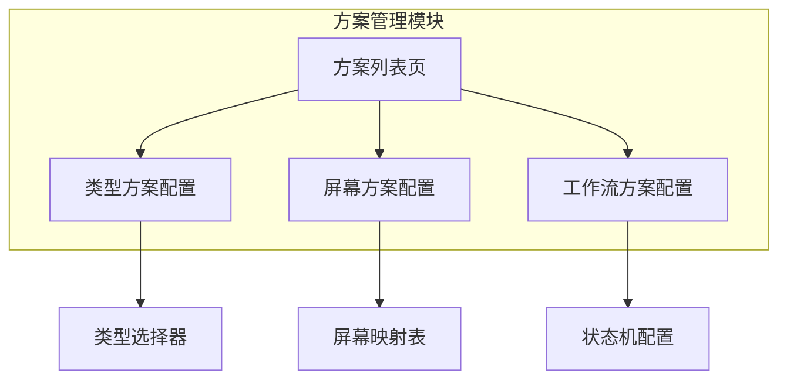

# 方案管理UI原型设计

## 0. 可视化原型图

### 页面架构图


### 列表页面布局
```
┌─────────────────────────────────────────────┐
│  🔙 返回  |  方案管理                        │
├──────────┬──────────────────────────────────┤
│ Tab导航   │                                  │
│ [类型方案]│  ┌──────────────────────────┐   │
│ [屏幕方案]│  │ 搜索框  [+新建方案]       │   │
│ [工作流]  │  ├──────────────────────────┤   │
│          │  │ 方案名称  | 类型数 | 操作  │   │
│          │  │----------|--------|-------│   │
│          │  │ 默认方案  |   5    |编辑删除│   │
│          │  │ 软件开发  |   4    |编辑删除│   │
│          │  └──────────────────────────┘   │
└──────────┴──────────────────────────────────┘
```

### 类型方案配置页面
```
┌─────────────────────────────────────────────┐
│  🔙 返回  |  编辑类型方案                    │
├─────────────────────────────────────────────┤
│ 基础信息                                     │
│ ┌─────────────────────────────────────────┐ │
│ │ 方案Key:  [software-types      ]        │ │
│ │ 方案名称: [软件开发类型方案      ]        │ │
│ │ 描述:     [适用于软件研发项目... ]        │ │
│ └─────────────────────────────────────────┘ │
│                                              │
│ 包含的工作项类型 (可拖拽排序)                 │
│ ┌─────────────────────────────────────────┐ │
│ │ ☑ 史诗      ⭐         [↑][↓][×]        │ │
│ │ ☑ 用户故事   📖         [↑][↓][×]        │ │
│ │ ☑ 任务       📄         [↑][↓][×]        │ │
│ │ ☑ Bug        🐛         [↑][↓][×]        │ │
│ │ ☐ 子任务     🎫         [+添加]          │ │
│ └─────────────────────────────────────────┘ │
│                                              │
│              [取消]  [保存]                  │
└─────────────────────────────────────────────┘
```

### 屏幕方案配置页面
```
┌─────────────────────────────────────────────┐
│  🔙 返回  |  编辑屏幕方案                    │
├─────────────────────────────────────────────┤
│ 基础信息                                     │
│ ┌─────────────────────────────────────────┐ │
│ │ 方案Key:  [default-screens     ]        │ │
│ │ 方案名称: [默认屏幕方案        ]          │ │
│ │ 描述:     [标准字段布局配置... ]          │ │
│ └─────────────────────────────────────────┘ │
│                                              │
│ 工作项类型 → 屏幕映射                         │
│ ┌─────────────────────────────────────────┐ │
│ │ 工作项类型 | 创建/编辑屏幕 | 查看屏幕    │ │
│ │-----------|--------------|------------│ │
│ │ 史诗      |[Default Screen]|[Default]  │ │
│ │           |  [配置]        | [配置]    │ │
│ │-----------|--------------|------------│ │
│ │ 用户故事  |[Story Screen] |[Story]    │ │
│ │           |  [配置]        | [配置]    │ │
│ │-----------|--------------|------------│ │
│ │ Bug       |[Bug Screen]   |[Bug]      │ │
│ │           |  [配置]        | [配置]    │ │
│ └─────────────────────────────────────────┘ │
│                                              │
│              [取消]  [保存]                  │
└─────────────────────────────────────────────┘
```

### 工作流方案配置页面
```
┌─────────────────────────────────────────────┐
│  🔙 返回  |  编辑工作流方案                  │
├─────────────────────────────────────────────┤
│ 基础信息                                     │
│ ┌─────────────────────────────────────────┐ │
│ │ 方案Key:  [standard-workflow   ]        │ │
│ │ 方案名称: [标准工作流          ]          │ │
│ │ 描述:     [标准审批流程...     ]          │ │
│ └─────────────────────────────────────────┘ │
│                                              │
│ 工作项类型 → 工作流映射                       │
│ ┌─────────────────────────────────────────┐ │
│ │ 工作项类型 | 工作流        | 初始状态    │ │
│ │-----------|--------------|------------│ │
│ │ 史诗      |[Epic Workflow]|[Open]      │ │
│ │           |  [配置]        |            │ │
│ │-----------|--------------|------------│ │
│ │ 用户故事  |[Story WF]     |[To Do]     │ │
│ │           |  [配置]        |            │ │
│ │-----------|--------------|------------│ │
│ │ Bug       |[Bug Workflow] |[Open]      │ │
│ │           |  [配置]        |            │ │
│ └─────────────────────────────────────────┘ │
│                                              │
│              [取消]  [保存]                  │
└─────────────────────────────────────────────┘
```

## 1. 设计理念

### 参考系统
- **Jira Scheme管理**: Type Scheme、Workflow Scheme、Screen Scheme
- **核心交互**: 
  - 列表页Tab切换三种方案类型
  - 配置页表格形式展示映射关系
  - 支持下拉选择器选择关联资源

### 关键交互模式
1. **类型方案**: Checkbox多选 + 拖拽排序
2. **屏幕方案**: 表格下拉选择 + 链接跳转配置
3. **工作流方案**: 表格下拉选择 + 链接跳转配置

## 2. 页面组件说明

### 方案列表页 (SchemeList.vue)
**职责**: 展示所有方案,支持Tab切换和CRUD操作

**核心功能**:
- Tab导航: 类型方案/屏幕方案/工作流方案
- 搜索框: 按方案名称搜索
- 新建按钮: 创建新方案
- 表格列: 方案名称、关联数量、系统标识、操作
- 操作: 编辑、删除(系统方案不可删)

### 类型方案配置页 (TypeSchemeConfig.vue)
**职责**: 配置类型方案包含的工作项类型及顺序

**核心功能**:
- 基础信息表单: Key、名称、描述
- 类型选择器: Checkbox多选可用类型
- 拖拽排序: 调整类型显示顺序
- 实时预览: 显示已选类型的图标和名称

### 屏幕方案配置页 (ScreenSchemeConfig.vue)
**职责**: 配置工作项类型与屏幕的映射关系

**核心功能**:
- 基础信息表单
- 映射表格: 每行一个工作项类型
- 下拉选择器: 选择创建/编辑屏幕、查看屏幕
- 配置链接: 点击跳转到Screen配置页面
- 批量保存: 一次性提交所有映射

### 工作流方案配置页 (WorkflowSchemeConfig.vue)
**职责**: 配置工作项类型与工作流的映射关系

**核心功能**:
- 基础信息表单
- 映射表格: 每行一个工作项类型
- 下拉选择器: 选择工作流
- 初始状态下拉: 选择工作流的起始状态
- 配置链接: 点击跳转到工作流配置页面

## 3. 状态管理

### 全局状态
```javascript
// 当前激活的Tab
const activeTab = ref('type') // 'type' | 'screen' | 'workflow'

// 方案列表数据
const typeSchemes = ref([])
const screenSchemes = ref([])
const workflowSchemes = ref([])

// 当前编辑的方案
const currentScheme = ref(null)
```

### 数据流
```
用户操作 → Vue组件 → API调用 → 后端Service → 数据库
                ↓
          ElMessage提示
                ↓
          重新加载列表
```

## 4. 响应式设计

### 断点策略
- **Desktop (>1200px)**: 完整布局,表格全宽显示
- **Tablet (768-1200px)**: 表格横向滚动,操作按钮折叠
- **Mobile (<768px)**: 卡片式布局,隐藏非关键字段

### 适配策略
- 表格使用`el-table`的`fixed`列
- 表单使用`el-form`的响应式布局
- 操作按钮在小屏幕下使用下拉菜单

## 5. 验收标准

### 功能指标
- [ ] 能查看所有方案列表并按Tab切换
- [ ] 能创建/编辑/删除方案(系统方案除外)
- [ ] 类型方案支持多选和拖拽排序
- [ ] 屏幕方案能为每个类型选择不同屏幕
- [ ] 工作流方案能为每个类型选择工作流
- [ ] 保存后数据正确持久化
- [ ] 点击配置链接能跳转到对应配置页

### 体验指标
- [ ] 列表加载时间 < 1s
- [ ] 保存操作有loading提示
- [ ] 错误操作有明确提示
- [ ] 系统方案有明确标识且不可删除

### 性能指标
- [ ] 首屏加载 < 2s
- [ ] API响应 < 500ms
- [ ] 表格渲染 < 100ms (100条数据)
