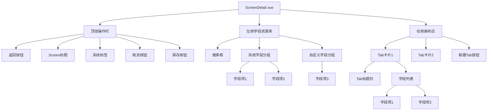
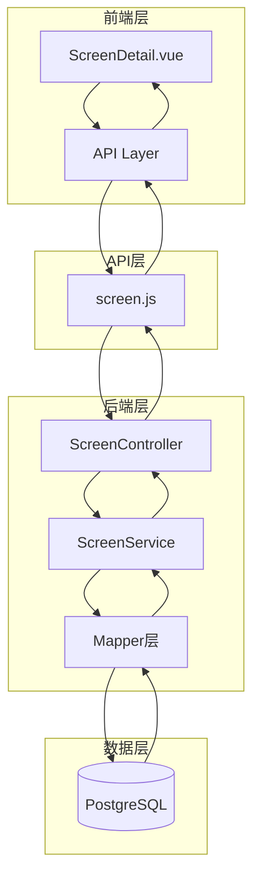
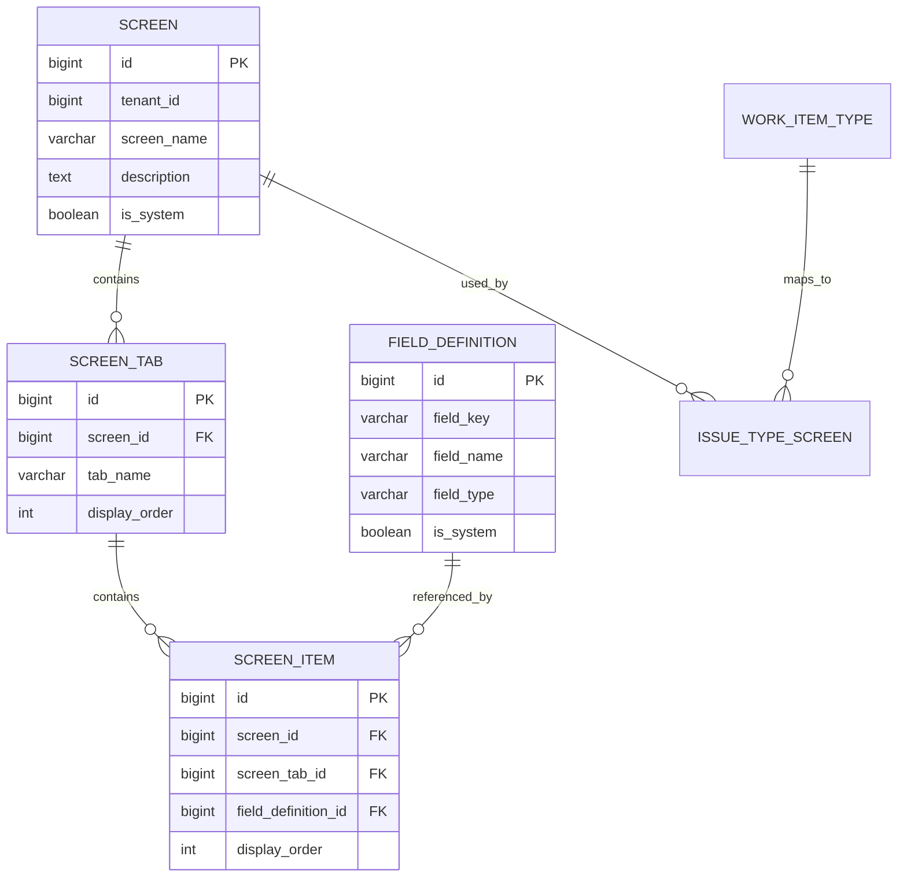
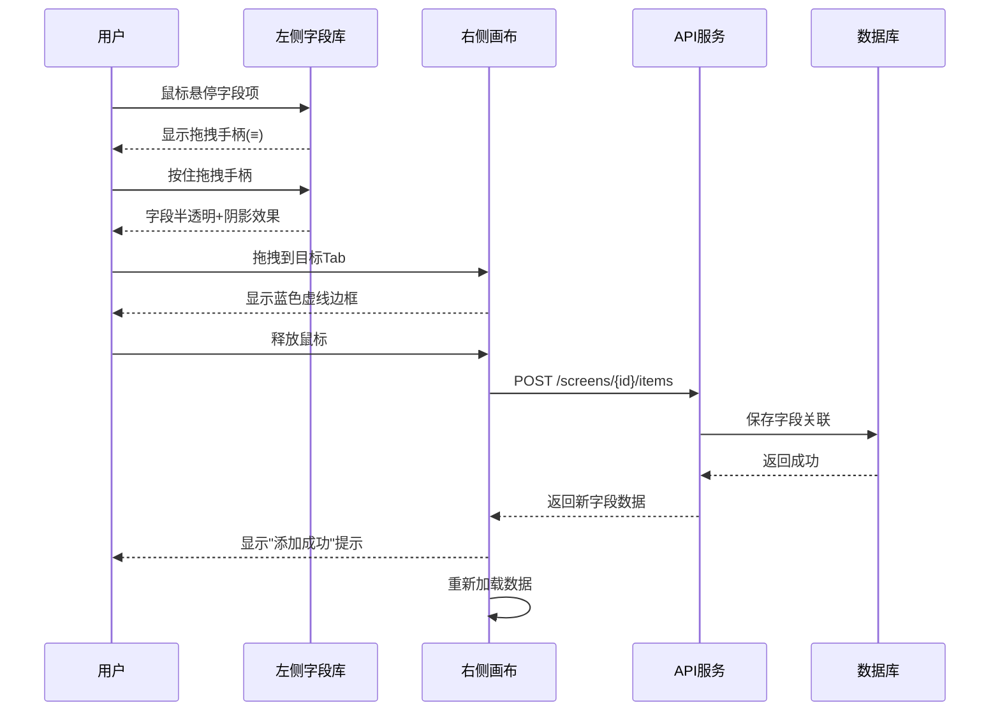
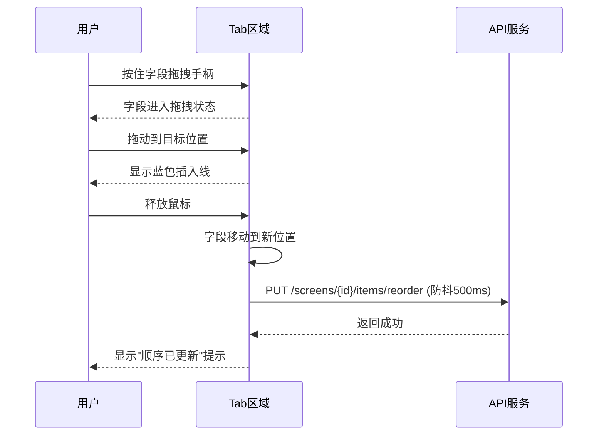
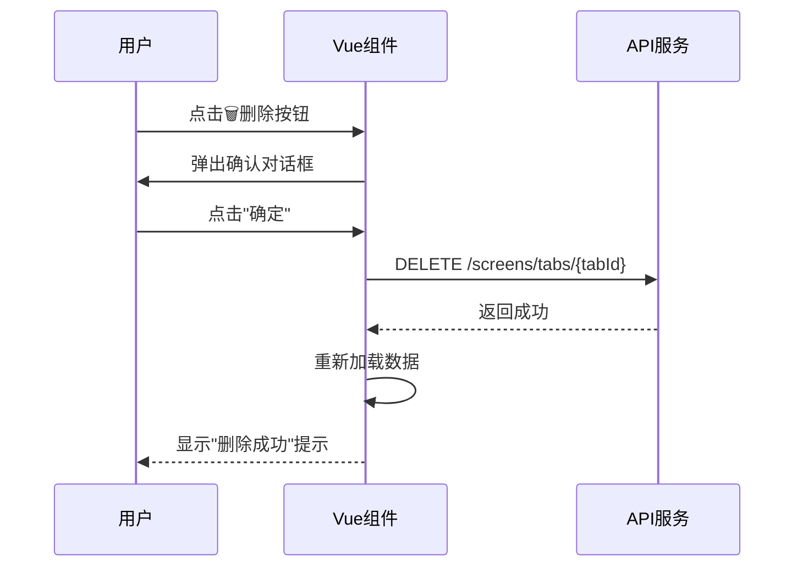
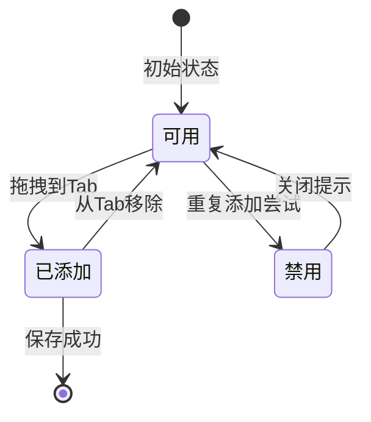

# Screen 配置页面详细技术设计文档（V3 - 基于可视化原型）

## 文档版本

| 版本 | 日期 | 作者 | 说明 |
|------|------|------|------|
| V1.0 | 2026-04-12 | AI Assistant | 初始版本 |
| V2.0 | 2026-04-12 | AI Assistant | 架构优化，简化组件 |
| V3.0 | 2026-04-13 | AI Assistant | 基于可视化原型图完善 |

---

## 1. 概述

### 1.1 文档目的
本文档定义 Screen 配置页面的完整技术实现方案，基于 ONES/Jira 的拖拽式字段配置交互模式，结合可视化原型图进行详细设计。

### 1.2 设计目标
- ✅ **可视化配置**：所见即所得的字段布局编辑
- ✅ **直观拖拽**：左侧资源库 → 右侧画布的拖拽添加
- ✅ **灵活排序**：Tab 和字段的自由拖拽排序
- ✅ **实时反馈**：操作即时响应，自动保存
- ✅ **响应式设计**：支持桌面端、平板端、移动端

### 1.3 参考系统
- **ONES Project**：工作项属性拖拽配置
- **Jira Screen**：字段管理与 Tab 组织
- **飞书项目**：详情页布局配置

### 1.4 相关文档
- [SCREEN_UI_PROTOTYPE.md](./SCREEN_UI_PROTOTYPE.md) - 可视化原型图
- [SCREEN_SDD_V2.md](./SCREEN_SDD_V2.md) - 旧版设计文档（已废弃）

---

## 2. 系统架构

### 2.1 技术栈

#### 前端技术栈
```
Vue 3.4.x          - 渐进式 JavaScript 框架
├─ Composition API - 组合式 API
├─ ref/reactive    - 响应式数据
└─ computed        - 计算属性

Element Plus 2.6.x - UI 组件库
├─ el-button       - 按钮组件
├─ el-card         - 卡片组件
├─ el-tag          - 标签组件
├─ el-input        - 输入框组件
├─ el-message      - 消息提示
└─ el-message-box  - 对话框

vuedraggable@next  - 拖拽库（基于 Sortable.js）
├─ clone 模式      - 克隆拖拽（左侧→右侧）
├─ group 模式      - 组内拖拽（排序）
└─ animation       - 动画效果

Vite 5.4.x         - 构建工具
SCSS               - CSS 预处理器
```

#### 后端技术栈
```
Spring Boot 3.4.4  - Java Web 框架
MyBatis Plus 3.5.9 - ORM 框架
PostgreSQL 14+     - 关系型数据库
Lombok 1.18.44     - 代码简化工具
```

### 2.2 组件架构（单一组件）



**设计理由**：
- ✅ 当前功能集中在单页面，无需组件拆分
- ✅ 减少 props/emits 传递复杂度
- ✅ 便于状态管理和调试
- ✅ 后续如需复用再提取组件

### 2.3 数据流架构



**数据流向**：
1. 用户操作 → Vue 组件状态更新
2. 组件调用 API 方法
3. API 发送 HTTP 请求到后端
4. 后端处理业务逻辑
5. 数据库持久化
6. 返回结果 → 前端更新状态

---

## 3. 数据库设计

### 3.1 表结构（复用现有）

已存在的表结构满足需求，无需修改：

#### screen 表
```sql
CREATE TABLE screen (
    id BIGSERIAL PRIMARY KEY,
    tenant_id BIGINT NOT NULL,
    screen_name VARCHAR(255) NOT NULL,
    description TEXT,
    is_system BOOLEAN DEFAULT FALSE,
    created_at TIMESTAMP DEFAULT CURRENT_TIMESTAMP,
    updated_at TIMESTAMP DEFAULT CURRENT_TIMESTAMP,
    UNIQUE(tenant_id, screen_name)
);
```

#### screen_tab 表
```sql
CREATE TABLE screen_tab (
    id BIGSERIAL PRIMARY KEY,
    screen_id BIGINT NOT NULL REFERENCES screen(id) ON DELETE CASCADE,
    tab_name VARCHAR(255) NOT NULL,
    display_order INTEGER NOT NULL DEFAULT 0,
    created_at TIMESTAMP DEFAULT CURRENT_TIMESTAMP,
    updated_at TIMESTAMP DEFAULT CURRENT_TIMESTAMP
);

-- 索引优化
CREATE INDEX idx_screen_tab_screen_order ON screen_tab(screen_id, display_order);
```

#### screen_item 表
```sql
CREATE TABLE screen_item (
    id BIGSERIAL PRIMARY KEY,
    screen_id BIGINT NOT NULL REFERENCES screen(id) ON DELETE CASCADE,
    screen_tab_id BIGINT NOT NULL REFERENCES screen_tab(id) ON DELETE CASCADE,
    field_definition_id BIGINT NOT NULL REFERENCES field_definition(id),
    display_order INTEGER NOT NULL DEFAULT 0,
    created_at TIMESTAMP DEFAULT CURRENT_TIMESTAMP,
    updated_at TIMESTAMP DEFAULT CURRENT_TIMESTAMP,
    UNIQUE(screen_tab_id, field_definition_id) -- 防止重复添加
);

-- 索引优化
CREATE INDEX idx_screen_item_tab_order ON screen_item(screen_tab_id, display_order);
```

#### issue_type_screen 表
```sql
CREATE TABLE issue_type_screen (
    id BIGSERIAL PRIMARY KEY,
    tenant_id BIGINT NOT NULL,
    work_item_type_id BIGINT NOT NULL,
    screen_id BIGINT NOT NULL REFERENCES screen(id),
    operation_type VARCHAR(20) NOT NULL, -- CREATE, EDIT, VIEW
    created_at TIMESTAMP DEFAULT CURRENT_TIMESTAMP,
    updated_at TIMESTAMP DEFAULT CURRENT_TIMESTAMP,
    UNIQUE(tenant_id, work_item_type_id, operation_type)
);
```

### 3.2 ER 图



### 3.3 初始化数据

参考 `schema.sql` 中的系统 Screen 初始化数据：
- Default Screen（默认屏幕）
- Bug Screen（Bug跟踪屏幕）
- Story Screen（用户故事屏幕）
- Task Screen（任务管理屏幕）

---

## 4. API 设计

### 4.1 RESTful API 规范

**基础路径**: `/api/v1`

**通用响应格式**:
```json
{
  "code": 200,
  "message": "success",
  "data": { ... }
}
```

**错误响应**:
```json
{
  "code": 400,
  "message": "参数错误",
  "data": null
}
```

### 4.2 Screen 管理 API

| 方法 | 路径 | 请求体 | 响应 | 说明 |
|------|------|--------|------|------|
| GET | `/screens` | - | `Screen[]` | 获取 Screen 列表 |
| GET | `/screens/:id` | - | `ScreenDetail` | 获取 Screen 详情（含 Tabs + Fields） |
| POST | `/screens` | `ScreenCreateRequest` | `Screen` | 创建 Screen |
| PUT | `/screens/:id` | `ScreenUpdateRequest` | `Screen` | 更新 Screen 基本信息 |
| DELETE | `/screens/:id` | - | `void` | 删除 Screen |

### 4.3 Tab 管理 API

| 方法 | 路径 | 请求体 | 响应 | 说明 |
|------|------|--------|------|------|
| POST | `/screens/:screenId/tabs` | `{ tabName: string }` | `ScreenTab` | 添加 Tab |
| DELETE | `/screens/tabs/:tabId` | - | `void` | 删除 Tab |
| PUT | `/screens/:screenId/tabs/reorder` | `number[]` | `void` | 调整 Tab 顺序 |

**请求示例** - 添加 Tab:
```http
POST /api/v1/screens/1/tabs
Content-Type: application/json

{
  "tabName": "人员信息"
}
```

**请求示例** - 调整 Tab 顺序:
```http
PUT /api/v1/screens/1/tabs/reorder
Content-Type: application/json

[2, 1, 3]
```

### 4.4 字段管理 API

| 方法 | 路径 | 请求体 | 响应 | 说明 |
|------|------|--------|------|------|
| POST | `/screens/:screenId/items` | `ScreenItemCreateRequest` | `ScreenItemResponse` | 添加字段到 Tab |
| DELETE | `/screens/items/:itemId` | - | `void` | 从 Screen 移除字段 |
| PUT | `/screens/:screenId/items/reorder` | `number[]` | `void` | 调整字段顺序 |

**请求示例** - 添加字段:
```http
POST /api/v1/screens/1/items
Content-Type: application/json

{
  "fieldDefinitionId": 5,
  "screenTabId": 2
}
```

**响应示例**:
```json
{
  "code": 200,
  "message": "success",
  "data": {
    "id": 35,
    "fieldDefinitionId": 5,
    "screenTabId": 2,
    "fieldKey": "assignee",
    "fieldName": "负责人",
    "fieldType": "USER",
    "displayOrder": 0
  }
}
```

**重要**: `ScreenItemResponse` 必须包含 `screenTabId` 字段，用于前端匹配拖拽添加的字段。

### 4.5 字段资源 API

| 方法 | 路径 | 查询参数 | 响应 | 说明 |
|------|------|----------|------|------|
| GET | `/field-definitions` | - | `FieldDefinition[]` | 获取可用字段列表 |

**响应示例**:
```json
{
  "code": 200,
  "message": "success",
  "data": [
    {
      "id": 1,
      "fieldKey": "summary",
      "fieldName": "摘要",
      "fieldType": "TEXT",
      "isSystem": true
    },
    {
      "id": 13,
      "fieldKey": "severity",
      "fieldName": "严重程度",
      "fieldType": "SELECT",
      "isSystem": false
    }
  ]
}
```

### 4.6 DTO 定义

#### ScreenDetailResponse
```java
@Data
public class ScreenDetailResponse {
    private Long id;
    private String screenName;
    private String description;
    private Boolean isSystem;
    private List<ScreenTabResponse> tabs;
    private Map<String, String> issueTypeMappings;
    private LocalDateTime createdAt;
    private LocalDateTime updatedAt;
}
```

#### ScreenTabResponse
```java
@Data
public class ScreenTabResponse {
    private Long id;
    private String tabName;
    private Integer displayOrder;
    private List<ScreenItemResponse> items;
}
```

#### ScreenItemResponse ⚠️ 重要
```java
@Data
public class ScreenItemResponse {
    private Long id;
    private Long fieldDefinitionId;
    private Long screenTabId;  // ✅ 必须包含，用于前端匹配
    private String fieldKey;
    private String fieldName;
    private String fieldType;
    private Integer displayOrder;
}
```

#### ScreenItemCreateRequest
```java
@Data
public class ScreenItemCreateRequest {
    @NotNull
    private Long fieldDefinitionId;
    
    @NotNull
    private Long screenTabId;
}
```

---

## 5. 前端详细设计

### 5.1 页面布局

#### 5.1.1 整体布局结构

```
┌──────────────────────────────────────────────────────────────────────┐
│  顶部操作栏 (60px 固定高度)                                           │
├──────────┬───────────────────────────────────────────────────────────┤
│          │                                                           │
│  左侧    │              右侧画布区                                     │
│  字段    │  ┌─────────────────────────────────────────────────┐    │
│  资源库  │  │  Tab 卡片 1                                      │    │
│  (320px) │  │  ┌─────────────────────────────────────────┐   │    │
│          │  │  │ 字段列表（可拖拽排序）                   │   │    │
│          │  │  └─────────────────────────────────────────┘   │    │
│          │  └─────────────────────────────────────────────────┘    │
│          │  ┌─────────────────────────────────────────────────┐    │
│          │  │  Tab 卡片 2                                      │    │
│          │  └─────────────────────────────────────────────────┘    │
│          │  [+ 新建 Tab]                                            │
│          │                                                           │
└──────────┴───────────────────────────────────────────────────────────┘
```

#### 5.1.2 响应式断点

| 断点 | 宽度范围 | 布局策略 |
|------|----------|----------|
| 桌面端 | ≥1200px | 左右分栏，左侧 320px 固定 |
| 平板端 | 768px-1199px | 左侧可折叠抽屉 |
| 移动端 | <768px | 单列布局，Tab 切换器 |

### 5.2 核心状态管理

```javascript
<script setup>
import { ref, computed, onMounted, watch } from 'vue'
import { useRoute, useRouter } from 'vue-router'
import { ElMessage, ElMessageBox } from 'element-plus'
import draggable from 'vuedraggable'
import { 
  getScreenById, 
  getAvailableFields,
  addTab,
  deleteTab,
  reorderTabs,
  addFieldToScreen,
  removeFieldFromScreen,
  reorderFields
} from '@/api/screen'

const route = useRoute()
const router = useRouter()

// ========== 核心状态 ==========
const screen = ref({})                    // Screen 详情数据
const availableFields = ref([])           // 可用字段列表
const loading = ref(false)                // 加载状态
const saving = ref(false)                 // 保存状态
const searchKeyword = ref('')             // 字段搜索关键词
const systemExpanded = ref(true)          // 系统字段展开状态
const customExpanded = ref(false)         // 自定义字段展开状态
const draggingField = ref(null)           // 当前拖拽的字段

// ========== 计算属性 ==========

/**
 * 已添加的字段 ID 集合
 * 用于判断字段是否已被添加到当前 Screen
 */
const addedFieldIds = computed(() => {
  const ids = new Set()
  screen.value.tabs?.forEach(tab => {
    tab.items?.forEach(item => {
      ids.add(item.fieldDefinitionId)
    })
  })
  return ids
})

/**
 * 过滤后的系统字段
 * 支持搜索关键词过滤
 */
const filteredSystemFields = computed(() => {
  return availableFields.value.filter(f => 
    f.isSystem && 
    f.fieldName.toLowerCase().includes(searchKeyword.value.toLowerCase())
  )
})

/**
 * 过滤后的自定义字段
 * 支持搜索关键词过滤
 */
const filteredCustomFields = computed(() => {
  return availableFields.value.filter(f => 
    !f.isSystem && 
    f.fieldName.toLowerCase().includes(searchKeyword.value.toLowerCase())
  )
})

// ========== 数据加载 ==========

/**
 * 加载 Screen 详情和可用字段列表
 */
const loadData = async () => {
  const id = route.params.id
  if (!id) return
  
  loading.value = true
  try {
    const [screenRes, fieldsRes] = await Promise.all([
      getScreenById(id),
      getAvailableFields()
    ])
    screen.value = screenRes
    availableFields.value = fieldsRes
    
    // 调试日志（开发环境）
    if (import.meta.env.DEV) {
      console.log('Screen loaded:', screen.value.screenName)
      console.log('Tabs count:', screen.value.tabs?.length)
      if (screen.value.tabs && screen.value.tabs.length > 0) {
        console.log('First tab items:', screen.value.tabs[0].items)
      }
    }
  } catch (error) {
    ElMessage.error('加载失败：' + error.message)
    console.error('Load data error:', error)
  } finally {
    loading.value = false
  }
}

// ========== 拖拽处理 ==========

/**
 * 拖拽开始事件
 * 记录当前拖拽的字段信息
 */
const handleDragStart = (evt) => {
  draggingField.value = evt.item.__draggable_context.element
}

/**
 * 字段拖拽添加到 Tab
 * 
 * 流程：
 * 1. 校验字段是否已添加
 * 2. 调用 API 添加字段
 * 3. 重新加载数据以同步状态
 * 4. 错误时回滚
 */
const handleDropField = async (evt, tab) => {
  // 从 evt.added 获取新添加的字段
  const addedItem = evt.added?.element
  if (!addedItem) return
  
  // 校验：字段是否已添加
  if (addedFieldIds.value.has(addedItem.fieldDefinitionId)) {
    ElMessage.warning(`字段"${addedItem.fieldName}"已在当前 Screen 中`)
    // 移除刚添加的项（通过 fieldDefinitionId 和 screenTabId 匹配）
    const index = tab.items.findIndex(item => 
      item.fieldDefinitionId === addedItem.fieldDefinitionId && 
      item.screenTabId === tab.id
    )
    if (index > -1) {
      tab.items.splice(index, 1)
    }
    return
  }
  
  try {
    await addFieldToScreen(screen.value.id, {
      fieldDefinitionId: addedItem.fieldDefinitionId,
      screenTabId: tab.id
    })
    ElMessage.success('字段添加成功')
    // 重新加载以获取后端返回的真实数据
    await loadData()
  } catch (error) {
    ElMessage.error('添加失败：' + error.message)
    // 移除失败的项
    const index = tab.items.findIndex(item => 
      item.fieldDefinitionId === addedItem.fieldDefinitionId && 
      item.screenTabId === tab.id
    )
    if (index > -1) {
      tab.items.splice(index, 1)
    }
    await loadData() // 恢复原状态
  }
}

/**
 * Tab 拖拽排序完成
 * 防抖后自动保存
 */
const handleReorderTabs = async () => {
  if (screen.value.isSystem) {
    ElMessage.warning('系统 Screen 不允许修改')
    await loadData() // 恢复原顺序
    return
  }
  
  try {
    const tabIds = screen.value.tabs.map(tab => tab.id)
    await reorderTabs(screen.value.id, tabIds)
    ElMessage.success('Tab 顺序已更新')
  } catch (error) {
    ElMessage.error('更新失败：' + error.message)
    await loadData() // 恢复原顺序
  }
}

/**
 * 字段拖拽排序完成
 * 防抖后自动保存
 */
const handleReorderFields = async (tab) => {
  if (screen.value.isSystem) {
    ElMessage.warning('系统 Screen 不允许修改')
    await loadData() // 恢复原顺序
    return
  }
  
  try {
    const itemIds = tab.items.map(item => item.id)
    await reorderFields(screen.value.id, itemIds)
    ElMessage.success('字段顺序已更新')
  } catch (error) {
    ElMessage.error('更新失败：' + error.message)
    await loadData() // 恢复原顺序
  }
}

// ========== Tab 操作 ==========

/**
 * 添加新 Tab
 */
const handleAddTab = async () => {
  try {
    const { value: tabName } = await ElMessageBox.prompt(
      '请输入 Tab 名称',
      '新建 Tab',
      {
        confirmButtonText: '确定',
        cancelButtonText: '取消',
        inputPattern: /.+/,
        inputErrorMessage: 'Tab 名称不能为空'
      }
    )
    
    await addTab(screen.value.id, tabName)
    ElMessage.success('添加成功')
    await loadData()
  } catch (error) {
    if (error !== 'cancel') {
      ElMessage.error('添加失败：' + error.message)
    }
  }
}

/**
 * 删除 Tab
 */
const handleDeleteTab = async (tab) => {
  try {
    await ElMessageBox.confirm(
      `确定要删除 Tab"${tab.tabName}"吗？该 Tab 下的所有字段也将被删除。`,
      '警告',
      { type: 'warning' }
    )
    
    await deleteTab(tab.id)
    ElMessage.success('删除成功')
    await loadData()
  } catch (error) {
    if (error !== 'cancel') {
      ElMessage.error('删除失败：' + error.message)
    }
  }
}

// ========== 字段操作 ==========

/**
 * 从 Tab 中移除字段
 */
const handleRemoveField = async (item, tab) => {
  try {
    await ElMessageBox.confirm(
      `确定要从 Tab"${tab.tabName}"中移除字段"${item.fieldName}"吗？`,
      '警告',
      { type: 'warning' }
    )
    
    await removeFieldFromScreen(item.id)
    ElMessage.success('移除成功')
    await loadData()
  } catch (error) {
    if (error !== 'cancel') {
      ElMessage.error('移除失败：' + error.message)
    }
  }
}

// ========== 其他操作 ==========

/**
 * 保存按钮（所有更改已实时保存）
 */
const handleSave = async () => {
  saving.value = true
  try {
    ElMessage.success('保存成功')
  } catch (error) {
    ElMessage.error('保存失败：' + error.message)
  } finally {
    saving.value = false
  }
}

/**
 * 返回上一页
 */
const goBack = () => {
  router.push('/config/screens')
}

// ========== 生命周期 ==========
onMounted(() => {
  loadData()
})
</script>
```

### 5.3 模板结构

```vue
<template>
  <div class="screen-config-container">
    <!-- 顶部操作栏 -->
    <div class="config-header">
      <el-page-header @back="goBack">
        <template #content>
          <span class="page-title">{{ screen.screenName || '屏幕配置' }}</span>
          <el-tag v-if="screen.isSystem" type="success" size="small" style="margin-left: 10px">
            系统
          </el-tag>
        </template>
      </el-page-header>
      <div class="header-actions">
        <el-button @click="goBack">取消</el-button>
        <el-button type="primary" :loading="saving" @click="handleSave">
          保存
        </el-button>
      </div>
    </div>

    <!-- 主体内容 -->
    <div class="config-body" v-loading="loading">
      <!-- 左侧字段资源库 -->
      <div class="field-library">
        <!-- 搜索框 -->
        <div class="search-box">
          <el-input
            v-model="searchKeyword"
            placeholder="搜索字段..."
            :prefix-icon="Search"
            clearable
          />
        </div>

        <!-- 系统字段 -->
        <div class="field-group">
          <div class="group-header" @click="systemExpanded = !systemExpanded">
            <el-icon><ArrowDown v-if="systemExpanded" /><ArrowRight v-else /></el-icon>
            <span>系统字段</span>
          </div>
          <draggable
            v-show="systemExpanded"
            :list="filteredSystemFields"
            :group="{ name: 'fields', pull: 'clone', put: false }"
            :sort="false"
            item-key="id"
            @start="handleDragStart"
            class="field-list"
          >
            <template #item="{ element }">
              <div 
                class="field-item"
                :class="{ disabled: addedFieldIds.has(element.id) }"
              >
                <el-icon class="drag-handle"><Rank /></el-icon>
                <div class="field-info">
                  <div class="field-name">{{ element.fieldName }}</div>
                  <div class="field-key">{{ element.fieldKey }}</div>
                  <el-tag size="small" :type="getFieldTypeColor(element.fieldType)">
                    {{ element.fieldType }}
                  </el-tag>
                </div>
              </div>
            </template>
          </draggable>
        </div>

        <!-- 自定义字段 -->
        <div class="field-group">
          <div class="group-header" @click="customExpanded = !customExpanded">
            <el-icon><ArrowDown v-if="customExpanded" /><ArrowRight v-else /></el-icon>
            <span>自定义字段 ({{ filteredCustomFields.length }})</span>
          </div>
          <draggable
            v-show="customExpanded"
            :list="filteredCustomFields"
            :group="{ name: 'fields', pull: 'clone', put: false }"
            :sort="false"
            item-key="id"
            @start="handleDragStart"
            class="field-list"
          >
            <template #item="{ element }">
              <div 
                class="field-item"
                :class="{ disabled: addedFieldIds.has(element.id) }"
              >
                <el-icon class="drag-handle"><Rank /></el-icon>
                <div class="field-info">
                  <div class="field-name">{{ element.fieldName }}</div>
                  <div class="field-key">{{ element.fieldKey }}</div>
                  <el-tag size="small" :type="getFieldTypeColor(element.fieldType)">
                    {{ element.fieldType }}
                  </el-tag>
                </div>
              </div>
            </template>
          </draggable>
        </div>
      </div>

      <!-- 右侧画布区 -->
      <div class="canvas-area">
        <!-- Tab 卡片列表 -->
        <draggable
          v-model="screen.tabs"
          item-key="id"
          handle=".tab-drag-handle"
          @end="handleReorderTabs"
          class="tabs-container"
        >
          <template #item="{ element: tab }">
            <el-card class="tab-card" shadow="hover">
              <!-- Tab 标题栏 -->
              <template #header>
                <div class="tab-header">
                  <div class="tab-title">
                    <el-icon class="tab-drag-handle"><Rank /></el-icon>
                    <span>Tab: {{ tab.tabName }}</span>
                  </div>
                  <el-button
                    v-if="!screen.isSystem"
                    type="danger"
                    text
                    :icon="Delete"
                    @click="handleDeleteTab(tab)"
                  >
                    删除
                  </el-button>
                </div>
              </template>

              <!-- 字段列表 -->
              <draggable
                v-model="tab.items"
                item-key="id"
                handle=".field-drag-handle"
                group="fields"
                animation="200"
                @end="handleReorderFields(tab)"
                class="tab-fields"
              >
                <template #item="{ element: item }">
                  <div class="tab-field-item">
                    <el-icon class="field-drag-handle"><Rank /></el-icon>
                    <div class="field-info">
                      <div class="field-name">{{ item.fieldName }}</div>
                      <div class="field-key">{{ item.fieldKey }}</div>
                      <el-tag size="small" :type="getFieldTypeColor(item.fieldType)">
                        {{ item.fieldType }}
                      </el-tag>
                    </div>
                    <el-button
                      v-if="!screen.isSystem"
                      type="danger"
                      text
                      :icon="Delete"
                      @click="handleRemoveField(item, tab)"
                    >
                      移除
                    </el-button>
                  </div>
                </template>
              </draggable>

              <!-- 空状态提示 -->
              <el-empty
                v-if="!tab.items || tab.items.length === 0"
                description="拖拽左侧字段到此处"
                :image-size="80"
              />
            </el-card>
          </template>
        </draggable>

        <!-- 新建 Tab 按钮 -->
        <el-button
          v-if="!screen.isSystem"
          class="add-tab-btn"
          :icon="Plus"
          @click="handleAddTab"
        >
          新建 Tab
        </el-button>
      </div>
    </div>
  </div>
</template>
```

### 5.4 样式设计

```scss
<style scoped lang="scss">
.screen-config-container {
  height: 100vh;
  display: flex;
  flex-direction: column;
  background: #f5f7fa;
  
  // ========== 顶部操作栏 ==========
  .config-header {
    display: flex;
    justify-content: space-between;
    align-items: center;
    padding: 16px 24px;
    background: #fff;
    border-bottom: 1px solid #dcdfe6;
    
    .page-title {
      font-size: 18px;
      font-weight: 600;
    }
    
    .header-actions {
      display: flex;
      gap: 10px;
    }
  }
  
  // ========== 主体内容 ==========
  .config-body {
    flex: 1;
    display: flex;
    overflow: hidden;
    
    // ===== 左侧字段资源库 =====
    .field-library {
      width: 320px;
      flex-shrink: 0;
      background: #fff;
      border-right: 1px solid #dcdfe6;
      display: flex;
      flex-direction: column;
      
      .search-box {
        padding: 16px;
        border-bottom: 1px solid #ebeef5;
      }
      
      .field-group {
        flex: 1;
        overflow-y: auto;
        
        .group-header {
          display: flex;
          align-items: center;
          gap: 8px;
          padding: 12px 16px;
          cursor: pointer;
          user-select: none;
          font-weight: 600;
          
          &:hover {
            background: #f5f7fa;
          }
        }
        
        .field-list {
          padding: 8px;
          
          .field-item {
            display: flex;
            align-items: center;
            gap: 8px;
            padding: 10px;
            margin-bottom: 8px;
            background: #fff;
            border: 1px solid #dcdfe6;
            border-radius: 4px;
            cursor: move;
            transition: all 0.2s;
            
            &:hover {
              background: #ecf5ff;
              border-color: #409eff;
            }
            
            &.disabled {
              opacity: 0.5;
              cursor: not-allowed;
              
              &:hover {
                background: #fff;
                border-color: #dcdfe6;
              }
            }
            
            .drag-handle {
              color: #909399;
              cursor: move;
            }
            
            .field-info {
              flex: 1;
              
              .field-name {
                font-size: 14px;
                font-weight: 500;
                margin-bottom: 4px;
              }
              
              .field-key {
                font-size: 12px;
                color: #909399;
                margin-bottom: 4px;
              }
            }
          }
        }
      }
    }
    
    // ===== 右侧画布区 =====
    .canvas-area {
      flex: 1;
      overflow-y: auto;
      padding: 24px;
      
      .tabs-container {
        display: flex;
        flex-direction: column;
        gap: 16px;
        
        .tab-card {
          :deep(.el-card__header) {
            padding: 12px 16px;
            background: #f5f7fa;
            border-bottom: 1px solid #ebeef5;
          }
          
          .tab-header {
            display: flex;
            justify-content: space-between;
            align-items: center;
            
            .tab-title {
              display: flex;
              align-items: center;
              gap: 8px;
              font-weight: 600;
              
              .tab-drag-handle {
                cursor: move;
                color: #909399;
              }
            }
          }
          
          .tab-fields {
            min-height: 60px;
            
            .tab-field-item {
              display: flex;
              align-items: center;
              gap: 8px;
              padding: 10px;
              margin-bottom: 8px;
              background: #fff;
              border: 1px solid #dcdfe6;
              border-radius: 4px;
              cursor: move;
              transition: all 0.2s;
              
              &:hover {
                background: #ecf5ff;
                border-color: #409eff;
              }
              
              .field-drag-handle {
                color: #909399;
                cursor: move;
              }
              
              .field-info {
                flex: 1;
                
                .field-name {
                  font-size: 14px;
                  font-weight: 500;
                  margin-bottom: 4px;
                }
                
                .field-key {
                  font-size: 12px;
                  color: #909399;
                  margin-bottom: 4px;
                }
              }
            }
          }
        }
      }
      
      .add-tab-btn {
        width: 100%;
        margin-top: 16px;
      }
    }
  }
}

// 拖拽中的样式
.sortable-ghost {
  opacity: 0.5;
  background: #c8ebfb;
}

.sortable-chosen {
  box-shadow: 0 2px 12px 0 rgba(0, 0, 0, 0.1);
}

.sortable-drag {
  opacity: 0.6;
  transform: rotate(2deg);
}
</style>
```

### 5.5 辅助函数

```javascript
/**
 * 根据字段类型返回 Element Plus Tag 颜色
 */
const getFieldTypeColor = (fieldType) => {
  const colorMap = {
    'TEXT': '',              // 蓝色（默认）
    'RICHTEXT': '',          // 蓝色
    'SELECT': 'success',     // 绿色
    'MULTI_SELECT': 'warning', // 橙色
    'USER': 'danger',        // 红色
    'DATE': 'warning',       // 黄色
    'NUMBER': 'info',        // 灰色
    'LABELS': ''             // 蓝色
  }
  return colorMap[fieldType] || ''
}
```

---

## 6. 交互设计

### 6.1 拖拽交互流程

#### 场景1：添加字段到 Tab



**视觉反馈**：
- 拖拽中：字段半透明（opacity: 0.6）+ 阴影 + 旋转 2°
- 放置目标：Tab 显示蓝色虚线边框（border: 2px dashed #409eff）
- 成功：绿色 Toast 提示"字段添加成功"

#### 场景2：调整字段顺序



**防抖策略**：
```javascript
import { debounce } from 'lodash-es'

const debouncedReorder = debounce(async (tab) => {
  await handleReorderFields(tab)
}, 500)
```

#### 场景3：删除 Tab



### 6.2 状态转换图



### 6.3 错误处理

| 错误场景 | 处理方式 | 用户提示 |
|----------|----------|----------|
| 网络中断 | 保留本地更改，显示离线提示 | "网络连接失败，请检查网络" |
| 保存失败 | 回滚到上次成功状态 | "保存失败：{错误信息}" |
| 并发冲突 | 提示配置已被他人修改 | "配置已被他人修改，请刷新页面" |
| 字段不存在 | 自动清理无效引用 | "字段已被删除，已自动清理" |
| 重复添加 | 阻止操作，恢复原位 | "字段'{name}'已在当前 Screen 中" |

---

## 7. 性能优化

### 7.1 防抖节流

```javascript
import { debounce } from 'lodash-es'

// 搜索防抖（300ms）
const debouncedSearch = debounce((keyword) => {
  searchKeyword.value = keyword
}, 300)

// 排序保存防抖（500ms）
const debouncedReorder = debounce(async (tab) => {
  await handleReorderFields(tab)
}, 500)
```

### 7.2 虚拟滚动（可选）

当字段数量 > 100 时启用虚拟滚动：

```javascript
import { useVirtualList } from '@vueuse/core'

const { list: virtualFields, containerProps, wrapperProps } = useVirtualList(
  filteredSystemFields,
  { itemHeight: 60 }
)
```

### 7.3 缓存策略

```javascript
// sessionStorage 缓存字段资源库（会话级）
const cacheKey = `screen_fields_${route.params.id}`

// 加载时优先读取缓存
const cachedFields = sessionStorage.getItem(cacheKey)
if (cachedFields) {
  availableFields.value = JSON.parse(cachedFields)
}

// 加载完成后更新缓存
sessionStorage.setItem(cacheKey, JSON.stringify(availableFields.value))
```

---

## 8. 测试策略

### 8.1 单元测试

```javascript
import { describe, it, expect, vi } from 'vitest'
import { mount } from '@vue/test-utils'
import ScreenDetail from '@/views/config/ScreenDetail.vue'

describe('ScreenDetail', () => {
  it('应该正确加载 Screen 数据', async () => {
    const wrapper = mount(ScreenDetail)
    await wrapper.vm.loadData()
    expect(wrapper.vm.screen.screenName).toBeDefined()
  })
  
  it('应该正确过滤系统字段', () => {
    const wrapper = mount(ScreenDetail)
    wrapper.vm.searchKeyword.value = '摘要'
    expect(wrapper.vm.filteredSystemFields.length).toBeGreaterThan(0)
  })
  
  it('应该阻止重复添加字段', async () => {
    const wrapper = mount(ScreenDetail)
    // 模拟拖拽已添加的字段
    // ...
  })
})
```

### 8.2 集成测试

```javascript
describe('Screen 配置流程', () => {
  it('完整的添加-排序-删除流程', async () => {
    // 1. 访问 Screen 详情页
    // 2. 拖拽字段到 Tab
    // 3. 调整字段顺序
    // 4. 删除字段
    // 5. 验证最终状态
  })
})
```

### 8.3 E2E 测试

使用 Playwright 或 Cypress 进行端到端测试：

```javascript
test('拖拽添加字段', async ({ page }) => {
  await page.goto('/config/screens/1')
  
  // 拖拽字段
  await page.dragAndDrop('.field-item:text("摘要")', '.tab-card:first-child')
  
  // 验证添加成功
  await expect(page.locator('.tab-field-item:text("摘要")')).toBeVisible()
})
```

---

## 9. 部署与监控

### 9.1 前端构建

```bash
# 安装依赖
npm install

# 开发环境
npm run dev

# 生产构建
npm run build
```

### 9.2 后端部署

```bash
# 编译
mvn clean package -Dmaven.test.skip=true

# 运行
java -jar target/workitem-system-1.0.0.jar
```

### 9.3 监控指标

- **前端性能**：首屏加载时间 < 2s，拖拽响应 < 100ms
- **后端性能**：API 响应时间 < 500ms，数据库查询 < 100ms
- **错误率**：API 错误率 < 1%

---

## 10. 验收标准

### 10.1 功能验收

- [ ] 能查看所有 Screen 列表
- [ ] 能进入 Screen 详情页
- [ ] 能从左侧拖拽字段到右侧 Tab
- [ ] 能拖拽调整 Tab 顺序
- [ ] 能拖拽调整字段顺序
- [ ] 能删除 Tab（非系统 Screen）
- [ ] 能移除字段
- [ ] 能新建 Tab
- [ ] 保存后数据持久化
- [ ] 刷新页面数据不丢失
- [ ] 系统 Screen 禁止修改

### 10.2 体验验收

- [ ] 拖拽流畅，无明显卡顿
- [ ] 视觉反馈清晰（悬停、拖拽、放置）
- [ ] 错误提示友好
- [ ] 加载状态明确
- [ ] 操作有确认提示

### 10.3 性能验收

- [ ] 首屏加载 < 2s
- [ ] 拖拽响应 < 100ms
- [ ] 保存请求 < 1s
- [ ] 100+ 字段无卡顿
- [ ] 内存占用合理

### 10.4 兼容性验收

- [ ] Chrome 最新版
- [ ] Firefox 最新版
- [ ] Safari 最新版
- [ ] Edge 最新版
- [ ] 移动端浏览器（响应式）

---

## 11. 后续优化方向

### P0（已完成）
- ✅ 基础布局（左右分栏）
- ✅ Tab 管理（增删改查）
- ✅ 字段拖拽添加
- ✅ 字段/Tab 拖拽排序
- ✅ 保存/取消功能

### P1（待实现）
- [ ] 字段搜索过滤（已实现基础版）
- [ ] 系统 Screen 保护（已实现）
- [ ] 实时保存提示
- [ ] 批量操作（多选字段）
- [ ] 撤销重做功能

### P2（可选）
- [ ] 响应式适配（平板/移动端）
- [ ] 键盘快捷键
- [ ] 虚拟滚动（大数据量）
- [ ] 导出/导入配置
- [ ] 配置版本管理

---

## 12. 附录

### 12.1 参考资料

- [Vue 3 官方文档](https://cn.vuejs.org/)
- [Element Plus 文档](https://element-plus.org/)
- [vuedraggable GitHub](https://github.com/SortableJS/vue.draggable.next)
- [ONES 产品设计](https://ones.ai/)
- [Jira Screen 文档](https://support.atlassian.com/jira-software-cloud/docs/configure-screens/)

### 12.2 变更记录

| 日期 | 版本 | 变更内容 | 作者 |
|------|------|----------|------|
| 2026-04-12 | V1.0 | 初始设计文档 | AI |
| 2026-04-12 | V2.0 | 架构优化，简化组件 | AI |
| 2026-04-13 | V3.0 | 基于可视化原型完善 | AI |

---

**文档结束**
