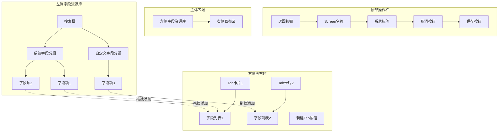
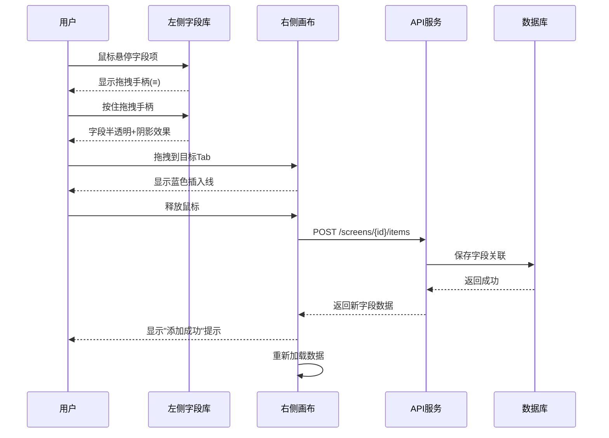
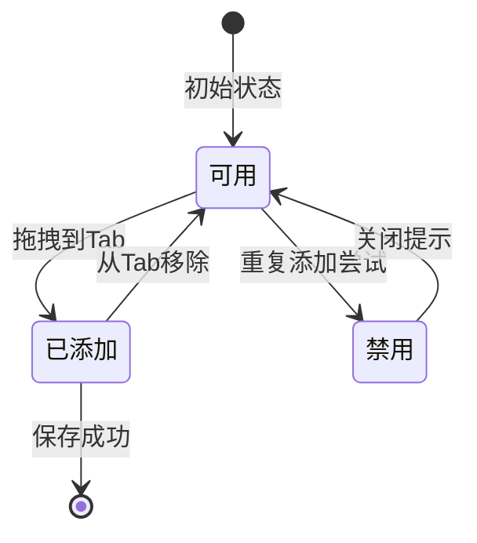
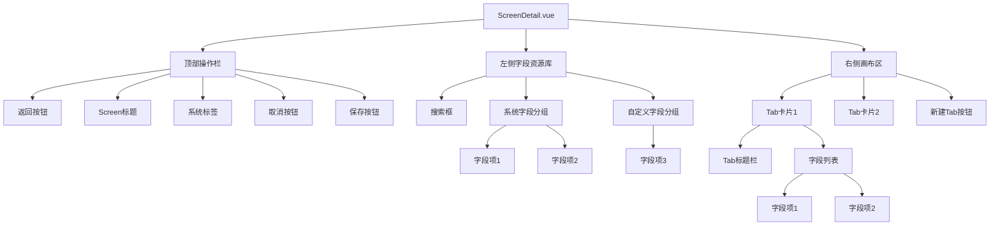

# Screen 配置页面原型设计（参考 ONES/Jira）

## 0. 可视化原型图

### 0.1 整体布局架构图



### 0.2 页面布局示意图

```
┌──────────────────────────────────────────────────────────────────────┐
│  ← 返回    Bug Screen 配置              [系统]     [取消]  [💾 保存] │
├──────────┬───────────────────────────────────────────────────────────┤
│          │                                                           │
│ 🔍 搜索  │  ┌─────────────────────────────────────────────────┐    │
│ 字段...  │  │ ≡ Tab: 详情                        [🗑️ 删除]    │    │
│          │  ├─────────────────────────────────────────────────┤    │
│ ▼ 系统   │  │ ┌─────────────────────────────────────────┐    │    │
│   字段   │  │ │ ≡ 摘要                                  │    │    │
│          │  │ │    summary                              │    │    │
│ □ TEXT   │  │ │    [TEXT]                        [移除] │    │    │
│ □ SELECT │  │ ├─────────────────────────────────────────┤    │    │
│ □ USER   │  │ │ ≡ 描述                                  │    │    │
│ □ DATE   │  │ │    description                          │    │    │
│          │  │ │    [RICHTEXT]                    [移除] │    │    │
│ ▶ 自定义 │  │ ├─────────────────────────────────────────┤    │    │
│   字段   │  │ │ ≡ 状态                                  │    │    │
│   (8)    │  │ │    status                               │    │    │
│          │  │ │    [SELECT]                      [移除] │    │    │
│          │  │ └─────────────────────────────────────────┘    │    │
│          │  └─────────────────────────────────────────────────┘    │
│          │                                                           │
│          │  ┌─────────────────────────────────────────────────┐    │
│          │  │ ≡ Tab: 人员信息                    [🗑️ 删除]    │    │
│          │  ├─────────────────────────────────────────────────┤    │
│          │  │ ┌─────────────────────────────────────────┐    │    │
│          │  │ │ ≡ 负责人                                │    │    │
│          │  │ │    assignee                             │    │    │
│          │  │ │    [USER]                        [移除] │    │    │
│          │  │ ├─────────────────────────────────────────┤    │    │
│          │  │ │ ≡ 报告人                                │    │    │
│          │  │ │    reporter                             │    │    │
│          │  │ │    [USER]                        [移除] │    │    │
│          │  │ └─────────────────────────────────────────┘    │    │
│          │  └─────────────────────────────────────────────────┘    │
│          │                                                           │
│          │  ┌─────────────────────────────────────────────────┐    │
│          │  │              ➕ 新建 Tab                         │    │
│          │  └─────────────────────────────────────────────────┘    │
│          │                                                           │
└──────────┴───────────────────────────────────────────────────────────┘
```

### 0.3 拖拽交互流程图



### 0.4 字段状态转换图



### 0.5 组件层次结构图



### 0.6 字段类型颜色规范

```
┌─────────────────────────────────────────────┐
│ 字段类型标识颜色                              │
├──────────────┬──────────┬───────────────────┤
│ 类型         │ 颜色     │ 示例              │
├──────────────┼──────────┼───────────────────┤
│ TEXT         │ 🔵 蓝色  │ [TEXT]            │
│ RICHTEXT     │ 🟣 紫色  │ [RICHTEXT]        │
│ SELECT       │ 🟢 绿色  │ [SELECT]          │
│ MULTI_SELECT │ 🟠 橙色  │ [MULTI_SELECT]    │
│ USER         │ 🔴 红色  │ [USER]            │
│ DATE         │ 🟡 黄色  │ [DATE]            │
│ NUMBER       │ ⚪ 灰色  │ [NUMBER]          │
│ LABELS       │ 🟤 棕色  │ [LABELS]          │
└──────────────┴──────────┴───────────────────┘
```

### 0.7 拖拽状态视觉反馈

**正常状态：**
```
┌────────────────────────────────┐
│ ≡ 摘要                         │
│    summary                     │
│    [TEXT]                      │
└────────────────────────────────┘
```

**悬停状态：**
```
┌────────────────────────────────┐
│ ≡ 摘要              ← 背景:#ecf5ff │
│    summary                     │
│    [TEXT]                      │
└────────────────────────────────┘
```

**拖拽中状态：**
```
┌────────────────────────────────┐
│ ≡ 摘要              ← 半透明:0.6 │
│    summary          ← 阴影+旋转2°│
│    [TEXT]                      │
└────────────────────────────────┘
         ↓
┌────────────────────────────────┐
│ ≡ 描述                         │
├════════════════════════════════┤  ← 蓝色虚线 #409eff
│ ≡ 状态                         │
└────────────────────────────────┘
```

**放置目标高亮：**
```
┌╌╌╌╌╌╌╌╌╌╌╌╌╌╌╌╌╌╌╌╌╌╌╌╌╌╌╌╌╌╌┐
│  Tab: 详情                    │  ← 边框:#409eff 虚线
│  ┌──────────────────────┐   │
│  │ ≡ 摘要               │   │
│  └──────────────────────┘   │
└╌╌╌╌╌╌╌╌╌╌╌╌╌╌╌╌╌╌╌╌╌╌╌╌╌╌╌╌╌╌┘
```

### 0.8 响应式布局对比

**桌面端（≥1200px）：**
```
┌──────────────┬──────────────────────────────┐
│              │                              │
│  左侧字段库   │      右侧画布区               │
│  (320px固定) │      (自适应宽度)             │
│              │                              │
└──────────────┴──────────────────────────────┘
```

**平板端（768px-1199px）：**
```
┌──────┬──────────────────────────────────────┐
│ ☰    │                                      │
│ 折叠 │      右侧画布区（全宽）                │
│      │                                      │
└──────┴──────────────────────────────────────┘
点击☰展开左侧抽屉
```

**移动端（<768px）：**
```
┌─────────────────────────┐
│ [☰ 字段库] Screen配置   │  ← 顶部工具栏
├─────────────────────────┤
│ Tab1 | Tab2 | Tab3      │  ← Tab切换器
├─────────────────────────┤
│                         │
│   字段列表              │
│   （垂直排列）          │
│                         │
└─────────────────────────┘
```

### 0.9 典型用户操作流程

**场景1：添加字段到Tab**
```
步骤1: 用户在左侧搜索框输入"摘要"
        ↓
步骤2: 系统过滤显示匹配的字段
        ↓
步骤3: 用户按住"摘要"字段的拖拽手柄
        ↓
步骤4: 字段变为半透明，显示阴影效果
        ↓
步骤5: 用户拖动到右侧"详情"Tab区域
        ↓
步骤6: Tab显示蓝色虚线边框，提示可放置
        ↓
步骤7: 用户释放鼠标
        ↓
步骤8: 前端调用API保存字段关联
        ↓
步骤9: 后端返回成功，显示绿色Toast"添加成功"
        ↓
步骤10: 页面重新加载，显示最新数据
```

**场景2：调整字段顺序**
```
步骤1: 用户在Tab内按住"描述"字段的拖拽手柄
        ↓
步骤2: 字段进入拖拽状态
        ↓
步骤3: 用户向上拖动到"摘要"上方
        ↓
步骤4: 在"摘要"上方显示蓝色插入线
        ↓
步骤5: 用户释放鼠标
        ↓
步骤6: 字段移动到目标位置
        ↓
步骤7: 防抖500ms后自动保存新顺序
        ↓
步骤8: 显示"顺序已更新"提示
```

**场景3：删除Tab**
```
步骤1: 用户点击Tab右上角的🗑️删除按钮
        ↓
步骤2: 弹出确认对话框
        ↓
步骤3: 对话框显示"确定要删除Tab'详情'吗？该Tab下的所有字段也将被删除。"
        ↓
步骤4: 用户点击"确定"
        ↓
步骤5: 前端调用DELETE API
        ↓
步骤6: 后端删除Tab及其关联字段
        ↓
步骤7: 显示"删除成功"提示
        ↓
步骤8: 页面重新加载
```

---

## 1. 设计理念

### 1.1 核心交互模式
- **左侧资源库**：可拖拽的字段列表
- **右侧画布区**：Tab + 字段的可视化配置区域
- **拖拽排序**：支持 Tab 和字段的自由拖拽调整顺序
- **实时预览**：所见即所得的配置体验

### 1.2 布局结构
```
┌─────────────────────────────────────────────────────────────┐
│  顶部导航栏：Screen名称 | 保存 | 取消                        │
├──────────┬──────────────────────────────────────────────────┤
│          │                                                  │
│  左侧    │              右侧画布区                           │
│  字段    │  ┌────────────────────────────────────┐         │
│  资源库  │  │  Tab 1: 详情 [拖拽手柄] [删除]     │         │
│          │  │  ┌──────────────────────────────┐  │         │
│  [搜索框]│  │  │ ≡ 摘要 (summary)             │  │         │
│          │  │  │ ≡ 描述 (description)         │  │         │
│  □ 系统  │  │  │ ≡ 状态 (status)              │  │         │
│    字段  │  │  │ ≡ 优先级 (priority)          │  │         │
│          │  │  └──────────────────────────────┘  │         │
│  □ 自定义│  └────────────────────────────────────┘         │
│    字段  │  ┌────────────────────────────────────┐         │
│          │  │  Tab 2: 人员 [+添加Tab按钮]        │         │
│          │  │  ┌──────────────────────────────┐  │         │
│          │  │  │ ≡ 负责人 (assignee)          │  │         │
│          │  │  │ ≡ 报告人 (reporter)          │  │         │
│          │  │  └──────────────────────────────┘  │         │
│          │  └────────────────────────────────────┘         │
│          │                                                  │
│          │  [+ 新建Tab]                                     │
└──────────┴──────────────────────────────────────────────────┘
```

---

## 2. 页面组件详细说明

### 2.1 顶部操作栏
**位置**: 页面顶部固定  
**元素**:
- Screen 名称（可编辑）
- 描述信息（可选）
- 操作按钮组：
  - `保存`（主按钮，蓝色）
  - `取消`（次按钮，灰色）
  - `预览`（可选，查看实际效果）

**交互**:
- 点击保存时验证配置完整性
- 未保存更改时离开页面需二次确认

---

### 2.2 左侧字段资源库

#### 2.2.1 搜索框
- 占位符："搜索字段..."
- 实时过滤下方字段列表
- 支持按字段名称、标识模糊搜索

#### 2.2.2 字段分类
**系统字段**（默认展开）
```
☑ 系统字段
  ├─ ≡ 摘要 (summary) - TEXT
  ├─ ≡ 描述 (description) - RICHTEXT
  ├─ ≡ 状态 (status) - SELECT
  ├─ ≡ 优先级 (priority) - SELECT
  ├─ ≡ 负责人 (assignee) - USER
  ├─ ≡ 报告人 (reporter) - USER
  ├─ ≡ 标签 (labels) - LABELS
  ├─ ≡ 截止日期 (dueDate) - DATE
  └─ ...
```

**自定义字段**（可折叠）
```
☐ 自定义字段 (8)
  ├─ ≡ 严重程度 (severity) - SELECT
  ├─ ≡ 组件 (component) - TEXT
  ├─ ≡ 版本 (version) - TEXT
  └─ ...
```

#### 2.2.3 字段项样式
```
┌────────────────────────────────┐
│ ≡ 摘要                         │
│    summary                     │
│    TEXT                        │
└────────────────────────────────┘
```
- **拖拽手柄**（≡）：鼠标悬停显示，按住可拖拽
- **字段名称**：加粗显示
- **字段标识**：灰色小字
- **字段类型**：标签形式展示（不同颜色区分类型）

#### 2.2.4 交互行为
- **拖拽到右侧**：将字段添加到当前选中的 Tab
- **已添加字段**：显示禁用状态或隐藏
- **重复添加**：提示"该字段已在当前 Screen 中"

---

### 2.3 右侧画布区

#### 2.3.1 Tab 容器
每个 Tab 为一个独立卡片：

```
┌──────────────────────────────────────────────┐
│ ≡ Tab 名称: 详情              [🗑️ 删除]      │
├──────────────────────────────────────────────┤
│                                              │
│  字段列表（可拖拽排序）                       │
│  ┌────────────────────────────────────┐     │
│  │ ≡ 摘要 (summary)            [移除] │     │
│  ├────────────────────────────────────┤     │
│  │ ≡ 描述 (description)        [移除] │     │
│  ├────────────────────────────────────┤     │
│  │ ≡ 状态 (status)             [移除] │     │
│  └────────────────────────────────────┘     │
│                                              │
└──────────────────────────────────────────────┘
```

**Tab 特性**:
- **拖拽手柄**（≡）：调整 Tab 顺序
- **Tab 名称**：双击可编辑
- **删除按钮**：系统 Screen 禁用，非系统 Screen 可用
- **空状态提示**：无字段时显示"拖拽左侧字段到此处"

#### 2.3.2 字段项
```
┌────────────────────────────────────────┐
│ ≡ 摘要                                 │
│    summary                             │
│    [TEXT]                              │
│                                  [移除] │
└────────────────────────────────────────┘
```

**字段特性**:
- **拖拽手柄**（≡）：调整字段顺序
- **字段信息**：名称、标识、类型
- **移除按钮**：从当前 Tab 移除（非删除字段定义）
- **Hover 效果**：显示浅蓝色背景

#### 2.3.3 新建 Tab 按钮
```
┌────────────────────────────────────────┐
│           + 新建 Tab                    │
└────────────────────────────────────────┘
```
- 点击弹出输入框
- 输入 Tab 名称后确认
- 自动创建空 Tab

---

## 3. 拖拽交互细节

### 3.1 拖拽视觉反馈

#### 拖拽中状态
- **被拖拽项**：半透明 + 阴影 + 旋转 2°
- **放置目标**：高亮边框（蓝色虚线）
- **插入指示器**：蓝色横线显示插入位置

```
┌────────────────────────────────┐
│ ≡ 摘要 (半透明，阴影)          │  ← 正在拖拽
└────────────────────────────────┘
         ↓
┌────────────────────────────────┐
│ ≡ 描述                         │
├════════════════════════════════┤  ← 蓝色插入线
│ ≡ 状态                         │
└────────────────────────────────┘
```

#### 拖拽结束
- 成功：播放轻微动画 + 显示"顺序已更新"提示
- 失败：恢复原位 + 显示错误提示

### 3.2 拖拽规则

| 场景 | 规则 |
|------|------|
| Tab 间拖拽 | 只能在 Tab 列表中上下移动 |
| 字段间拖拽 | 只能在当前 Tab 内上下移动 |
| 左侧→右侧 | 从资源库拖拽到 Tab 中添加字段 |
| 跨 Tab 拖拽 | 不支持（需先移除再添加） |
| 系统 Screen | 禁用所有拖拽和删除操作 |

---

## 4. 状态管理

### 4.1 数据流
```
用户操作 → 本地状态更新 → API 调用 → 后端保存 → 刷新状态
```

### 4.2 关键状态
```javascript
{
  screen: {
    id: 1,
    screenName: 'Bug Screen',
    description: 'Bug跟踪屏幕',
    isSystem: false,
    tabs: [
      {
        id: 1,
        tabName: '详情',
        displayOrder: 0,
        items: [
          { id: 1, fieldDefinitionId: 1, displayOrder: 0 },
          { id: 2, fieldDefinitionId: 2, displayOrder: 1 }
        ]
      }
    ]
  },
  availableFields: [...],  // 左侧资源库字段
  selectedTabId: 1,        // 当前选中的 Tab
  isDirty: false,          // 是否有未保存更改
  saving: false            // 保存中状态
}
```

### 4.3 自动保存策略
- **防抖保存**：拖拽结束后 500ms 自动保存
- **手动保存**：点击保存按钮立即保存
- **保存失败**：回滚到上次成功状态

---

## 5. 响应式设计

### 5.1 断点
- **桌面端**（≥1200px）：左右分栏布局
- **平板端**（768px-1199px）：左侧可折叠
- **移动端**（<768px）：单列布局，Tab 切换

### 5.2 移动端适配
```
┌─────────────────────┐
│  [☰ 字段库] Screen  │  ← 顶部工具栏
├─────────────────────┤
│  Tab1 | Tab2 | Tab3 │  ← Tab 切换器
├─────────────────────┤
│                     │
│   字段列表          │
│   （垂直排列）      │
│                     │
└─────────────────────┘
```

---

## 6. 无障碍设计

### 6.1 键盘操作
- **Tab 键**：在可聚焦元素间切换
- **空格/回车**：激活按钮
- **方向键**：在拖拽列表中移动选中项
- **Ctrl+Z**：撤销上次操作（可选）

### 6.2 屏幕阅读器
- 所有拖拽手柄添加 `aria-label="拖拽排序"`
- 字段项添加角色 `role="listitem"`
- 操作按钮添加明确标签

---

## 7. 性能优化

### 7.1 虚拟滚动
- 字段数量 > 50 时启用虚拟滚动
- 仅渲染可视区域字段

### 7.2 防抖节流
- 搜索输入：300ms 防抖
- 拖拽保存：500ms 防抖
- 滚动加载：200ms 节流

### 7.3 缓存策略
- 字段资源库：会话级缓存
- Screen 配置：本地存储草稿

---

## 8. 错误处理

### 8.1 常见错误场景
| 错误 | 处理方式 |
|------|----------|
| 网络中断 | 显示离线提示，保留本地更改 |
| 保存失败 | 显示错误详情，提供重试按钮 |
| 并发冲突 | 提示"配置已被他人修改"，提供合并选项 |
| 字段不存在 | 自动清理无效引用，提示用户 |

### 8.2 用户提示
- **成功**：绿色 Toast，2s 自动消失
- **警告**：黄色 Toast，需手动关闭
- **错误**：红色 Dialog，需用户确认

---

## 9. 与现有功能对比

### 9.1 当前实现 vs 新设计

| 特性 | 当前实现 | 新设计 |
|------|---------|--------|
| 布局 | 表格列表 | 可视化画布 |
| 拖拽 | 仅支持排序 | 支持添加+排序 |
| 字段选择 | 下拉选择器 | 拖拽添加 |
| 实时预览 | ❌ | ✅ |
| 批量操作 | ❌ | ✅（多选字段） |
| 搜索过滤 | ❌ | ✅ |
| 撤销重做 | ❌ | ✅（可选） |

---

## 10. 技术选型建议

### 10.1 拖拽库
- **推荐**：`vuedraggable@next`（已安装）
- **备选**：`@dnd-kit/core`（更现代，但需额外学习）

### 10.2 UI 组件
- **卡片**：Element Plus `el-card`
- **标签**：Element Plus `el-tag`
- **图标**：Element Plus Icons
- **提示**：Element Plus `ElMessage` / `ElMessageBox`

### 10.3 状态管理
- **简单场景**：Vue 3 `ref` + `reactive`
- **复杂场景**：Pinia Store（如需跨页面共享状态）

---

## 11. 开发优先级

### P0（必须）
1. 基础布局（左右分栏）
2. Tab 管理（增删改查）
3. 字段拖拽添加
4. 字段/Tab 拖拽排序
5. 保存/取消功能

### P1（重要）
6. 字段搜索过滤
7. 系统 Screen 保护
8. 实时保存提示
9. 错误处理

### P2（可选）
10. 批量操作
11. 撤销重做
12. 响应式适配
13. 键盘快捷键

---

## 12. 验收标准

### 12.1 功能验收
- [ ] 能查看所有 Screen 列表
- [ ] 能进入 Screen 详情页
- [ ] 能从左侧拖拽字段到右侧 Tab
- [ ] 能拖拽调整 Tab 顺序
- [ ] 能拖拽调整字段顺序
- [ ] 能删除 Tab（非系统 Screen）
- [ ] 能移除字段
- [ ] 能新建 Tab
- [ ] 保存后数据持久化
- [ ] 刷新页面数据不丢失

### 12.2 体验验收
- [ ] 拖拽流畅，无明显卡顿
- [ ] 视觉反馈清晰
- [ ] 错误提示友好
- [ ] 加载状态明确
- [ ] 操作有确认提示

### 12.3 性能验收
- [ ] 首屏加载 < 2s
- [ ] 拖拽响应 < 100ms
- [ ] 保存请求 < 1s
- [ ] 100+ 字段无卡顿

---

**下一步**：根据此原型图输出详细技术设计文档（SCREEN_SDD_V2.md）
